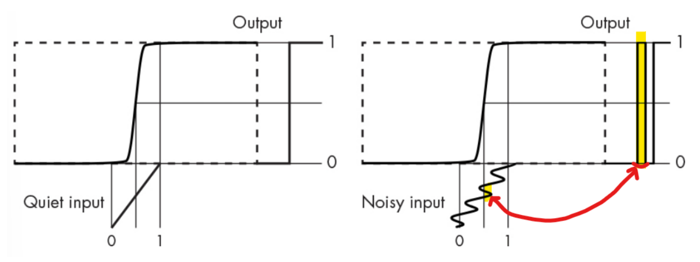

# Glitch

Digital Circuit에서의 **Glitch**는 아주 짧은 시간 동안 

* 원래 의도한 값이 아닌,
* 다른 값들(error value)로 

출력 신호들이 나오는 현상임.

> 일반적으로 특정 신호 패턴들에서 발생되며, 입력에서의 정전기 등으로 인한 짧은 순간의 NOISE등이 원인임.

원래 어원은 사소한 흠집이나 오류를 나타내며, bug가 실제적인 프로그램이나 시스템의 오류라면 *glitch는 좀더 가벼운 개발자가 의도하지 않은 비정상적인 현상(좀 더 심각도가 낮은)* 을 가르킴.

## Example of Noise Glitch

아래 그림에서 왼쪽은 이상적인 경우로 noise가 전혀 없는 input으로 output에서 glitch가 없지만, 오른쪽은 noise가 있어서 **absolute thresholding**을 사용하는 경우 transfer function으로 인해 output에서 **noise glitch**가 보임.

* 오른쪽에서 형광펜으로 강조된 부분이 서로 연관이 있는 곳을 연결하고 있음.
* 짧은 순간 threshold를 넘나드는 Input에서의 noise가 output에서의 noise glitch가 발생. 

## Solution

앞서 애기한 Noise glitch의 경우, Schmitt trigger 등을 사용하면 해결됨.  
[Schmitt Trigger](https://dsaint31.tistory.com/entry/CI-Schmitt-trigger) : Hysteresis 를 이용!

또는 Differential signaling을 통한 noise를 줄이는 방안도 가능함.  
[Differential signaling](https://dsaint31.tistory.com/entry/CI-Differential-Signaling-%EC%B0%A8%EB%8F%99%EC%8B%A0%ED%98%B8)