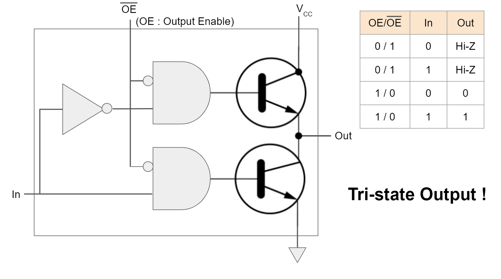

# Tri-state Output

`Enable` 입력을 추가해서, 해당 output을 사용하려면 `Enable` (or `OE`(Output Enable))에 active 신호를 주어지면 `Output`이 `Input`과 연결된다고 생각하면 된다.

* `Enable`이 low인 경우가 바로 `off` 또는 `hi-Z`라고 부름.
* $\text{OE}$(or $\overline{\text{OE}}$)로 `Enable`을 표기하기도 함.

* 위 그림의 Tri-state output에선 위아래의 Transistor들의 base에 동시에 1이 들어가지 못하게 설계됨.
* 만약 1이 동시에 들어가면 meltdown이 발생!

Tri-state output은 `Enable`을 도입함으로서 open-collector output처럼 여러 개가 연결될 수 있음. 단, 연결된 여러 output들 중 사용할 output에만 `enable`을 activation시키고 나머지 deactivation시켜야 함. 