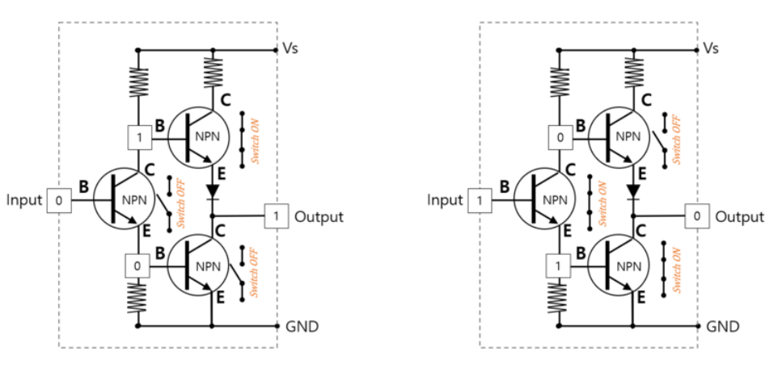
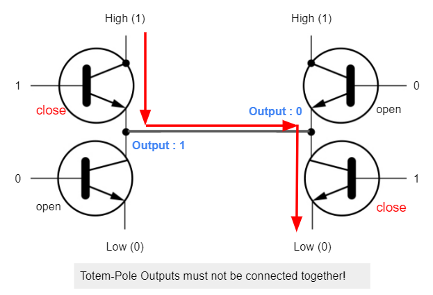

# Totem-Pole Output

다음 그림은 NPN BJT를 2개를 연결한 Totem-Pole Output을 보여줌.
> 위와 아래에 같은 NPN BJT가 연결되어 토템처럼 보인다고 해서 Totem-Pole이라고 불림

* 왼쪽은 input이 `0`이 들어가서 Totem-Pole의 상단에는 `1`이 하단에는 `0`이 들어가며 이로 인해 output이 `1`이 나옴.
* 오른쪽은 output이 `1`이 들어간 경우로 output이 `0`으로 나옴.
* 왼쪽과 오른쪽 각각의 그림에서 상하로 연결된 NPN BJT들의 구조가 Totem-Pole 임.
* 상하의 NPN BJT의 base에서 들어가는 input은 항상 달라야 함(상보형 동작).

상단의 BJT는 일종의 active pull-up으로 출력을 high voltage와 연결하고 있음.

## Note
Open-Collector (FET의 경우 Open-Drain)의 경우와 달리, Totem-Pole Output은 절대 서로 곧바로 연결해서는 안됨.

* output을 서로 연결할 경우, 한쪽이 `1`로 다른 쪽인 `0`인 경우 short가 일어나서 출력단에 연결된 BJT가 망가지게 됨.