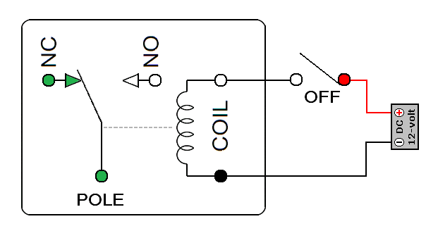
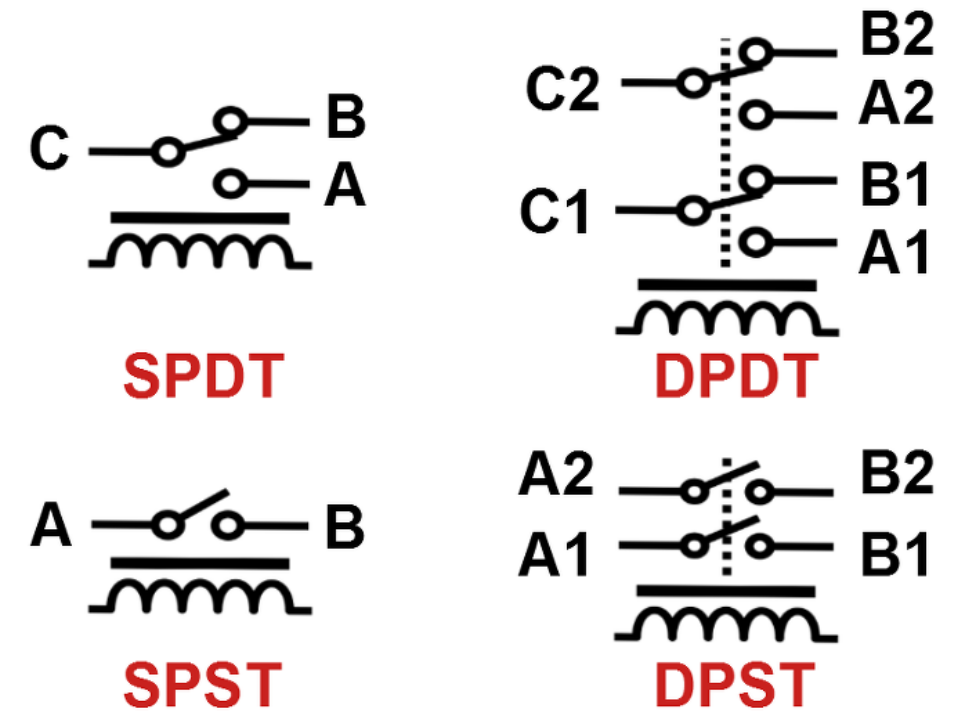

# Relay (계전기)

Electromagnet (전자석)을 이용한 일종의 switch(스위치)임.

* NC : Normally Closed (전자석이 off일 경우 연결되는 접점)

Relay에 전기가 가해지면 전자석에 의해 switch가 켜지고(혹은 커지거나), 전기가 끊기면 내부의 스프링에 의해 다시 커지는 (혹은 켜지는) 동작을 수행함.
* 일반적으로 전자석 제어용 전압/전류는 낮음
* 즉, 낮은 전압/전류를 이용하여 더 높은 전압/전류를 제어하는데 사용됨.

> 초기 컴퓨터에서 사용되었으나 물리적으로 동작하는 소자이다보니 수명이 짧고, 크기 크다는 단점을 가져 현재는 컴퓨터에서는 거의 쓰이지 않음.
* 일반적인 switch들과 달리 relay는 고전압, 고전류를 제어하는 switch로 활용가능함(주 용도?).

다음은 Schematic daigram으로 Relay의 종류를 표시함.

* SPDT : Single Pole Double Throw ( 입력 1개, 출력 2개)
* SPST : Single Pole Single Throw ( 입출력이 각각 1개.)
* DPDT : Double Pole Double Throw ( 입력 2개, 각 입력당 출력 2개)
* DPST : Double Pole Single Throw ( 입력 2개, 각 입력당 출력1개)