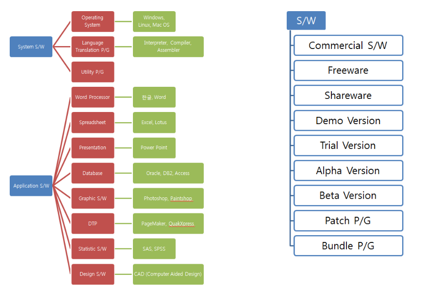

# Computer 주요 구성 요소

## Hardware

컴퓨터를 구성하는 물리적 기계장치.

다음과 같은 ***5대 기본 장치*** 들로 구성된다.

* CPU (Central Processing Unit)
    * 기본적인 logical/arithmetic operation을 수행.
    * Primary memory에서 instruction들을 하나씩 [fetch](../ch04/ce04_22_fetch_execute.md#fetch)해서 해독하여 해당하는 작업을 수행하기 위한 명령을 내리는 device.
* Primary Memory
    * 컴퓨터에서 수행할 프로그램과 처리할 데이터를 저장하는 장치.
    * CPU와 데이터를 주고 받는다.
* Secondary Memory
    * 당장 수행하지 않는 프로그램과 데이터를 저장하고 있는 장치.
    * Primary Memory보다 대용량이며, access에 걸리는 시간이 긴 특징을 가짐.
* Input Device
    * data나 program을 외부로부터 컴퓨터로 읽어들이는 역할 수행.
    * 키보드와 마우스가 대표적.
* Output Device
    * 처리한 결과를 외부로 출력하는 역할을 수행.
    * 모니터와 프린터가 대표적.

> CPU와 Memory, I/O Devices 와 같이 세가지 구성요소로  
> 기술되는 경우도 많음.

---

## Software

H/W를 운용하고 이용하기 위한 program(프로그램).

크게 System SW와 Application으로 나누어진다.

* System S/W
    * 컴퓨터와 사용자의 중간에서 컴퓨터 시스템을 효율적으로 운영할 수 있도록 도와주는 S/W
    * 사용자가 컴퓨터 H/W에 대한 이해없이도 컴퓨터를 유용하게 사용할 수 있도록 컴퓨터의 작동 자체를 다룸.
    * OS 가 대표적인 System S/W이며, compiler, linker, loader등도 System S/W임.
* Application
    * 특정한 용도에 맞게 활용하기 위해 만들어진 S/W
    * 사용자가 <u>컴퓨터를 사용하는 용도를 직접적으로 만족시켜주기 위한 프로그램</u>.

* P/G: abbreviation of "program"