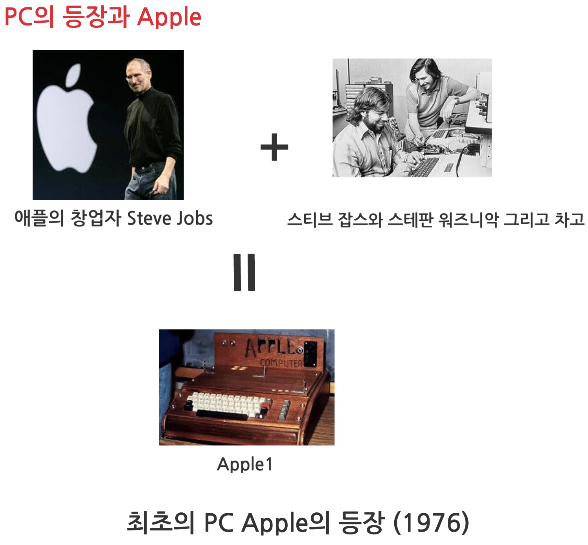

# History of Computer

여기서는 컴퓨터의 발전사를 다룬다. 쉽게 따라가기 위해서 세대별로 나누어서 정리했으나....

모든 역사가 그렇듯이 칼로 딱 잘라지지도 않고, 사람마다 견해가 다르기 때문에 흐름을 따라가기 위한 일종의 도구로서 generation을 이해하자. 기억과 이해를 돕기 위해 도입한 것으로 만고불변의 진리가 아니다. 특히 현대에 가까워질수록 사람마다 의견이 다르다.

> 더불어 최초 논쟁에 큰 의미를 부여하지 말고, 어떤 기술이 왜 등장했는지에 더 관심을 기울여야 한다. 많이 알려진 최초의 ~~ 은 깊게 파보면 다른 경우가 곧잘 나온다. (하늘 아래 새 것이 없다는 애기가 나올 정도로 모든 것이 과거의 기술과 개념들이 조합되고 개선되면서 나오는 것이 대부분이다.)

---

---

## 조상님들...

### Mechanical Calculator

{style="display: block; margin: 0 auto; width=500"}

* First mechanical calculator (Blaise Pascal): 1642 (addition, subtraction)
* Leibniz calculator (Gottfried Leibniz) : 1671 (multiplication, division 을 추가.)

19세기

Babbage's [Difference Engine(차분기관)과 Analytical Engine(분석기관)](https://ds31x.tistory.com/383)

20세기

Vannevar Bush's [Differential Analyzer (미분해석기)](https://ds31x.tistory.com/390)

* Analog Mechanical Calculator.

Claude Shannon's [A Symbolic Analysis of Relay and Switching Circuits (1939년)](https://ds31x.tistory.com/393)

* Computer를 Switch의 조합으로 만들 수 있음: Digital Logic Circuit 의 등장.

---

### 0세대 컴퓨터.

`Z3`
: 세계 최초의 프로그래머블 `이진수 기반 전기기계식 범용 컴퓨터`: [Relay](../ch02_co/ce02_03_1_relay.md) 
[Z3에 대하여](https://ds31x.tistory.com/385) 

`Atanasoff Berry Computer (ABC)`
: 세계최초의 `전자식 디지털 컴퓨터`로 알려짐 (`ENIAC`은 최초의 전자식 디지털 범용컴퓨터): [Vacuum Tube](../ch02_co/ce02_03_2_vacuum_tube.md)사용.  
1937~1942년에 아이오와 주립대의 존 빈센트 아타나소프와 클리포드 베리가 개발한 컴퓨터로 **복잡한 수학계산(선형방정식 풀이)** 을 위해 설계된 Special Purpose Computer.  
"[Plugboard (정식명칭: Control Panel)](https://ko.wikipedia.org/wiki/%ED%94%8C%EB%9F%AC%EA%B7%B8%ED%8C%90)를 통해 Programming이 가능한 `ENIAC`" 과 달리 프로그래밍이 가능한 [범용컴퓨터](./category_of_computers.md#사용목적에-따른-분류)가 아니었음.  
때문에 ABC를 가리켜 컴퓨터가 아닌 특정 계산만이 가능한 고정된 전자장치라고 여기는 의견도 있음.  
[ABC에 대하여](https://ds31x.tistory.com/378)

`Colossus`
: Alan Turing이 만든 bombe (에니그마를 해독하기 위한 전기기계식 컴퓨터?)와 그의 확률론적 방식에 영향을 받아,  
Tommy Flowers 그룹이 설계하고 개발한 1943~1945년 개발된 컴퓨터.
(bombe는 이미테이션 게임이라는 영화를 보면 관련 이야기들이 나옴.)  
2차세계대전(1939~1945) 중 독일군의 암호전신기인 [Lorenz Cipher](https://ko.wikipedia.org/wiki/%EB%A1%9C%EB%A0%8C%EC%B8%A0_%EC%95%94%ED%98%B8%EA%B8%B0%EA%B3%84)를 해독하기 위해 개발된 세계최초의 `프로그래밍(외장형)이 가능한 전자디지털 Computer`였음 (Plugboard 이용).  
(오늘날의 범용 컴퓨터와 거리가 먼 [Special-Purpose Computer](./category_of_computers.md#사용목적에-따른-분류) 이며, 최초의 범용 프로그래밍이 가능한 컴퓨터는 `ENIAC`으로 인정하는 의견이 다수임.)
^^군사기밀이었기 때문에 한참 후에 존재가 공개(1970년대)^^ 된 컴퓨터 (Vacuum tube를 사용했고, 스위치 및 플러그(plugboard)를 이용한 프로그래밍을 지원)  
[The Colossus에 대하여](https://ds31x.tistory.com/379) 

`(Harvard) Mark I`
: 세계 최초의 `전기기계식 Computer`로 알려짐 (Z3가 패전국 독일제라는 약점이...).  
1944년 IBM사에 개발한 것으로 Automatic Sequence Control Calculator (ASCC)이라는 공식명칭을 가짐.  
속도와 범용성, 구현 방식 등에서 현대의 컴퓨터와 큰 차이를 보이지만, 프로그램에 따라 순차적으로 계산을 수행하는 자동화된 연산기계라는 의의를 가짐. 
(Harvard에 설치되어서 Harvard Mark I 으로 불림).  
3,000개의 [`Relay(전기기계식 switch)`](../ch02_co/ce02_03_1_relay.md)와 4마력의 Motor 72개로 구성됨.  
15.3m의 길이에 2.4m의 높이에 걸맞는 31.5톤의 무게로 알려짐(기계식의 위엄?).  
`톱니바퀴로 가감산이 가능한 계산기를 Gear(치차)식 계산기`라고 부르는데, 이것의 극한으로 간 것이 Mark I 임  
(Motor가 필요한 이유가 Gear등을 회전시켜야 하기 때문).  
원폭 개발(맨해튼 프로젝트) 등에 사용됨.  
[Harvard Mark I 에 대하여](https://ds31x.tistory.com/380)

> 전기기계식(electromechanical) : `Relay`가 사용됨을 의미함.

참고: [기계식, 전기식, 전자식 의 차이](https://ds31x.tistory.com/377)

---

---

---

## 1st Generation

**1951 ~ 1959 : `Vacuum Tube`의 시대**.

* 1951년 1세대의 대표적인 computer인 `UNIVAC I`이 상용화됨.
    * 참고로, 1945년 (최초로 프로그래밍이 가능한 전자식 컴퓨터인 `ENIAC` 의 등장) 부터 1세대라고 보는 이들도 많음.
* [`Vacuum tube`](../ch02_co/ce02_03_2_vacuum_tube.md) 가 주 구성요소임.
    * 많은 전력소모와 발열 과 함께 잦은 고장의 원인.
* Memory (기억장치)
    * 수은지연회로 (mercury acoustic delay lines), William Tube 및 Magnetic Drum ( ***자기드럼*** ) 등..
* 입력이 Paper Tape (종이테이프) 및 Punched Cards (천공카드)
    * ^^`Vacuum Tube`의 열로 인해 종이테이프가 탈 정도^^ 였다고 함.    
* Milli-Second 단위의 연산속도.

과학 계산, 통계처리, 미사일 탄도 계산 등에 이용되었음.  
S/W 라는 개념이 없다고 봐도 될정도로 S/W가 **H/W에 강하게 의존** 하던 세대이다.  
컴퓨터가 수행할 동작을 배선을 통해 만든 회로를 교체해야 하는 형태 (=`hard wired 방식` 또는 `plugboard` 사용)이다.

> `H/W` : 컴퓨터를 구성하는 물리적 기계장치.  
> `S/W` : H/W를 운영하고 이용하기 위한 프로그램.

---

### ENIAC (Electronic `Numerical` Integrator and Calculator) **

> 프로그래밍이 가능한 전자식 디지털 컴퓨터, 10진수 체계, Vacuum Tube (~`전자식`)

[ENIAC](https://ds31x.tistory.com/381)

1946년 개발된 일반적으로 알려진 ***최초의 전자 디지털 범용컴퓨터***.
사실 0세대라고도 본다.

* 미사일 탄도 계산을 위한 미분방정식을 풀기 위해서...
* 100 여명의 수학자들이 모여 한 달동안 계산 을 대체하기 위해.
* **Decimal (십진수 체계)** 를 사용. 

<!--figure class="inline end" markdown>
</figure-->
{style="display: block; margin: 0 auto; width:300px"}
<figcaption>By Unidentified U.S. Army photographer - Image from [2], Public Domain, https://commons.wikimedia.org/w/index.php?curid=978770</figcaption>

18,000 여개의 Vacuum Tube 들과 1,500 개의 Relay로 구성되었고, 150kW의 전력소모 및 $24 \times 6.974 \times 0.945 \text{m}^3, 30\text{t}$의 정말 큰 컴퓨터.

* 존 모클리 : 물리학자.
* 프레스퍼 에커트 : 전기공학자.

펜실베니아 대학 (Mauchly and Eckert)에서 가동할 경우, 펜실베니아의 가로등이 희미해질 정도였다고함.

* `hard-wired` 배선과 스위칭으로 컴퓨터를 제어. (~프로그래밍?)
* Paper tape, Punched card 가 입력수단.

> 최초의 ***디지털 전자식*** : Vacuum Tube 를 이용함.
>
> 앞서 언급한 `Colossus` 를 최초의 디지털 전자식 컴퓨터로 인정해야하나,  
> 군사적 목적으로 인해 공개가 늦어진 점과  
> `Colossus`가 범용 컴퓨터가 아니라는 점 때문에  
> **`ENIAC`이 최초의 디지털 전자식 컴퓨터로 알려짐.**

---

### EDSAC (Electronic Delay Storage Automatic Calculator) **

> 1949년 개발된 (실용적인) ^^최초의 Stored Program Computer.^^

[EDSAC에 대하여](https://ds31x.tistory.com/384)

역시 0세대로도 볼 수 있음.

영국의 윌킨스 그룹에서 

* von Neumann의 `von Neumann Architecture`를 채택하여 개발.
* **10진수를 기반** 으로 동작.

---

### EDVAC (Electronic Discrete Variable Automatic Computer) **

> 1952년 von Neumann이 제안한 `Stored Program Computer` (프로그램 내장형 컴퓨터) Architecture를 채택하여 개발된  
> ***이진수(`Binary`) 기반 컴퓨터*** .

[EDSAC에 대하여](https://ds31x.tistory.com/384)

* ENIAC은 program이 내장되어 있지 않음. (수동 전화 교환기 와 같은 외양의 plugboard 이용. 배선 변경으로 컴퓨터 동작을 지시.)
* EDVAC은 현재 디지털 컴퓨터들이 채택하고 있는 `Stored Program Computer` 개념과 ^^이진법 (binary) 을 실제 구현^^ 한 컴퓨터임.
* 그 유명한 `John von Neumann`이 컨설팅을 담당.

> 기존의 `EDSAC` 등은 10진수를 사용함.  
> `Z3`, `ABC` 등이 binary system을 사용했으나, 현대 컴퓨터의 architecture인 stored program computer 중에서 최초로 binary system이라는 점은 이후 컴퓨터들에 큰 영향을 끼침.

---

### 중요: The von Neumann Architecture ***

`Stored Program Computer`라고 불리며,  
현대 컴퓨터들이 대부분 채택하고 있는 구조.

> Program(=Set of Instructions)을 Data와 똑같이 메모리에 저장하여  
> 소프트웨어 변경의 유연성을 제공하고,  
> 다양한 작업을 수행할 수 있는 범용성을 갖춘 컴퓨터 구조

흔히, 다음과 같은 세 부분으로 구성됨.

* Data를 외부로부터 입력받고, 처리 결과를 외부에 표시하는 **I/O Device** (키보드, 모니터, 프린터 등등)
* Data와 Program의 저장을 담당하는 **Memory** 
    * Storage를 포함.
* Data를 Program에 따라 처리를 담당하는 **CPU** (`Control Unit`과 `ALU`등으로 구성됨.)
    * von Neumann이 제안한 구조에서 CPU는 여러 component로 구성됨.
    * 오늘날의 single chip 형태는 [Intel의 4004라는 Micro-processor의 등장(1971)](https://dsaint31.tistory.com/417) 이후에 해당함.

{ style="display: block; margin:0 auto; width:300px" }
<figcaption>Stored program Architecture</figcaption>

Neumann은  

* Memory(기억장치)에 컴퓨터의 Instruction들과 Data들을 함께 저장하는 `Stored Program` 방식을 
* 1946년에 제안했고,  
* `EDVAC`이 이를 1952년 구현했음  

> `EDSAC`이 먼저 이를 1949년에 구현했으나  
> `EDVAC`관련 보고서에서 `Stored Program Computer` Architecture에 대한 언급이 공식적으로 첫 등장함). 

Stored Program Architecture는 

* Data와 Program(or Instructions)을 동일한 방식으로 Memory에 저장하고, 동일한 방식으로 처리.
* `모든 실행되는 program은 우선 Main Memory에 적재`되어야 함.

> *Data와 Program이 저장되는 Memory* 가  
> von Neumann architecture 에선 동일하기 때문에  
> ***Bottleneck 현상*** 이라는 단점을 가짐.  
>  
> 이를 분리시킨 구조인 **Harvard Architecture** 도 존재함.  
> 이 경우, Program과 Data에 동시에 접근이 가능하다는 장점을 가지지만,  
> 분리된 Bus와 Memory가 필요하여, 보다 복잡한 구성이 요구됨.  
> 
> 현대 컴퓨터에선 **CPU 내부에선 Harvard Architecture를 적용하고, 외부는 von Neumann Architecture를 적용** 하고 있음.

^^`EDVAC` (or `EDSAC`) 이후, 이를 기점으로 `Software`라는 개념 (H/W의 영향을 보다 덜 받는 형태)이 등장함!^^

`Stored Program` Architecture 이전에는 

* Hard-Wired 방식 또는 Plugboard 방식으로 
* Computer 가 수행하는 Task를 변경하려면, 
* 물리적으로 전선을 연결하여 ***회로를 새로 구성*** 해야함 
* 해당 컴퓨터의 H/W 지식 없이는 Task 변경 자체가 불가능.

---

### UNIVAC I (UNIVersal Automatic Computer I) **

1951년 개발된 ^^최초의 `상업용 컴퓨터`^^.

ENIAC의 개발 그룹의 핵심 멤버들(J. Mauchly 와 J.P. Eckert)이 설계한 컴퓨터로 Eckert-Mauchly Computer Corporation에서 개발을 시작되었으나 1950년 Remington Rand라는 회사에 인수되었고, UNIVAC I은 Remington Rand사에서 출시됨(최초의 고객은 미국인구조사국 이었음).

* Magnetic Tape(자기테이프)를 secondary memory(보조기억장치)로 도입함.

{style="display: block; margin: 0 auto; width:300px" }
<figcaption>By U.S. Census Bureau employees - https://www.census.gov/history/, Public Domain, https://commons.wikimedia.org/w/index.php?curid=61118833</figcaption>

125만 달러 수준의 고가였고, 관공서 및 대형 연구소 등에서 사용됨.  
참고로 당시 대한민국 1인당 GDP는 50~60 달러 수준

> `UNIVAC`이 유명해진 이유는,  
> 1952년 대통령선거에서 개표가 5% 정도 진행된 시점에서 ^^매우 적은 sample만으로 정확히 당선자로 아이젠하워를 예측^^ (CBS TV)하는데 사용되었기 때문임.  
> 군사적 목적 이외의 컴퓨터의 효용성을 대중에 크게 알린 사건임.

---

추가적으로  
: 최초의 상용 `Mainframe`으로 간주되는 [IBM-701 (1952년)](https://en.wikipedia.org/wiki/IBM_701)와 [IBM-704 (1954)](https://ko.wikipedia.org/wiki/IBM_704)도 유명한 1세대 컴퓨터임.

---

---

## 2nd Generation

1950년대 후반 ~ 1960년대 중반 정도. `Transistor`의 시대.

* [`Transistor`](../ch02_co/ce02_03_3_transistor.md) (1948년 개발됨) 가 주 구성요소임.
    * `Vacuum tube`를 사용했던 컴퓨터들 보다 1/100 수준의 크기로 소형화.
    * 동시에 생산단가가 낮아지면서 상업용 컴퓨터 보급이 보다 원활해짐.
* Memory (기억장치)
    * Magnetic Core(자기코어, Primary Memory)
    * Secondary Memory : Magnetic Tape(자기테이프), Magnetic Disc(자기디스크) 등.
* Micro-Second 단위의 연산속도.
* `Operating System (OS)`  등장: (`Batch Processing` System이 중심)
    * ^^Batch Processing(1950년대)^^ 이 주로 사용되었으나 ^^`Multi-programming`(1960년대)의 개념^^ 도 등장.
        * `Multi-Programming`이란 I/O 처리로 인해 CPU 연산이 필요하지 않은 경우,  
        다른 프로그램에게 CPU를 사용할 수 있도록 해 줌.  
        (이를 위해 **여러 프로그램이 Main Memory에서 동시에 상주함.**)
            * 이전의 방식(한 프로그램이 끝날 때까지 점유)은 Uni-programming (단일 프로그램)이라고 불림.
            * 고가의 컴퓨터를 효율적으로 사용하기 위한 기술이었고 이는 `Time-Sharing` system으로 이어짐.
        * `Batch Processing`이란
            * 특정 시간에 ***대량의 데이터를 일괄적으로 처리*** 하는 것을 의미.
            * 컴퓨터에서 어떤 작업이 주어지면 끝날 때가지 해당 작업만 수행하는 방식. 
            * 한 프로그램의 수행이 끝나면, 사람이 이를 확인하고 다음 수행할 프로그램을 전달해주는 형태임.
            * Processor Scheduling 이라는 개념이 도입되기 전에는 거의 모든 작업이 Batch Processing 이었음.
* 본격적으로 `Machine Code`와 `Assembler Language`가 이용됨.

> `Multi-Programming`과 비슷한 개념이 `Multi-Tasking`임.  
>
> ^^CPU의 Idle Time을 줄이기 위해 도입된 Multi-Programming^^ 과 달리,  
> (Multi-Programming은 하나의 장비에서 여러 프로그램의 동시 수행을 목표로 하지 않음.)  
> ^^`Multi-Tasking`은 하나의 Resource를 여러 Process들이 공유하는 방식을 통해,    
> ***동시(`Concurrency`)에 수행*** 되는 것을 목표^^ 로 하고 있어서  
> ^^Multi-Programming의 논리적인 확장^^ 이라고 볼 수 있다.  
>  
> 사실 Resource에서 가장 중요한 것이 CPU 이기 때문에 어찌 보면 유사한 개념이지만,  
> `Multi-Tasking`은 `Round-Robin` scheduling algorithm과 같은 ^^`스케쥴링` 이 Multi-Programming에 보다 추가^^ 된 것이며  
> 여러 Task를 동시에 수행시키기 위한 기술(사실은 그렇게 느껴지게 하기 위한 기술)이다.  
> 
> 반면, `Multi-Programming`은  
> 오직 ***단일 CPU의 idle time을 줄이기 위한 context changing 에만 초점을 둔 것*** 으로  
> 여러 작업이 동시에 실행되는 것(또는 그렇게 느껴지는 것)을 보장 및 고려하지 않는다.  
>  
> 결국, `Multi-Tasking`은 ^^Multi-Programming에 Multi-Processing과 Time-Sharing 등의 개념 등이 보다 추가^^ 된 것이다.  
>
> 보다 자세한 건 다음 urls을 참고하라.  
> 
> * [Difference Between Multiprogramming and Multitasking](https://www.tutorialspoint.com/difference-between-multiprogramming-and-multitasking)
> * [Multi-Tasking System](../../OS/operating_system.md#4-2-4-multi-tasking-system-)
> * [Multi-Programming System](../../OS/operating_system.md#4-2-2-multi-programming)

`TRADIC`, `TX-0` 등이 유명한 2세대 컴퓨터임.

> `ENIAC`이 17,000개의 vacuum tube를 사용한 것에 비교하여  
> `TRADIC`은 ^^800개의 transistor를 사용하면서 1/15,000 수준의 전력을 소비^^ 했음.

---

### 오늘날의 I/O Devices

1960년 초반에 등장한 `키보드`와 `모니터`의 등장으로  
기존의 `Batch Processing`에서 `Interactive System`(1960년대)으로의 변화가 가능해짐.   

키보드와 모니터 등을 통해 사용자에게 작업이 진행되는 중간에 입력과 출력이 가능해졌다 (Interaction). 

---

### TRADIC (TRAnsistorized Airborne DIgital Computer)

1955년 AT&T Bell 연구소의 J. H. Felker가 만든 ^^Transistor기반 컴퓨터^^.  
800여개의 Transistor와 10,000여개의 게르마늄 수정정류기를 사용한 것으로 알려짐.

{style="display: block; margin: 0 auto; width:300px"}
<figcaption>By Unknown author - Retrieved January 24, 2015 from Radio-Electronic Engineering magazine, Ziff-Davis Publishing Co., New York, Vol. 24, No. 5, May 1955 , cover on http://www.americanradiohistory.com, Public Domain, https://commons.wikimedia.org/w/index.php?curid=38024210</figcaption>

---

### TX-0 (Transistorized eXperimental computer 0)

1956년 MIT Lincoln 연구소의 Ken Olson과 Stan Olson (형제임), Harlan Anderson 이  
미 해군의 후원으로 개발한 ***범용 Transistor 기반 컴퓨터*** .

---

### LARC (Livermore Atomic Research Computer)

2차 세계대전 이후  
^^핵무기 개발 경쟁^^ 으로 인해 탄생한 초기 `슈퍼컴퓨터`.  
버클리 대학 부설 로렌스 연구소와 스페릴랜드사가 미 해군 연구개발센터에 1960년 개발 설치함.   
(참고로 개발 비용에 비해선 만족스러운 성능이 아니었다고 함.) 

---

---

## 3rd Generation

1964년대 ~ 1971년대

* Integrated Circuit (`IC`)가 주요 구성요소.
    * IC 사용은 보다 높은 신뢰성과 처리속도와 용량을 보유한 컴퓨터를 보다 작게 만들 수 있도록 해줌.
* Mainframe의 시대
    * IBM 360 시리즈 출시 이후 Mainframe이라는 용어가 일반화됨.
    * 동시에 minicomputer(PDP-8)가 등장하기 시작함.
* `UNIX` 의 등장(1960년대 후반) : ***현대적인 OS 등장*** .
    * [PDP-7 컴퓨터 (1964, minicomputer)](https://ko.wikipedia.org/wiki/PDP-7)에서 `UNIX` 초기버전을 Assembly Language로 개발(Ken Thompson, **Dennis Ritchie**).
    * `Time Sharing System` (시분할 시스템)을 채택하여 여러 Terminal을 지원하게 됨.
    * 최초로 `Multi-Tasking` (다중작업 및) 다중사용자가 가능한 OS.
    * ***^^`UNIX`는 현대 OS의 기본 개념을 수립한 OS로 매우 큰 가치를 지님.^^***
* Nano-Second의 연산속도
* 컴퓨터에 `Family` (계열) 개념이 일반화되면서 기종간 호환성이 커짐.

IBM 360 (1964), CDC 7600, UNIVAC1108 등

* 유명한 3세대 컴퓨터로서 이 당시는 ***Mainframe의 시대*** 이기도 함.  
* 이들 컴퓨터는 일부 문헌에서 2세대로도 기재되지만 `IC`의 개념으로 보면 3세대라 보는게 맞다고 생각됨. 

또한 1964년의 ***`BASIC`을 기점으로 S/W 자체가 상용*** 제품으로 인정을 받기 시작.

---

### BASIC (Beginner's All-purpose Symbolic Instruction Code)

1964년 다트머스 대학의 John Kemeny(존 케메니)와 Thomas Kurtz(토마스 커츠)가 개발.

* 교육용으로 시작됨.
* Imperative Language (명령형 언어: `How to do it` 에 초점을 둠)
* `Interpreter` 방식으로 시작되었으나, 이후 Compiler도 도입됨.

S/W 단독으로 상용화가 이루어지기시작.  
초창기에 가장 유명한 상용 S/W는 BASIC 인터프리터 (MS의 첫 제품)였음. 
(그 전까지는 computer를 사면 S/W는 Bundle로 제공되는게 일반적이었음)

---

### IBM 360

1964년 IBM이 내놓은 ^^범용대형컴퓨터^^ (`Mainframe`).

^^360은 360도를 의미^^ 하여, 해당 컴퓨터가 어느 특정한 분야가 아닌 모든 연구 및 산업 분야에서 사용가능한 범용을 강조하기 위해 붙여진 이름을 가짐.

* 8bit에 해당하는 `byte`라는 개념과 `Byte 단위의 Memory address`, `Word`의 개념과 같이 오늘날 컴퓨터 기술에서 표준적으로 사용되는 여러 기술이 적용된 컴퓨터임.
* ^^다중 사용자 접속^^ 을 제공했으며 많은 대학교와 연구소등에서 사용된 기념비적인 컴퓨터임.

---

### PDP-8 

1965년 Digital Equipment Corporation (`DEC`)에서 개발된 최초의 <u>상업적으로 성공한 `Minicomputer`</u>.

* 컴퓨터의 소형화와 대중화를 이끈 기기로
* 저렴하고 높은 성능으로 `Mainframe` 중심의 컴퓨팅에서 벗어나기 시작한 계기가 됨.
* 이후 PC의 근간이 되는 `Microcomputer`로 발전에 큰 영향을 줌.

---

### CDC (Control Data Corporation) 7600

1968년 CDC가 개발한 슈퍼컴퓨터. 
당시, 진정한 ***슈퍼컴퓨터*** 로 인정받은 컴퓨터로서  
기존의 시스템(CDC 6600)보다 10배 이상 빠른 속도 (10 Mega-`FLOPS`)와 6배 이상의 메모리(약 480KB: 65,536 word) 등을 가진 컴퓨터로 알려짐.  

* CDC 7600에서 1 Word는 60 Bits였음: 오늘날 Word와 다름.
* 고도로 최적화된 `Pipeline` 및 병렬처리 활용.
  
이를 개발한 Seymour Cray는 오늘날 슈퍼컴퓨터의 아버지로 불림. 

* 이후 `Vector Processor`를 기반으로 하는 Cray-1 을 개발.

> 참고로, 오늘날에는 PC의 CPU도 몇 백 Giga-FLOPS임. 

---

### 정보처리 속도 단위: FLOPS

`FLOPS (FLoating-point Operation Per Second)`는  
정보처리 속도 단위로 ***초당 부동소수점 연산 횟수*** 를 의미함.  

`Mega-`, `Giga-` 등의 [prefix](../ch01/ch01_14_prefix.md)와 함께 사용된다.  
다른 단위로는 `IPS` (Instruction Per Second)로 ***초당 명령어 횟수*** 도 있음.

> 인간의 경우  
> `LIPS` (Logical Inference Per Second)로 ***초당 논리적추론 횟수*** 를 적용할 수 있는데,  
> 보통 ^^인간이 2 LIPS 정도^^ 가 가능하다.  
> 참고로 1LIPS는 대략 100~1,000 개의 [Instruction](../ch01/ch01_00_data_representation.md#4-operations)으로 구성된다고 알려짐.

---

---

## 4th Generation

1970년대 ~ 현대임. `VLSI`의 시대.

`LSI` (Large Scaled Integrated circuit)과 `VLSI` (Very Large Scaled Integrated circuit)이 사용된 컴퓨터
^^오늘날의 컴퓨터가 4세대^^ 에 속한다. (혹자들은 5세대를 애기하기도 하지만...)

* 오늘날 ^^CPU로 불리는 `Micro-Processor`가 드디어 등장^^ 한 세대이며,  
이를 통해 Personal Computer (PC)가 보급되기 시작한 세대이기도 함.
    * [`Intel4004` (1971년. 최초의 Micro-processor, 4bit CPU)](https://dsaint31.tistory.com/417)는 
    * 2,300개의 Transistor로 구성되었고 초당 60,000개의 연산이 가능.
* `Internet`의 등장으로 Network가 일반화된 세대이기도 하며,  
휴대용 컴퓨터가 등장한 세대이기도 함.

> 일부 문헌에서는 ^^`VLSI`를 이용하는 컴퓨터를 5세대라고 부르기도 하지만^^,  
> `VLSI`가 1980년대 개발된 이후로 급격한 성능향상이 이루어져  
> `VLSI`와 `ULSI` (Ultra LSI)구분 자체가 무의미해지면서, 
> `VLSI`라고 불리는 범위가 많이 변경된 현재에 이를 적용하기는 어려워보인다.  
> 실제로 오늘날 사용되는 엄청난 집적도의 IC들도 그냥 `VLSI`로 불리고 있다.  
> (과거 개념으로 보면, Ultra Super 등등의 수식어가 붙어야 한다. 실제로 PC에 사용되는 I7 cpu가 100억 수준의 소자가 집적되어 있다).  
> [IC 관련 자세한 것은 이 링크를 참고](../ch02_co/ce02_03_4_IC.md)  
> 
> 때문에 <u>지적 능력을 가진 컴퓨터의 등장을 가르켜 5세대</u>라고 불러야 한다는 의견이 대두되고 있다.  
> (요즘 등장하는 AI PC???)
> 
> 즉, 컴퓨터 자신이 학습을 하고, 학습한 내용을 토대로 자신의 성능을 향상시키는 것이 가능해지는 컴퓨터가  
> 대중화되는 시대를 5세대라고 해야한다는 의견인데...  
> 2010년 이후 기계학습 (특히, 딥러닝)의 발전으로  
> 일부 분야에서는 사람 이상의 성능을 스스로 학습하여 달성하는 컴퓨팅이 가능해지고 있음에도  
> 컴퓨터 측면에서 4세대와의 명확한 차이를 구분짓기 쉽지 않다.   

앞서 애기한대로, 지나치게 엄격하고 세대를 나누는 건 의미가 없다.  
^^발전사를 기억하기 쉽게 하기위해 도입한 개념^^ 으로만 생각하자.

---

### Personal Computer (`PC`)

1976년 `PC` Apple의 등장으로 개인이 Computer를 가지는 시대가 열림.

{style="display: block; margin:0 auto;width:400px"}

[Apple2](https://ds31x.tistory.com/394)가 1977년 나오면서 PC가 본격적으로 보급되기 시작함.

> 참고로  
> 상당수 문헌에서는 Apple2를 3세대 컴퓨터로 분류하기도 하며,  
> 이후 등장한 IBM 5150과 Macintosh (최초의 GUI를 도입한 PC)를 4세대로 분류한다.

* [Microprocessor 의 등장(Intel4004, 1971)](https://dsaint31.tistory.com/417) 이후로 microprocessor를 CPU로 한 경우를 대략 PC로 보는 의견이 보다 다수임. 
* PC의 등장은 4세대라고 보는 견해가 다수임.

---

## References

* My Computer Notes's [What are the Generations of Computer](https://mycomputernotes.com/generations-of-computer/)
* [History of Computer Development](https://prezi.com/868wjfuzufee/presentation/?token=8d632e494ae6ccbd5097afc5eca19b7cee1de821c024dce1e4fa45af0d473d95&utm_campaign=share&utm_medium=copy)
* smart.science.go.kr's [컴퓨터](https://smart.science.go.kr/scienceSubject/computer/timeView.action) : 강추함. 재미도 있음.
