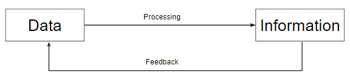
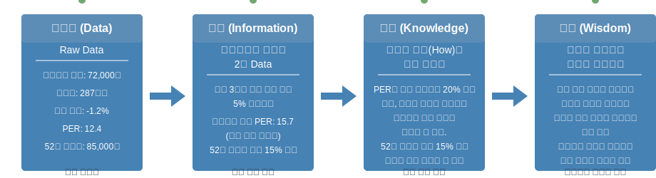
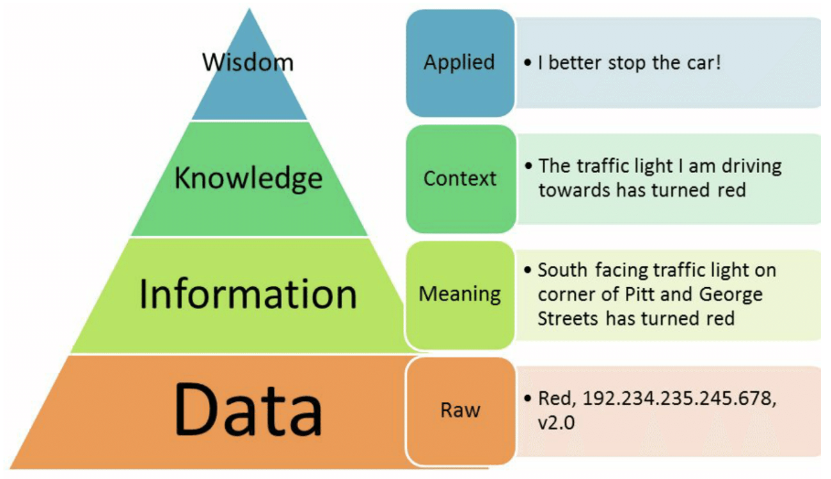
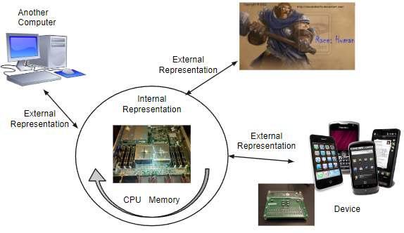

# Representation of data within a computer system.

## 1. Data vs. Information

{style="display: block; margin:0 auto; width:500px"}

`Data`
: 어떤 처리가 이루어지지 않은 상태의 character(문자)나 number(수치), image(그림) 등으로  
***단순히 측정하고 수집된 것*** 을 의미함.  
어떤 의미나 목적을 포함하지 않고 수집 측정된 raw data를 의미.  
주로 컴퓨터에 입력되는 데이터를 의미.  
`단순한 사실의 나열`이라고 생각하면 됨.

`Information`
: 어떠한 목적이나 의도에 맞게 ***data를 가공 처리한 것***.  
어떤 목적에 의해 유용하게 사용할 수 있는 것을 information이라고 함.  
`의미있는 Data`라고 생각하면 됨.

> data를 처리하여 information으로 만들고,  
해당 information으로 decision making이나 task가 수행된다.

다음과 같이 4단계로 나누어서 구분하기도 함: `DIKW` 

{style="display: block; margin: 0 auto; width:700px"}

* original : [~~정보의 진화단계 - 2025.2 링크 끊김~~](http://egloos.zum.com/yjhyjh/v/39721)

---
### 참고: DIKW Pyramid
{style="display: block; margin: 0 auto; width:500px"}

* [ref.](https://www.facebook.com/photo?fbid=305573416480146&set=a.302919646745523&locale=ko_KR): SK T-Brain's Facebook.
* 정보의 진화 단계를 설명하는 DIKW 피라미드임. 
* 인간은 데이터로부터 정보를 구성하는 과정을 자연스럽게 수행하며, 이 능력을 "지능" 이라고 정의함.
* 컴퓨터가 이러한 지능을 갖게 하는 것이 곧 인공지능 연구의 목표라고 볼 수 있음.

> "지능"에 대한 정의는 매우 여러가지이며, 위의 정의는 그 중 한가지임.

---
하지만 많은 경우, data와 information은 구분하지않고 사용된다. 

>보통 input으로 사용되는 ^^[측정](https://dsaint31.tistory.com/469#%EC%B0%B8%EA%B3%A0%3A%20Measurement(%EC%B8%A1%EC%A0%95)%EC%9D%B4%EB%9E%80%3F-1-4) 등으로 획득된 data를 **raw data**^^ 라고 부르며, 처리 등을 거치고 나서도 거의 **data** 라고 부름.

---

---

## 2. Computer and Data

Computer의 또다른 정의는 다음과 같다.  

    **Computer** :  
    외부로부터 입력된 값을 받아들여 처리한 결과를  
    출력시키거나 장래에 사용하기 위해 보관하는 장치

이를 줄여서 말하면 ***Data를 처리하여 information를 얻는 장치*** 라고 할 수 있다.

> Computer의 다른 이름인  
> 
> * Electronic Data Processing System(EDPS),  
> * Automatic Data Processing System(ADPS) 
>  
> 들은 ***data processing에 초점*** 을 둔 경우이다.

---

Computer가 다루는 information들은 다음과 같다.

* Data
    * Numerical data : Number (real number, natural number, integer, ...)
    * Non-numerical data : Letter (or `char`actor), Symbol
* Data structure (자료구조)
    * Linear Lists, 
    * Trees, 
    * Rings, 
    * etc
* Program (Instruction set)

---

---

## 3. Data Representation

Computer 가 다루는 data들은 computer의 내부 및 외부에서 다양한 representation을 가지게 된다.

{style="display: block; margin: 0 auto; width:500px"}

> 내부에서 사용되는 표현은 주로 ***계산을 위한 경우*** 로  
> 이진수를 기반으로 하는 numerical data 중심이며,  
> ^^외부와의 Information exchange (정보교환) 을 위해 사용되는 표현은 code^^ 등을 기반으로 하는  
> non-numerical data 중심(주로 `str` 로 표현됨)이라고 볼 수 있다.

---

다음과 같이 data 종류 및 용도에 따라 

* Internal Representation과 
* External Representation으로 

바뀌어 컴퓨터에서 사용된다. 

---

`Numbers` (for computing)
: Most of numbers stored in the computer are eventually changed by some kinds of calculations

* ***Internal*** Representation ***for calculation*** efficiency.
* Final results need to be converted to as External Representation for presentability.

`Alphabets`, `Symbols`, and `some Numbers` 
: Elements of these information do not change in the course of processing

* ***No needs for Internal Representation*** since they are not used for calculations
* External Representation ***for processing and presentability***

---

---

## 4. Operations

Computer가 Data를 처리하는 ***연산*** 을 가르킴.

* Computer가 수행하는 작업을 가리키는 `Instruction`과 비슷하게 사용되지만,
* <u>`operation`은 주로 숫자 또는 논리 연산을 의미</u>하고 
* <u>`instruction`은 자료의 로딩, 복사 등의 컴퓨터가 수행하는 작업들의 기본 단위 명령어</u>를 의미하는 경우로 많이 사용됨.

> `Operation`은 수학 등에서 정의되는 경우가 많음.  
>   
> 수학에서의 `Operation`이란  
> 
> * Empty set이 아닌 `set`에서 
> * 2개의 element를 이용하여 제 3의 element를 만드는 것을 가르킴.
>
> 위는 algebraic operations 중 binary operation을 말한 것으로  
> `Algebraic Operations`  란 특정 `set` 위에 정의된 연산으로, 그 연산의 결과가 다시 그 `set`의 원소가 되는 연산을 가리킴.

---

Operation의 구분은 operand (피연산자)의 갯수에 따라 다음과 같이 구분됨.

* **Unary**
    * 1개의 operands(or inputs), 1개의 output.
    * `shift`, `move`, `not`
* **Binary**
    * 2개의 operands(or inputs), 1개의 output.
    * `and`, `or`, 사칙연산
* **Ternary** 
    * 3개의 operands(or inputs), 1개의 output.
    * Programming Language 에서 가끔 등장!
    * conditional operator라고도 불림.
    * Python: `status = "adult" if age>=19 else "minor"`
    * C: `char* status = age >= 19 ? "adult" : "minor"`     

---

operand 의 type에 따라 다음으로도 나뉨.

* Numerical Operators (or Arithmetic Operators)
* Logical Operators (or Boolean Operators)

추가적으로 다음의 operator도 존재:

* Relational Operators
* Membership Operators
* Assignment Operators
* Shift Operators
* Bitwise Operators