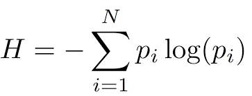

# Information (정보)

어떠한 목적이나 의도에 맞게 `Data`를 ^^가공 처리한 것^^ 을 가리킨다.  

> 간단하게는 `의미있는 Data`라고 생각할 수 있다.  
  
하지만 이 설명은 일종의 정성적인 설명임: 단순히 `Data`와 차이를 설명한 것임. 

다음과 같이 정량적으로 정보의 "양" (평균정보량, entropy)을 산출할 수도 있음.

{style="display: block; margin: 0 auto; width=400px"}

---

정량적인 부분을 도입한  
`Amount of Information (정보량)`으로 설명하면 다음과 같다.  
  
> 정보량은  
> 
> * `학습(어떤 사실을 알게된 경우)`의 결과로 인한  
> * `놀람의 양(degree of surprise)` 로 해석할 있다.

- 빈번하게 일어날 것 같지 않은 Event (발생확률 $p$가 매우 작음)가 발생하는 경우 (=발생함을 알게 된 경우),  
빈번하게 일어나는 Event가 일어나는 경우보다 더 많은 Information 을 획득.
- 항상 발생하는 Event가 발생 할 경우,  
우리가 얻는 Information의 양은 없음 (=0)

위의 Information의 개념을 적용한다면,  
우리는 이제 특정 Event가 발생할 경우 얻어지는 ^^정보량 $h(x)$^^ 이  
해당 Event 의 발생확률 $p(x)$에 의해 결정된다고 볼 수 있다.

---

---

## 1. 정보량 : bit

어떤 Discrete Random Variable $x$ 에서  
해당 $x$ 의 값을 알게 되는 경우 얻게되는 정보량을  
Shannon이 제안한 방식으로 정량화하면 다음과 같은 수식이 된다.

$$
h(x)=-\log_2p(x)
$$

- $h(x)$ : 확률변수가 $x$ 값을 가질 때의 정보량
- $p(x)$ : 확률변수가 $x$ 값을 가질 확률.

> $\log$를 사용하여, $[0,1]$의 probability를 $[-\infty, 0]$으로 펼쳐주고,  
> `negation` 으로 처리하여 quantity of information이 $[0,\infty]$ 의 범위에 존재하게 처리.

확률변수가 가질 수 있는 값은  

* 다양한 경우의 수를 가지는 경우보다,  
* `0` 또는 `1`을 가지는 경우로 한정 (binary)하는 것이 가장 기본적이라고 볼 수 있다 (예: 특정 event의 발생 유무).

이는 Information을 다루는 컴퓨터가 기본적으로 이진수를 사용하는 것과도 연관된다.

---

위의 정보량의 수식에서 

* 흔히 $\log$의 base(밑수)는 2를 사용하며 
* 이 경우 정보량의 단위가 바로 `bit` (binary digit의 약자)가 된다.

> 참고로 밑수가 2인 $\log$ 가 아닌  
> 자연로그 $\ln$를 사용하는 경우도 많은데  
> 이 경우 단위는 `Nat` ($\approx 1.443\text{bit}$) )이 된다.

---

---

## 2. Entropy : 평균 정보량

$x$가 $0,1,\cdots,n$ 의 값을 가지는 random-variable일 때, 
이 random-variable(확률변수) $x$에 대한 평균 정보량이 바로 entropy임. 

이는 결국 해당 확률변수에서 기대되는 정보량(평균정보량) 이라고 할 수 있다.

$$
H[x]=-\sum_{x=0}^n p(x)\log_2{p(x)}
$$

- 확률변수가 절대 될 수 없는 값이 있을 경우, 해당 값의 발생확률이 $p(x)=0$이 되므로 이는 entropy 에 기여 없음.
- 확률변수가 특정 상수로 고정될 경우, $p(x)=1$이기때문에 $\log_2p(x)=\log_21=0$이 되므로 entropy가 0이 됨.

---

위의 경우는 discrete한 경우이며, continuous random variable의 경우는 다음과 같음.

$$
H(x)=-\int_{-\infty}^{\infty}p(x)\log_2{p(x)}dx
$$

Noiseless coding theorem (Shannon, 1948)에서  
Entropy가 평균정보량으로 제안되었고  
Entropy는  
***특정 데이터를 처리하는데 필요한 bit수의 lower bound를 계산*** 하는데 많이 이용된다.

- Entropy는 random variable의 상태를 전송하는데 필요한 bit 수의 Lower Bound라고 볼 수 있음.
- 예를 들어 엔트로피가 `3.4` 라면 결국 `4bit` 이상이 필요하다.

---

---

## 참고: Entropy가 극대화 되는 경우는 언제인가?

Discrete random variable의 경우에는

* 해당 변수가 가질 수 있는 값들의 발생확률이 모두 같은 경우, 
* 즉, 해당 확률변수가 **Uniform Probability Distribution** 인 경우 **Entropy가 최대** 임.

Gaussian probability distribution을 따르는 **Continuous random variable** 의 경우, 

* **해당 분포의 Variance, $\sigma^2$ 가 클 수록** **entropy가 증가** 함.
* **Gaussian probability distribution** 에서 variance가 무한대일 경우 entropy는 최대가 됨.

> 참고로, Gaussian Probability Distribution에서  
> Variance가 무한대인 경우가 
> 바로 **uniform probability distribution** 임.

---

## 참고: Gaussian Distribution (Normal Distribution)

$$
p(x)=\frac{1}{\sqrt{2\pi\sigma^2}}\exp\left(-\frac{(x-\mu)^2}{2\sigma^2}\right)
$$

* $\sigma$ : standard deviation
* $\mu$ : mean

---

---

## 같이 보면 좋은 자료들

* [Logarithmic Function](https://dsaint31.tistory.com/578)
* [Random Variable](https://dsaint31.tistory.com/466)
* [Entropy](https://dsaint31.tistory.com/291)