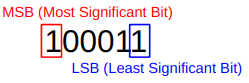

# MSB and LSB

MSB는 `M`ost `S`ignificant `B`it의 약어이고, LSB는 `L`east `S`ignificant `B`it의 약어임.

> Computer people are fond of ***three-letter acronyms!*** 

2진수 표기시 가장 왼쪽에 있는 bit가 `MSB`이고, 가장 오른쪽에 있는 bit가 `LSB`가 됨.  

{style="display: block; margin:0 auto; width:300px"}

내 월급(or 용돈)을 2진수로 표기시 ^^어느 자리 숫자가 중요한지^^ 를 생각해보면 쉽게 해당 용어를 익힐 수 있다.

* Positive Integer 만을 표시하는 `Unsigned` 경우에는 가장 큰 자리수가 된다.
* Negative Integer를 고려할 경우, `MSB`는 Positive인지 Negative인지를 나타내는 sign이 됨.
    * `0` : positive.
    * `1` : negative.