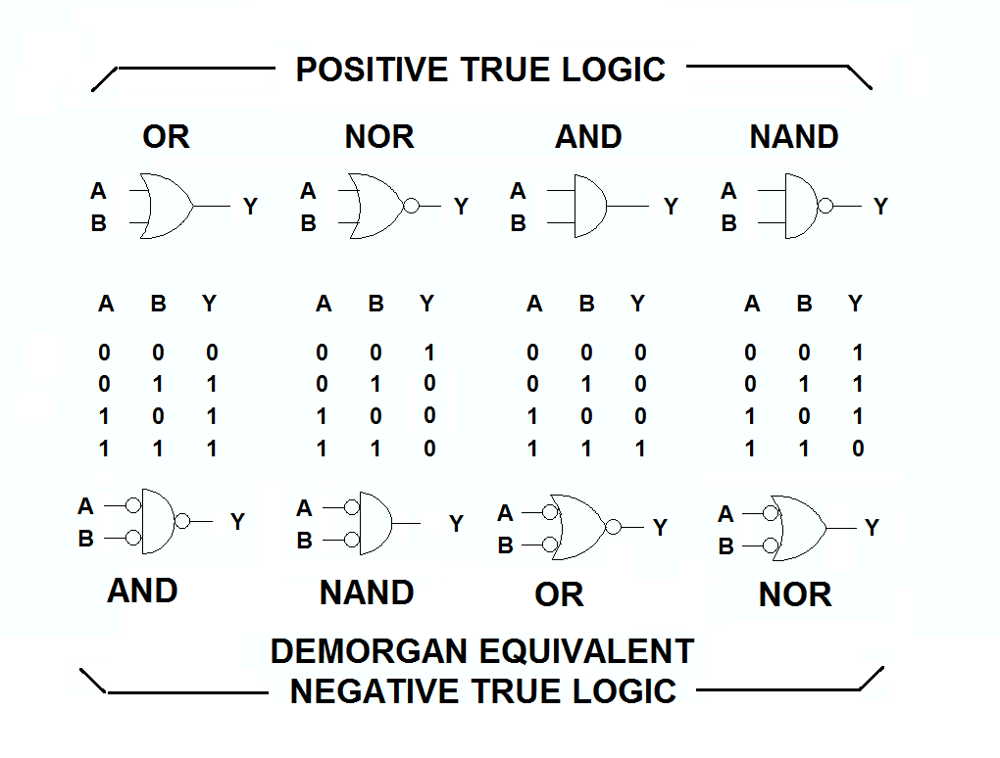
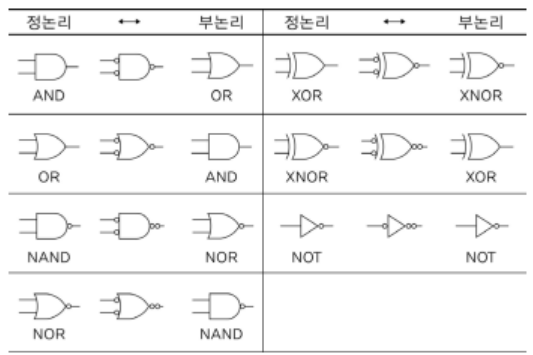

# Boolean Algebra

{style="display:block; margin: 0 auto; width=500px"}

George Boole(1815-1864, 영국)이 고안한 logic을 다루는 algebra로  
"True, False를 수학적인 영역으로 포함"시켜  
참과 거짓을 `1`,`0`에 대입하고, `AND`, `OR`, `NOT` 등의 Logical Operation을 사용하여 논리적 동작(논리회로의 동작)을 대수적으로 처리한다.  

> 즉, `bit`들을 이용한 Logical Operation들에 대한 규칙들을 정의하고 있다.

* 참고로 boolean algebra의 연산들을 구현하고 있는 IC를 가리켜 (logic) gate라고 부름.
* [logic gate란](https://dsaint31.tistory.com/406)

---

---

## Pre-requirements

`Operation`
: `Algebraic Operations` 이 흔히 애기하는 Operation인데,  
이는 특정 `Set` 위에 정의된 ***연산*** 으로,  
그 연산의 결과가 다시 그 `Set`의 원소가 되는 연산을 가리킴.

`Logical Operation`
: 논리 연산 (logical operation, logical connective) 혹은 불 연산 (`Boolean Operation`)은  
`True`, `False` 두 가지 element(원소, 집합을 이루는 개체)만 존재하는 Set(엄밀하게는 ring 으로 불림)에서의 Operation.  
(즉, 결과값도 `True` 또는 `False`가 됨.)

`Algebra`
: 변수(variables)와 연산(operations)을 사용하여  
수학적 구조(mathematical structures)와 관계(relationships)를  
연구하고 다양한 문제를 해결하는 학문.

> 때문에 `algebra`는 ^^임의의 집합(e.g., vector set)^^ 과 해당 집합에 대한 ^^연산(e.g., vector sum, scalar multiple)을 정의^^ 하고 이를 묶은 것을 가르키기도 함. 이같은 대수적 구조의 예로 `linear algebra`의 vector space를 들 수 있음.

---

---

## Rules

* Associative Rule (결합) : $(a \text{ AND } b) \text{ AND } c = a \text{ AND } (b \text{ AND } c)$
* Commutative Rule (교환) : $a \text{ AND } b = b \text{ AND } a$
* Distributive Rule (분배) : $a \text{ AND } (b \text{ AND } c) = (a \text{ AND } b) \text{ AND }(a \text{ AND } c)$

---

---

## Basis Operations

연산들의 정의는 아래 Truth Table (진리표)를 확인하라.

* `NOT` 
* `AND`
* `OR`

---

---

## Composite Operations

연산들의 정의는 아래 Truth Table (진리표)를 확인하라.

* `NAND`
* `NOR`
* `XOR` : eXclusive OR

Composite Operation은 이름 그대로 Basic Operation들의 조합으로 만들어질 수 있다.
예를 들어 `a XOR b = (a OR b) AND NOT (a AND b)` 가 성립한다.

---

---

## Symbols and Truth Table

{style="display: block; margin:0 auto; width:500px"}

* `NOT`의 경우, symbol에서 `NAND`나 `NOR`, `XNOR`에서 보이듯이 
* 작은 circle (or bubble)로 대체됨.

---

---

## De Morgan's Law

1800년대 Augustus De Morgan이 Boolean Algebra에 추가한 규칙  

Logic Operation에서 

* `OR`와 `NOT`으로 표현된 expression을 
* `AND`와 `NOT`으로 표현된 expression으로 바뀌어질 수 있음을 보여준다.

> 학부에서 디지털 회로 또는 컴퓨터 개론 등에서  
> combinatorial logic gate를 배울 때 만나는 중요 규칙.

명제(논리학)를 이용한 표현은 다음과 같음.

$$ \begin{aligned}\neg(p \vee q) =\neg p \wedge \neg q \\ \neg(p \wedge q) =\neg p \vee \neg q \end{aligned} $$

Set(집합)을 이용한 표현은 다음과 같음.

$$ \begin{aligned}(A \cup B)^C =A^C \cap B^C \\ (A \cap B)^C =A^C \cup B^C \end{aligned} $$

디지털 회로등에서의 표현은 다음과 같음.

$$ \begin{aligned}\overline{(A + B)} =\overline{A}\cdot \overline{B} \\ \overline{(A \cdot B)} =\overline{A} + \overline{B} \end{aligned} $$

De Morgan's Law를 통해, `Negative Logic`을 사용할 수 있다.

> Digital System등에서 나오는 개념으로  
> high voltage와 low voltage에 논리값을 할당하는 종류 중 하나임.  
> high voltage에 1을 low voltage에 0을 할당하는 경우가 `positive logic`이라고 불리며,  
> 반대로 high voltage에 0을 low voltage에 1을 할당하는 경우는 `negative logic`이다. 

다음의 Truth Table은 같은 logic을 positive logic(좌)과 negative logic(우)으로 표현한 예를 보여준다.

| 좋은 심성 | 좋은 능력 | 배우자감 | |좋지않은 심성| 좋지않은 능력 | 배우자감 아님|
|:---:   |:---:    |:---: |---|:---:     | :---:    |:---:     |
| F       | F      | F    | | T          | T         |T          |
| F       | T      | T    | | T          | F         |F          |
| T       | F      | T    | | F          | T         |F          |
| T       | T      | T    | | F          | F         |F          |

왼쪽의 positive logic은 `OR` 연산의 결과이며, negative logic에서는 `AND`에 해당된다  
(위의 DeMorgan's Law가 들어맞음.)

> Positive Logic에서의 `OR`는 Negative Logic에서는 `AND`로 설명되어진다.

다음은 Positive Logic(정논리)와 Negative Logic(부논리)간의 Gate들의 관계를 보여준다.

{style="display: block; margin:0 auto;width:500px"}
<figcaption>original : https://electronics.stackexchange.com/questions/53019/negative-logic-and-positive-logic-gates</figcaption>

{style="display: block; margin:0 auto;width:400px"}
<figcaption>original : '디지털 논리회로 이해', 오창환 저, 한국학술정보(주)</figcaption>

> 쉽게 생각해서, `AND` Gate의 등가는  
> 모든 입출력에 `NOT`을 붙이고,  
> `AND`를 `OR`로 바꿔주면 된다.  
> 이를 나타내고 있는 것이 바로 De Morgan's Law임.