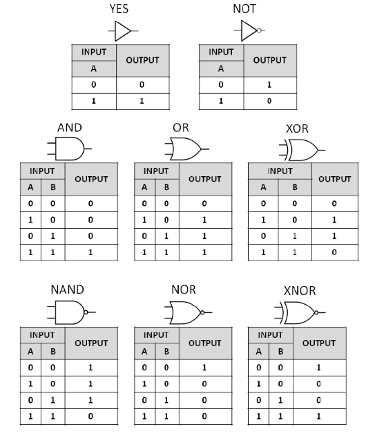

# Boolean Algebra

George Boole(1815-1864, 영국)이 고안한 logic을 다루는 algebra로  
"True, False를 수학적인 영역으로 포함"시켜  
참과 거짓을 `1`,`0`에 대입하고, `AND`, `OR`, `NOT` 등의 logical operation을 사용하여 논리적 동작(논리회로의 동작)을 대수적으로 처리한다.  

> 즉, `bit`들을 이용한 logical operation들에 대한 규칙들을 정의하고 있다.

## Pre-requirements

`Operation`
: empty set이 아닌 set에서 2개의 element를 이용하여 제 3의 element를 만드는 것을 가르킴.

`logical operation`
: 논리 연산 (logical operation, logical connective) 혹은 불 연산 (boolean operation)은 `True`, `False` 두 가지 element(원소, 집합을 이루는 개체)만 존재하는 Set(엄밀하게는 ring 으로 불림)에서의 operation. (즉, 결과값도 `True` 또는 `False`가 됨.)

`algebra`
: 간단한 정의로 애기하면 "set of rules for operating on numbers"으로, number사이의 관계를 문자(
$x$ 등의 변수)를 사용하여 간단하게 나타내는 것(변수에 대입)과 이를 이용하여 효율적으로 계산(방정식 풀기)하는 기술을 가르킨다. 좀더 학문적으로 애기한다면, ^^어떤 set(집합)과 해당 set에 속한 element들을 이용하도록 정의된 operation(연산)들에 대한 규칙을 연구하는 학문^^ 이다.

> 때문에 `algebra`는 ^^임의의 집합(e.g., vector set)^^ 과 해당 집합에 대한 ^^연산(e.g., vector sum, scalar multiple)을 정의^^ 하고 이를 묶은 것을 가르키기도 함. 이같은 대수적 구조의 예로 `linear algebra`의 vector space를 들 수 있음.

## Rules

* Associative Rule (결합) : $(a \text{ AND } b) \text{ AND } c = a \text{ AND } (b \text{ AND } c)$
* Commutative Rule (교환) : $a \text{ AND } b = b \text{ AND } a$
* Distributive Rule (분배) : $a \text{ AND } (b \text{ AND } c) = (a \text{ AND } b) \text{ AND }(a \text{ AND } c)$

## Basis Operations

연산들의 정의는 아래 Truth Table (진리표)를 확인하라.

* `NOT` 
* `AND`
* `OR`

## Composite Operations

연산들의 정의는 아래 Truth Table (진리표)를 확인하라.

* `NAND`
* `NOR`
* `XOR` : eXclusive OR

composite operation은 이름 그대로 basic operation들의 조합으로 만들어질 수 있다.
예를 들어 `a XOR b = (a OR b) AND NOT (a AND b)` 가 성립한다.

## Symbols and Truth Table

* `NOT`의 경우, symbol에서 `NAND`나 `NOR`, `XNOR`에서 보이듯이 작은 circle (or bubble)로 대체됨.

## De Morgan's Law

1800년대 Augustus De Morgan이 Boolean Algebra에 추가한 규칙  
logic operation에서 `OR`와 `NOT`으로 표현된 expression을 `AND`와 `NOT`으로 표현된 expression으로 바뀌어질 수 있음을 보여준다.

> 학부에서 디지털 회로 또는 컴퓨터 개론 등에서 combinatorial logic gate를 배울 때 만나는 중요 규칙.

명제(논리학)를 이용한 표현은 다음과 같음.

$$ \begin{aligned}\neg(p \vee q) =\neg p \wedge \neg q \\ \neg(p \wedge q) =\neg p \vee \neg q \end{aligned} $$

Set(집합)을 이용한 표현은 다음과 같음.

$$ \begin{aligned}(A \cup B)^C =A^C \cap B^C \\ (A \cap B)^C =A^C \cup B^C \end{aligned} $$

디지털 회로등에서의 표현은 다음과 같음.

$$ \begin{aligned}\overline{(A + B)} =\overline{A}\cdot \overline{B} \\ \overline{(A \cdot B)} =\overline{A} + \overline{B} \end{aligned} $$

De Morgan's Law를 통해, negative logic을 사용할 수 있다. 

다음의 Truth table은 같은 logic을 positive logic(좌)과 negative logic(우)으로 표현한 예를 보여준다.

| 좋은 심성 | 좋은 능력 | 배우자감 | | 좋지않은 심성 | 좋지않은 능력 | 배우자감 아님|
|:----:   |:----:    |:----: |---|:----:     |  :----:     |:----:     |
| F       | F         | F    | | T           | T           |T          |
| F       | T         | T    | | T           | F           |F          |
| T       | F         | T    | | F           | T           |F          |
| T       | T         | T    | | F           | F           |F          |

왼쪽의 positive logic은 `OR` 연산의 결과이며, netative logic에서는 `AND`에 해당된다 (위의 DeMorgan's Law가 들어맞음.)
