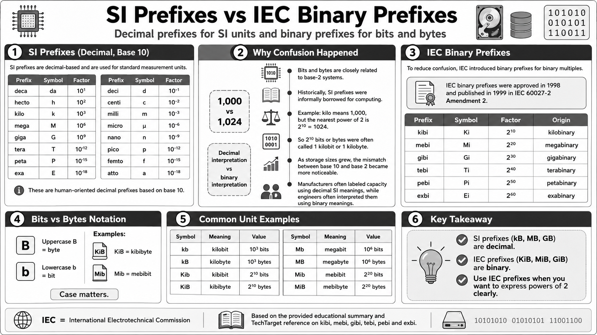

---

title: SI Prefixes and IEC Binary Prefixes
tags: [Kibi, Mebi, Gibi, Tebi, Pebi, Exbi]
------------------------------------------

# SI Prefixes and IEC Binary Prefixes

{style="display:block; margin: 0 auto;width:600px"}

## Prefixes for SI Units

우리가 일반적으로 사용하는 prefix들은 SI Unit (국제단위, gram, meter 등등)을 위한 것들이며 십진수 기반임.

| Prefix | Symbol |   Factor  |   | Prefix | Symbol |   Factor   |
| :----: | :----: | :-------: | - | :----: | :----: | :--------: |
|  deca- |   da   |   $10^1$  |   |  deci- |    d   |  $10^{-1}$ |
| hecto- |    h   |   $10^2$  |   | centi- |    c   |  $10^{-2}$ |
|  kilo- |    k   |   $10^3$  |   | milli- |    m   |  $10^{-3}$ |
|  mega- |    M   |   $10^6$  |   | micro- |  $\mu$ |  $10^{-6}$ |
|  giga- |    G   |   $10^9$  |   |  nano- |    n   |  $10^{-9}$ |
|  tera- |    T   | $10^{12}$ |   |  pico- |    p   | $10^{-12}$ |
|  peta- |    P   | $10^{15}$ |   | femto- |    f   | $10^{-15}$ |
|  exa-  |    E   | $10^{18}$ |   |  atto- |    a   | $10^{-18}$ |

* 이들의 단위들은 ^^인간을 위한 것^^ 이므로 `base`를 `10`으로 사용하고 있다.

`bit`와 `byte`의 경우,

* `base-2 system`과 밀접하게 관련되기 때문에
* 실제로는 ***2의 제곱*** 으로 표현되는 것이 자연스러움.

하지만 과거에는 ^^bit나 byte에 대한 prefix도 SI unit의 prefix를 차용해서 사용^^ 했다.
이때 단순히 SI prefix를 그대로 사용한 것이 아니라, SI Unit의 prefix에 ^^가장 가까운 2의 제곱값을 대응^^ 시킴.

* 컴퓨터 초기에는 `kilobits` 또는 `kilobytes` 를 많이 사용함.
* `kilo-`가 의미하는 1,000에 가장 가까운 2의 제곱값이 바로 $2^{10}=1024$ (2의 10승, 2 to the power 10)이기 때문에,
* 원래는 $2^{10}$ bits 또는 $2^{10}$ bytes인 것을 그냥 1 kilobit 또는 1 kilobyte라고 부르는 식으로 사용함.

문제는 이런 암묵적인 차용 때문에 base(밑수)를 10으로 보는 사람과 2로 보는 사람들 사이에서 오차가 발생한다는 점임.

Storage 기술이 발전하면서 더 큰 prefix가 사용되기 시작했고, 이로 인해 오차는 점점 더 커지게 됨.

* 실제로 storage를 판매하는 회사들은 ^^SI Unit에서의 prefix로 계산, 즉 밑수를 10으로 사용^^ 하여 제품의 저장용량을 표시했고,
* 이를 사용하는 기술자들은 프로그래밍에 익숙하기 때문에 2를 밑수로 하여 해당 용량을 이해하는 경우가 많았다.

이러한 혼동을 줄이기 위해 IEC가 2진 배수(binary multiples, bit와 byte를 단위로 하는 경우를 의미)를 위한 새로운 prefix를 제안하고 표준화하게 됨.

> IEC binary prefix는 1998년에 승인되었고, 1999년에 IEC 60027-2 Amendment 2로 출판함.

하지만 아직도 많은 사람들이 SI unit의 prefix를 2진 prefix처럼 이해하고 사용하고 있는 것이 현실임.

> IEC : International Electrotechnical Commission.

---

## IEC Binary Prefixes

앞서 설명한 IEC가 정한 binary multiples를 위한 prefix는 다음과 같음:
(가급적, bit나 byte 관련 2진 배수를 나타낼 때는 이 IEC Standard Prefix를 사용할 것)

| Prefix | Symbol |  Factor  |   Origin   |
| :----: | :----: | :------: | :--------: |
|  kibi- |   Ki   | $2^{10}$ | kilobinary |
|  mebi- |   Mi   | $2^{20}$ | megabinary |
|  gibi- |   Gi   | $2^{30}$ | gigabinary |
|  tebi- |   Ti   | $2^{40}$ | terabinary |
|  pebi- |   Pi   | $2^{50}$ | petabinary |
|  exbi- |   Ei   | $2^{60}$ |  exabinary |

`KiB`는 `kibibyte`를 의미하고, `Mib`는 `mebibit`를 의미한다.

* 대문자 `B`는 관례적으로 byte를
* 소문자 `b`는 bit를 의미하나, 문맥에 따라 다를 수 있으니 주의할 것.

예를 들어 다음과 같이 구분할 수 있음.

| Symbol | Meaning  | Value          |
| :----: | :------- | :------------- |
|   kb   | kilobit  | $10^3$ bits    |
|   kB   | kilobyte | $10^3$ bytes   |
|   Kib  | kibibit  | $2^{10}$ bits  |
|   KiB  | kibibyte | $2^{10}$ bytes |
|   Mb   | megabit  | $10^6$ bits    |
|   MB   | megabyte | $10^6$ bytes   |
|   Mib  | mebibit  | $2^{20}$ bits  |
|   MiB  | mebibyte | $2^{20}$ bytes |

주의할 점은 `KB`, `MB`, `GB` 같은 표기가 문맥에 따라 애매하게 쓰이는 경우가 많다는 점임.
엄밀하게는 SI prefix를 따르면 `kB`, `MB`, `GB`는 각각 $10^3$, $10^6$, $10^9$ bytes를 의미한다.
반면 $2^{10}$, $2^{20}$, $2^{30}$ bytes를 명확히 나타내고 싶다면 `KiB`, `MiB`, `GiB`를 사용하는 것이 좋다.

## 참고자료

* techtarget's [kibi, mebi, gibi, tebi, pebi and exbi](https://www.techtarget.com/searchstorage/definition/Kibi-mebi-gibi-tebi-pebi-and-all-that)
