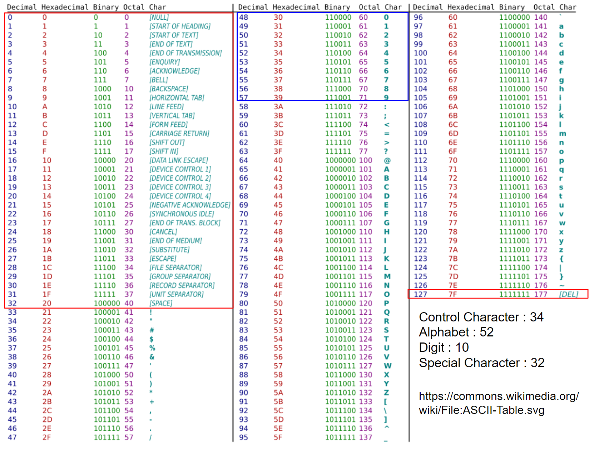
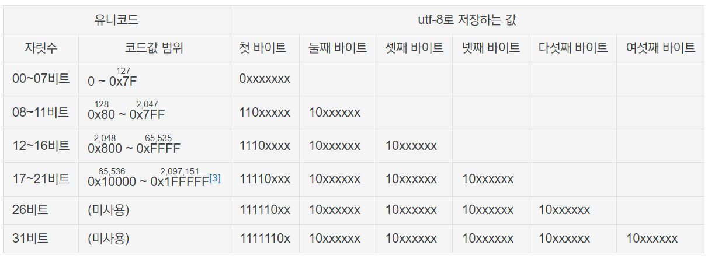
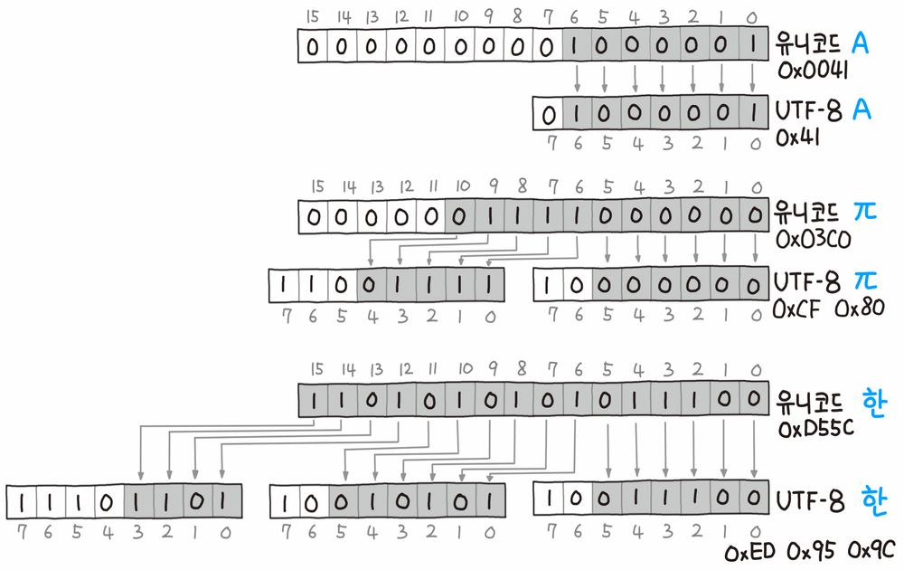

# Codes for Characters

> ***Code*** 란  
> 
> 특정 형태의 information을  
> 다른 방법으로 표현하는 **규칙** 또는 해당 규칙으로 표현된 **결과물** 을 가리킴.

문자를 나타내기 위한 code는  
**인간이 사용하는 문자** 를 일종의 **기호 또는 숫자로 표현** 하는 것을 의미한다.

* encoding : ^^대상 information을 code로 변환하는 과정 또는 규칙^^ 을 의미.
* decoding : code로부터 원래의 information으로 얻는 과정 또는 규칙을 의미.

문자를 나타내기 위한 code 중 가장 오래되었지만 여전히 사용되고 있는 ^^**ASCII** (American Standard Code for Information Interchange)^^ 가 가장 유명함.

하지만, 비영어권에서도 컴퓨터의 사용이 확장되면서 영문자만을 고려한 ASCII 외의 코드가 필요하게 되었고, 각 나라마다 자국어를 위한 고유의 코드들이 제안되던 시기를 거치게 됨 (1byte 또는 2bytes에 글자를 표현하기 위해 쥐어짜내던 시절). 

* 우리나라로 한정하면, 그 시기에 가장 많이 사용된 코드가 바로 `EUC-KR` 이며 아직까지도 사용됨.
* 비록 각 나라에서 제안된 코드들은 나름 효과적 (최소한 자국내에선) 이었지만, 
* 다국어를 한번에 처리할 필요성 (하나의 웹페이지에 여러 언어를 표기)이 점점 커지기 시작했고, 
* 이같은 요구에 의해 탄생한 것이 바로 Unicode 임. 

***Unicode*** 는 

* 전세계의 문자기호(고대문자나 음악기호, 수학기호 등도 포함)를 
* ***단일 코드 테이블로 표현*** 한 코드이며, 
* 이를 기반으로 하는 여러 encoding 방식을 가지고 있습니다.

> ***Unicode 간략 정리***
> 
> * Unicode 처음에는 ^^16bit를 기반으로 다양한 언어의 글자를 표현^^ 가능하도록 설계되었으나 
> * 현재는 ^^21bit로 확장^^ 됨.
> * 초기에 16bit로 충분하다고 생각했지만, 
> * 점점 더 많은 기호로 포함되었고 이는 보다 많은 bit를 요구하기에 이름.
>
> Unicode 와 관련 encodings
> 
> 1. 영문자만 사용하는 경우 8bit(사실은 7bit)의 `ASCII` 만으로도 충분하기 때문에, Unicode가 제안된 이후에도 서구권은 `ASCII` 만을 고려 및 지원하는 경우가 일반적이었음. 
> 2. 결국 기존의 `ASCII`와 같은 code 들과의 호환성을 유지하면서 Unicode를 사용할 수 있도록 해주는 encoding의 필요성이 요구됨.
> 3. 또한 너무 많은 bit를 요구한다는 단점으로 저장과 전송에 효율적인 bytes로 변환이 요구됨.
> 
> 이같은 이유로 Unicode는 일종의 code 값의 역할을 하고, 이를 **컴퓨터에서 실제 저장하는 `byte`는 다르게 하는 encoding 방식** 들이 개발되었고 사용되고 있음.
>   
> * 이는 기존의 code값이 곧 컴퓨터에서 사용하는 `byte` 값이었던 ASCII와 같은 이전 코드들과 unicode가 가지는 가장 큰 차이점임.

다음은 대표적인 code 들을 등장 시대 순으로 소개하고 있다.

---

## The American Standard Code for Information Interchange (ASCII)

컴퓨터 초창기에 다양한 code들이 제안되었으나, 1963년 개발된 `ASCII`가 사실상 표준으로 살아남았다. ASCII는 영문자를 처리하는데 아직까지도 널리 사용된다.  
  
`ASCII`는 7bit 만으로 다양한 *숫자기호* 와 *영문자들*, 그리고 *특수문자* 및 *Control character(제어문자)* 들을 표현한다.

> ^^7bit 만으로 표현^^ 되었지만, 컴퓨터가 발전하면서 한번에 처리하는 단위가 `byte`가 되면서 ASCII를 사용하는 데이터 type의 크기가 1byte가 되었다. C언어의 `Char` Data type이 가장 대표적인 ASCII 응용사례라고 할 수 있다.

ASCII 의 상세 구성은 다음과 같다.

* 34개의 Control Character (`NUL`포함)
* 94개의 Printable Character
    * 52개의 알파벳 대소문자
    * 10개의 숫자
    * 32개의 특수 문자



> `ASCII`는 이름에서 알 수 있듯이 ***Information Interchange*** 를 위해 만들어진 것이기 때문에, Control character의 상당수는 communication (통신)과 관련되어 있다. 현재는 이들 중 많은 경우가 사용되지 않는다.

---

## American National Standard Institute (ANSI)

간략히 애기하면 `ASCII`의 7bit를 기반으로 8bit로 확장을 한 code이다.  

후에 개발된 Unicode가 단일 테이블에 모든 문자를 표현하는 것과 달리 ANSI는 ***code page를 이용*** 하여 한번에 해당 code page에 해당하는 나라의 문자를 표현하는 방식을 취한다.  

* 즉, 128개는 ASCII 를 그리고 추가된 1 bit에 의해 늘어난 128개는 각국의 언어의 기호들이 할당되는 방식임. 

한글과 같은 경우에 128개로 부족하기 때문에, 

* 8bit를 더 할당하여 
* ***2byte를 사용*** 한다. 

`ANSI`를 이용한 대표적 한글 code는 `CP949`인데, 

* 해당 이름의 `949`는 ***code page를 지칭*** 한다. 
* 이는 Microsoft에서 제안한 방식이기 때문에 `MS949`라고도 불림.
* Windows OS에서 주로 사용되는데, 한국의 당시 OS는 거의 Windows였기 때문에 사실상 한글 표준으로 사용되었음. 
* 참고로 ^^완성형^^ 임. 

`ANSI` 방식은 ***자국어 만을 지원하는 경우에는 큰 문제가 없지만***, 영어 외의 다른나라 글자들을 동시에 표현해야하는 경우엔 사용이 어렵다는 단점을 가진다.

> ANSI는 ***미국 국가표준 협회 (American National Standard Institution)*** 의 약어로서, 엄밀하게는 encoding 의미하지 않고 해당 협회를 가리킨다고 볼 수도 있다.  
> 하지만, 해당 기관이 많은 표준안들을 제시하기 때문에 ***해당 협회가 정한 표준안*** 을 ANSI라고 지칭하는 경우가 많다.  
> 여기서는 encoding방식이지만, 다른 분야에서는 해당 협회가 제시한 그 분야 관련 표준안일 수 있다는 애기임.

---

## Extended Unix Code-Korea (EUC-KR)

이름에서 알 수 있듯이 ^^Unix 계열에서 한글 지원을 위해 등장^^ 한 encoding 방식이며, 2byte를 이용한 ^^완성형^^ 방식이다.  

* `CP949`와 마찬가지로 `ANSI`를 ^^한글 지원을 위해 확장한 형태^^ 이며,
* `CP949`와 마찬가지로 완성형의 한계로 인해 모든 한글을 표현하지 못한다(또한, `ANSI`의 단점도 그대로 가진다). 
* `CP949` 보다 먼저 개발되었고, 웹페이지 등에서 `CP949` 못지 않게 널리 사용되었다.

표현 가능한 한글 문자 수는 `CP949`보다 적었으나 인터넷에서 서버로 사용되는 장비의 OS가 주로 Unix 계열이었기 때문에 널리 사용되었다고 볼 수 있다.

---

---

---

## Unicode

전세계 문자와 기호를 하나의 테이블에 정리한 code:  
때문에 전세계의 문자를 일관되게 표현하고 다룰 수 있음.

> 지원되는 문자가 계속 추가되면서 필요한 bit 크기가 점점 늘어나고 있다  
> (사실 16bit면 충분할 것으로 생각했지만 현재는 21bit로 늘어났음.) 

한글 문자들의 code는 다음을 통해 확인 가능함. [Unicode:Hangul Syllables](http://unicode.org/charts/PDF/UAC00.pdf)

Unicode는 기존의 다른 code들과 달리 ***할당된 code와 다른 byte로 컴퓨터에서 저장*** 된다. 

* 이는 워낙 많은 문자와 기호를 지원하다 보니 code가 매우 긴 bit를 요구하기 때문임.
* 기존 encoding 방식들과의 호환성과 저장 및 전송에서의 효율성을 고려하여 Unicode의 code값을 컴퓨터에 저장되는 `bytes`로 변환하는 여러 encoding 방식이 제안.

> 위에서 `bytes` 라고 표현한 것은 컴퓨터에서 ***기본으로 byte 단위로 저장*** 이 이루어지 때문임.  
> 흔히 `bytes`는 컴퓨터에서 실제 저장되는 code(or 방식)를 지칭하다고 보면 된다.

---

---

### Code와 Encoding

앞서 살펴본 code와 encoding의 정의를 다시 표현하면 다음과 같다.

`code`
: 일상 생활에서 사용되는 문자나 숫자, 또는 정보를 컴퓨터 등에서 인식하기 쉬운 특정 기호로 기호화한 것.  
(보통 숫자, hexadecimal 또는 binary로 표현됨)

`encoding`
: 특정 데이터를 code로 바꾸는 것을 encoding이라고 함.  
역의 과정은 decoding이라고 한다.

Unicode는 "ASCII와 같은 단순한 encodings" 와 비교할 때 ^^훨씬 많은 bit를 요구^^ 하기 때문에 ***저장*** 및 ***전송*** 에 사용되는 bytes 를 Unicode의 코드값을 그대로 사용하지 않음.  

> Unicode를 사용할 때,  
> 글자 하나를 나타내는 Unicode의 code 값을  
> 그대로 2진수의 bytes로 변환한 것을 컴퓨터에서 사용하지 않는다.  

Unicode 에서는 ***저장 및 전송을 위해 bytes 로 encoding*** 하는 방법이 제공된다. 이를 위한 encoding으로는 다음이 대표적임.
 
* `UTF-8` (가변길이), 
* `UTF-16` (가변길이), 
* `UTF-32` (고정길이) 
 
이와 달리, `ANSI` 계열과 `ASCII`는 따로 ***저장 및 전송을 위해 bytes 로 encoding*** 하는 방법이 없고, ***code에 해당하는 이진수로 표기된 고정된 길이의 bytes가 그대로 저장 및 전송*** 된다.

> 참고로 `UTF-8` 또는 `UTF-16` 과 같은 ***가변길이방식*** 을  
> `multi-bytes` 라고 부름.

때문에, Unicode라 해도 실제 저장된 byte의 값을 보면 다를 수 있음을 유의해야 한다.

---

---

### Encodings for Unicode.

앞서 설명한대로 Unicode의 경우, code값과 bytes가 다르다. 이 둘 사이에도 변환이 이루어지기 때문에 이를 위한 encodings가 존재한다.

> ASCII 만을 배운 초보자의 경우, Unicode에서 code값과 실제 저장된 bytes의 값이 다른 경우 당황해하는 경우가 많다. 

이 절에서는 Unicode 에서 주로 사용되는 ***저장 및 전송을 위한 bytes 를 위한 encodings*** 을 간략히 다룬다.

---

***`UTF-16`***

* 초기에 가장 많이 사용된 encoding은 다국적 기업들이 적극적으로 사용한 `UTF-16`이었다. 
* 2 bytes를 통해 영어권과 유럽의 언어를 효과적으로 처리하는 장점을 가짐.
* 하지만, 특정 문자의 경우 4 bytes로 확장되어야하는 단점을 가졌고, 
* 특히 비영어권 개발자들에게 `UTF-16`은 기존의 `ANSI`보다 훨씬 불편한 방식이었음.
* 때문에 자국 이외의 국가에서 서비스해야 하는 경우를 제외하고는 기존의 `ANSI`계열의 encoding을 선호함.

---

***`UTF-8`***

이에 반해 같은 가변길이(multi-bytes)인 `UTF-8` 은 

* ^^단일 encoding으로서 다국어가 쉽고 효율적으로 처리^^ 하면서 
* Unicode 의 거의 모든 문자를 처리할 수 있게 해주는 장점을 보임.

때문에 개발자들에게 매우 적극적으로 도입되었고 현재는 사실상의 표준으로 자리를 잡음.

사실 `UTF-8`은 한글 만으로 한정짓게 되면 저장공간의 관점에선 효율적이지 않다. 

* 한글 문자 하나가 2byte로 처리가 가능한 `UTF-16`이나 `ANSI` 방식(`EUC-KR`, `CP949`)과 달리 
* `UTF-8`은 ^^3byte로 처리함.^^ 

하지만 storage 용량과 통신속도가 나날이 빨라지는 현실에서 ^^단일 방식으로 일관적이면서 쉽게 처리^^ 가 되는 `UTF-8`은 전세계의 개발자들에게 환영을 받았고, 거의 대부분의 unicode 지원 S/W들 및 programming languages가 `UTF-8`을 기본방식으로 사용하면서 ***실제적인 표준*** 이 됨. 

---

***`UTF-32`***

* 고정길이를 사용하며 어찌보면 가장 처리가 일관적인 방식이다. 
* 문자 하나에 4bytes를 쓴다는 단점이 무색해질 만큼 storage가 더욱 가격이 내려가고, 통신속도나 압축기술이 발전한다면 `UTF-8`을 대체할 수도 있을 듯...
* 하지만 현재는 아님.

이 문서에서는 `UTF-8` 만을 좀 더 자세히 다룬다.

---

#### UTF-8 (Universal Coded Character Set + Transformation Format – 8-bit)

Go언어 개발자로 더 유명한 `롭 파이크`가 `켄 톰슨`과 함께 개발한 Unicode encoding이다.  

* 한 문자를 표현하는데 1~4 bytes (Multi-bytes) 를 사용하며 
* 하위 1바이트 영역은 `ASCII`와 호환됨. 
  * `ASCII`로 충분한 영어권의 경우, 1 byte 만을 사용하는 효율성을 보이며 
  * 동시에 ***다국어 처리가 단일 방식으로 쉽게 처리*** 됨.

> 경쟁방식인 `UTF-16` 경우,  
> 다국적 기업들의 초기 전폭적인 지원이 있었음에도  
> `UTF-8`의 사용하기 쉽다는 장점을 넘지 못했다.  

가장 급격하게 대중화되고 있는 Python 3.x에서도 문자열은 unicode를 사용하며 UTF-8을 기본 encoding으로 채택하고 있다.

앞서 말한대로 `UTF-8`은 `가변길이(multi-bytes)`를 사용하며, 각 경우의 규칙은 다음과 같음.

* 1byte만을 사용하는 경우, `MSB`가 `0`으로 시작한다.
* 2bytes를 사용하는 경우, 상위 byte는 `110`으로 시작하고, 하위 byte는 `10`으로 시작한다.
* 3bytes를 사용하는 경우, 상위 bytes는 `1110`으로 시작하고, 2번째, 3번째 bytes는 `10`으로 시작한다.
* 4bytes를 사용하는 경우, 상위 byte는 `11110`으로 시작하고 나머지 byte들은 `10`으로 시작한다.

다음 테이블과 예를 참고하면 위의 규칙을 쉽게 이해할 수 있다.





---

#### Example for UTF-8

```Python
test = 'a가b나c다'
print('len of test:',len(test))
utf8_test = test.encode('utf-8')
print('len of utf8_test:',len(utf8_test),"/ type:",type(utf8_test))
```

* built-in function `len()`은 글자수를 반환한다.
* 특정 encoding으로 처리된 bytes에 대한 길이는 ***사용되는 byte 수*** 이다.
* 영문자는 1byte를 차지. ASCII!!
* 한글은 3bytes를 차지함.
