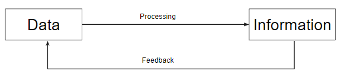

# Representation of data within a computer system.

## Data vs. Information

`Data`
: 어떤 처리가 이루어지지 않은 상태의 character(문자)나 number(수치), image(그림) 등으로 ***단순히 측정하고 수집된 것*** 을 의미함. 어떤 의미나 목적을 포함하지 않고 수집 측정된 raw data를 의미. 주로 컴퓨터에 입력되는 데이터를 의미.  
`단순한 사실의 나열`이라고 생각하면 됨.

`Information`
: 어떠한 목적이나 의도에 맞게 data를 가공 처리한 것. 어떤 목적에 의해 유용하게 사용할 수 있는 것을 information이라고 함.  
`의미있는 Data`라고 생각하면 됨.

data를 처리하여 information으로 만들고, 해당 information으로 decision making이나 task가 수행된다.

* original : [정보의 진화단계](http://egloos.zum.com/yjhyjh/v/39721)

하지만 많은 경우, data와 information은 구분하지않고 사용된다. 

>보통 input으로 사용되는 측정 등으로 획득된 data를 raw data라고 부르며, 이후엔 거의 data라고 부름.

## Computer and Data

Computer의 또다른 정의는 다음과 같다.
    외부로부터 입력된 값을 받아들여 처리한 결과를 출력시키거나 장래에 사용하기 위해 보관하는 장치

이를 줄여서 말하면 Data를 처리하여 information를 얻는 장치라고 할 수 있다.

> Computer의 다른 이름인 Electronic Data Processing System(EDPS), Automatic Data Processing System(ADPS) 들이 data processing에 초점을 둔 경우이다.

Computer가 다루는 information들은 다음과 같다.

* Data
    * Numerical data : number (real number, natural number, integer, ...)
    * Non-numerical data : Character, Symbol
* Data structure : 데이터 성분 사이의 구조
    * Linear Lists, 
    * Trees, 
    * Rings, 
    * etc
* Program(Instruction set)

## Data Representation

Computer 가 다루는 data들은 computer의 내부 및 외부에서 다양한 representation을 가지게 된다.

주로 내부에서 사용되는 표현은 이진수를 기반으로 하는 numerical data 중심이며, 외부와의 정보교환을 위해 사용되는 표현은 code 등을 기반으로하는 non-numerical data 중심이라고 볼 수 있다.

> 우리가 컴퓨터에게 숫자를 입력해도, 
