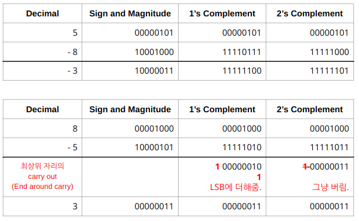
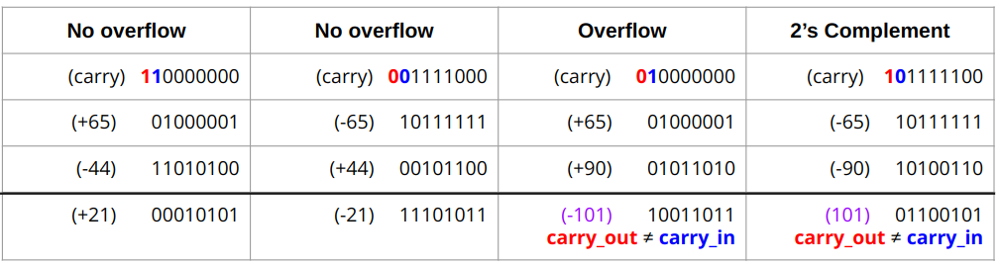

# Negative Number

컴퓨터에서 bit로 음수를 표현하는 방법은 크게 다음의 3가지가 있음.

* Sign and Magnitude
* 1's Complement (1의 보수)
* 2's Complement (2의 보수) \*\*

가장 널리 사용되는 방식은 **2's Complement** 이며, 앞의 방법들은 이를 이해하기 위한 stepping stone정도로 생각해도 된다.

## Sign and Magnitude

가장 simple한 방법. 

* `MSB`는 sign을 나타낸다.
* 나머지 bit들은 positive integer의 경우와 마찬가지로 magnitude를 나타냄.

> 공학에서 magnitude는 크기, 양 등을 나타내며, 보통 0이상의 양수를 value로 가짐.

`Sign and Magnitude`는 단점으로 `+0`과 `-0`의 표현이 각각 존재하게 된다. (같은 수이니 하나로 표현되어야 하는데 2개의 다른 표현형이 존재함.) 또한 logic operation으로 arithmetic operation을 구현하기 쉽지 않음.

## 1's Complement (1의 보수)

positive inteager표현에서 모든 bit에 `NOT`연산을 취함으로서 대응되는 negative inteager를 구하는 방법.

> `011` (=+3)의 모든 bit에 `NOT`을 취하면, `100`이 되며 이를 -3으로 삼는 방법이다. MSB가 `1`이면 negative가 됨.

`Sign and Magnitude`와 마찬가지로 `+0`과 `-0`의 표현이 각각 존재한다.

`Complement` (보수)란
: 기준수 $A$를 정했을 때, 임의의 수 $m$에 대한 complement $m^\prime$은 $A$에서 $m$을 빼서 $m’$이 되는 수를 말함. (이진수의 경우, $A=1$이 됨.)

## 2's Complement ***

2's complement는 negative integer를 구할 때 우선 1's complment을 구하고 여기에 1을 더해준다.

> `011` (=+3)을 예로 들면 1's complement인 `100`에 1을 더한 `101`이 바로 -3의 표현형이 된다.

zero에 대한 표현형이 하나가 되며, artithmetaic operation을 구하기도 간단하다.

## Complement에 의한 subtraction (뺄셈)

1's complement와 2's complement의 경우, 덧셈만으로 뺄셈의 구현이 가능함.

$$ x-m = x + (A-m) - A = x + m’ - A$$

마지막 항의 $A$를 빼주는 동작을 고려하면, Complement $m’$를 이용하여 덧셈으로 뺄셈을 구현할 수 있음.
  
이는, MSB에서 carry out (=End around carry)가 발생할 경우에

`1's complement`
: 해당 ^^MSB에서 carry out^^ 을 LSB에 더해주면 같은 효과임.

`2's complement`
: 해당 ^^MSB에서 carry out^^ 을 그냥 빼주면 됨.

다음 예를 통해 확인해 보자.

* 상단의 경우, MSB에서 carry out이 없는 경우로 complement를 사용할 때 그냥 더해주면 됨.
* 하단의 경우, MSB에서 carry out이 발생한 경우로 위에서 설명한대로 각각 처리하여 올바른 답이 나옴을 보여줌.
* `Sign and Magnitude` 방식은 그냥 더해서는 안되므로 뺄셈을 위한 별도의 처리기가 필요함.

## Overflow Detection for 2's Complement.

MSB에서의 carry in과 carry out이 같을 경우는 overflow가 아니지만, 이 둘이 다를 경우는 overflow임. 

* carry in : 이전 자리의 연산의 결과로 carry가 넘어온 것. 
* carry out : 현재 자리의 연산의 결과로 carry가 발생한 것.

* 왼쪽의 2개 경우는 overflow가 발생하지 않았으며, 결과가 제대로 나옴.
* 오른쪽의 2개의 경우는 overflow가 발생함. MSB에서의 carry in(푸른색)과 carry out(붉은색)이 다름을 확인할 수 있다.

## Summary

Negative integer를 표현 방법들의 비교를 요약하면 다음과 같음.

1. 음수 변환 수월함
    * `Sign and Magnitude` > `1’s Complement` > `2’s Complement`
2. Hardware 측면
    * `Sign and Magnitude`: adder와 subtractor 따로 필요. (구현복잡)
    * `1’s Complement`, `2’s Complement`: adder 만 있으면 충분.
3. 연산 속도
    * `2’s Complement` > `1’s Complement` : (end-around carry처리 필요)
4. Zero 의 유일한 representation.
    * `2’s Complement` 는 유일한 표현형 지원.

때문에, `2’s Complement` 가 사용됨.

