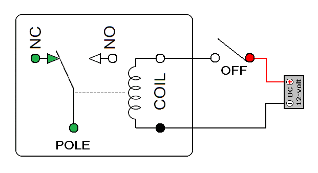
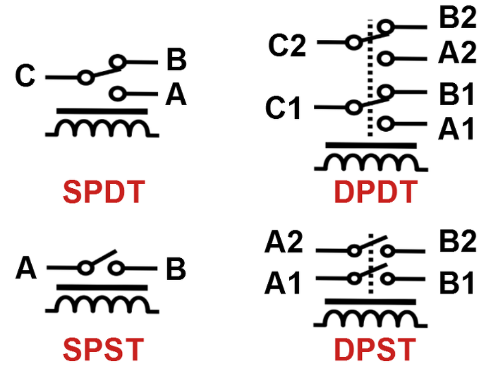

# Relay (계전기)

Electromagnet (전자석)을 이용한 일종의 Switch(스위치)임.  

> 반도체를 이용한 Contact Point가 없는 Relay인  
> Solid State Relay도 있으나  
> 여기선 `전기기계식 relay`만 설명한다.

---

---

## Relay 개요도

{style="display: block; margin:0 auto; width:400px"} 

- `NC`: Normally Closed 
    - 여기에 연결되면 circuit 이 closed 상태가 됨: `1` 
    - 위 그림에서는 전자석이 Off일 경우 연결되는 접점
    - 평소에 Switch가 닫혀 있음.
- `NO`: Normally Opened
    - 여기에 연결되면 circuit 이 open 상태가 됨: `0`
    - 위 그림에서는 전자석이 On일 경우 연결됨.
    - 평소에 Switch 가 열려 있음.

---

---

## Relay 동작방식

`Relay`에 전기가 가해지면 전자석에 의해 Switch가 켜지고(혹은 커지거나),  
전기가 끊기면 내부의 스프링에 의해 다시 꺼지는 (혹은 켜지는) 동작을 수행함.

* 일반적으로 전자석 제어용 전압/전류는 낮음 (위의 그림에서 DC 12-Volt 가 사용됨)
    * 12 Volts 가 컴퓨터에선 낮은 편은 아님.  
* 즉, 낮은 전압/전류를 이용하여 더 높은 전압/전류를 제어하는데 사용됨.

> 초기 컴퓨터에서 사용되었으나 ^^물리적으로 동작^^ 하는 소자이다보니  
> *수명이 짧고, 크기가 크며, 동작속도가 느리다* 는 단점을 가져  
> 현대의 컴퓨터에서는 거의 쓰이지 않음. (거기다 전력 소모도 큼)

---

---

## 주 응용분야.

* 초기 전기기계식 컴퓨터에서 `AND`, `OR`, `NOT` 등의 Gates를 구현하는데 사용됨.
    * 1950 년 이전에 컴퓨터에서 사용됨: e.q. 1947년의 하바드 마크 II.
    * 일반 Switch와 달리, 전기로 on/off 를 제어할 수 있고 `NOT` 연산을 수행할 수 있는 `Inverter` 를 구현할 수 있음.
    * `NOT` 연산은 Boolean Algebra 에서 `Functional Complete`가 되기 위해 반드시 필요함.
* Single-Pole, 10-Throw `Stepper Relay` 등을 이용하여 (옛날) 전화기의 다이얼이 구현되기도 했음.
* TV 등의 전원을 리모컨으로 켤 때도 내부에서 사용됨. 
    * 보통 전원을 켤 때 딸깍 소리가 ^^전자석에 의해 접점에 붙어 스위치가 켜지는 소리임^^.

일반적인 Switch들과 달리 Relay는 `고전압, 고전류를 제어하는 Switch`로 활용되는 경우가 많다.  
  
단점으로 `Back EMF` (역기전력, Back Electro-Motive Force)에 의한 단자 손상 및 Noise 등에 취약함.

---

---

## Relay's Schematic Diagram

다음은 Schematic Diagram으로 Relay의 종류를 표시함.

{style="display: block; margin: 0 auto; width:500"}

* SPDT : Single-Pole Double-Throw ( 입력 1개, 출력 2개)
* SPST : Single-Pole Single-Throw ( 입출력이 각각 1개.)
* DPDT : Double-Pole Double-Throw ( 입력 2개, 각 입력당 출력 2개)
* DPST : Double-Pole Single-Throw ( 입력 2개, 각 입력당 출력1개)

---

---

## 참고자료들

* [한 권으로 읽는 컴퓨터 구조와 프로그래밍, 113p](https://ebook-product.kyobobook.co.kr/dig/epd/ebook/E000002986369) 