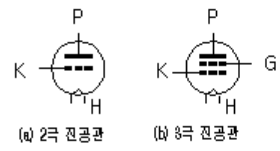

# Vacuum Tubes (진공관)

Thermionic emission (열전자 방출)을 이용하여 증폭기 및 switch역할을 할 수 있는 device.

## 작동방식

heater에 의해 cathode가 충분한 온도에 도달하면 electron(열전자)가 방출되고 이 열전자는 vacuum tube내에서 anode로 전달됨. 

* `P` : plate의 앞글자를 딴 것. anode를 가르킴.
* `K` : cathode를 가르킴.
* `H` : heater를 가르킴.
* `G` : grid를 가르킴.

`Diode` 
: 이처럼 vacuum tube가 cathode와 anode만 가진 경우는 **전류를 한방향으로만 흐르게** 하는데 사용되며 diode라고 불림. 

`Triode` 
: cachode에서 방출된 electron이 anode로 가는 경로에 grid를 삽입하고 해당 grid에 작은 ***전압 변화*** 를 가할 경우, cathode에서 anode로 흐르는 전류에 매우 큰 변화를 가져올 수 있음 (이를 이용하여 일종의 증폭기로 vacuum tube가 사용가능함) 

## 장단점

> Vacuum Tube는 Relay와 달리 물리적인 소자가 아니기 때문에 ^^*전기를 이용한 매우 우수한 switch*^^ (당시 기준)로 동작 가능하며 이는 초기 컴퓨터 개발에 주요소자로 사용된 이유였음.  
> 하지만, 큰 출력을 필요한 경우, vacuum tube의 크기가 매우 커져야 하는 단점을 지님.

* 실제로 IC에 비해 너무 커서(bulky), 오늘날의 컴퓨터에서는 거의 사용되지 않음.
* 또한 열전자 방출을 위한 heater로 인해 너무 뜨겁고 에너지 소모가 크다는 단점이 있음.
* 또한 vacuum tube자체가 깨지기 쉽다는 점도 오늘날 컴퓨터에 들어가는 소자로는 적절하지 못함.

## 현재의 사용처

* 의료기기 중 `X-ray발생(X-ray tube)`에 사용되며, **전자레인지** 나 **오디오 기기** 에 사용됨.
* 특히 Vacuum tube를 사용한 증폭기의 경우, 고유의 음색이 매우 좋아서 고가의 오디오기기에서 사용됨.
* 첨단 분야에서는 핵융합 발전 등에서 plasma를 가속시키기 위해서 사용되는 등 여전히 응용분야가 많은 편임.