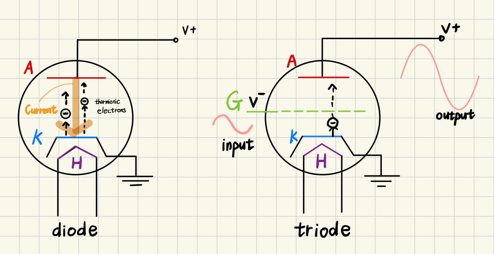

# Vacuum Tubes (진공관)

Thermionic electron emission (열전자 방출)을 이용하여  

* ^^Amplifier (증폭기)^^ 및 
* ^^Switch^^ 역할을 할 수 있는 Device.

---

---

## 작동방식

Heater에 의해 ***Cathode가 충분한 온도에 도달*** 하면  
**Electron(엄밀히는 열전자)가 방출** 되고  
이 열전자는 Vacuum Tube 내에서 **Anode로 전달됨** . 

{style="display: block; margin:0 auto; width:600px"}

* `P` : Plate의 앞글자를 딴 것. Anode를 가르킴.
* `K` : Cathode를 가르킴.
* `H` : Heater를 가르킴.
* `G` : Grid를 가르킴.

### Diode 

: 이처럼 Vacuum tube가 Cathode와 Anode만 가진 경우는  
**전류를 한방향으로만 흐르게** 하는데 사용되며 `Diode`라고 불림. 

### Triode

: Cathode에서 방출된 Electron이 Anode로 가는 경로에 **Grid를 삽입** 하고,  
해당 Grid에 작은 ***전압 변화*** 를 가할 경우,  
Cathode에서 Anode로 흐르는 전류에 매우 큰 변화를 가져올 수 있음  
(이를 이용하여 일종의 증폭기로 Vacuum Tube가 사용가능함)

위의 그림에서 input은 voltage의 변화이고,  output은 current 의 변화임. 

> Grid에 Cathod보다 낮은 전압을 가할 경우, 일종의 장벽으로 동작하여 thermionic electron 을 밀어내어 Anode에 도달하는 것을 방해하게 됨. 충분히 낮은 전압을 가할 경우에는 진공관 내의 전류 흐름이 끊어지게 됨. 만약 Cathode와 같은 레벨의 전압이 가해질 경우에는 thermionic electron의 흐름을 방해하지 않게 된다. 즉, 일종의 switch 로서 triode 는 사용할 수 있음.

---

이 외에도 Tetrode 등이 있음. 보다 자세한 건 다음 url을 참고하라:

* [Types of Electronic vacuum tubes](https://www.vtadiy.com/book/chapter-2-vacuum-tube-basics/2-2-electronic-vacuum-tubes/)

---

---

## 장단점

> Vacuum Tube는  
> Relay와 달리 ***물리적인(or 기계적인) 소자가 아니기 때문*** 에  
^^*전기를 이용한 매우 우수한 Switch*^^ (1950년대 기준)로 동작 가능하며  
> 이는 초기 컴퓨터 개발에 Vacuum Tube가 주요소자로 사용된 이유였음.  
> 하지만, 큰 출력을 필요한 경우,  
> Vacuum Tube의 크기가 매우 커져야 하는 단점을 지님.

* 실제로 IC에 비해 너무 커서(bulky), 오늘날의 컴퓨터에서는 거의 사용되지 않음.
* 또한 ***열전자 방출을 위한 Heater*** 로 인해 너무 뜨겁고 에너지 소모가 크고 수명이 짧다는 단점이 있음.
* 또한 Vacuum Tube자체가 깨지기 쉽다는 점도 오늘날 컴퓨터에 들어가는 소자로는 적절하지 못함.

---

---

## 현재의 사용처

* 의료기기 중 `X-ray발생(X-ray tube)`에 사용되며, **전자레인지** 나 **오디오 기기** 에 사용됨.
* 특히 Vacuum Tube를 사용한 증폭기의 경우, 고유의 음색이 매우 좋아서 고가의 오디오기기에서 사용됨.
* 첨단 분야에서는 핵융합 발전 등에서 Plasma를 가속시키기 위해서 사용되는 등 여전히 응용분야가 많은 편임.