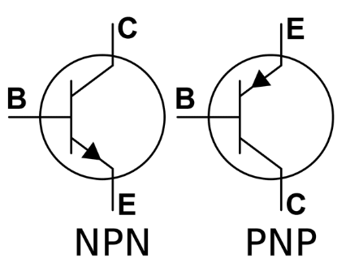

# Transistor (Transfer + Register)

오늘날 ^^전자기기^^ 에서 주로 사용되는 소자이며, ^^`전기회로`와 `전자회로`를 구분짓는 **Active Device**^^ 의 대표격인 소자. 

전류(BJT) 또는 전압(FET)에 의해 제어되는 

* Switch, *** 
* 가변저항, 
* 증폭기 (`Trasnfer` 의 의미에서 한 단자에서 다른 단자로 증폭하여 전달.)

로 사용된다.

---
  
기본적으로 배울 때에는 대표적인 Bi-Junction Transistor (`BJT`)와 Field Effect Transistor (`FET`)를 다룬다. 

* Device 하나의 효율은 BJT가 보다 좋지만, 
* `FET`는 크기가 매우 작아 같은 크기에 60~80 배의 집적도가 가능하여 

`BJT`보다 `FET`가 보다 많이 사용되는 추세임. (원가의 측면 등에서도 `FET`가 훨씬 유리).

FET에서도 `Metal Oxide Silicon FET`가 주로 많이 사용되고, `N-channel MOSFET` 과 `P-channel MOSFET` 중에서도 Carrier가 훨씬 ^^빠른 Electron을 사용^^ 하는 `N-channel MOSFET` 이 가장 많이 사용됨.  

> 기존 기술들(`Relay` 와 `Vacuum Tube`)에 비해 소형화가 가능하여 컴퓨터의 소형화에 큰 기여를 함. 

---

---

## 기본 원리.

다음 YouTube 동영상을 참고할 것.

* [Transistor 소개: NPN BJT 기반](https://youtu.be/7ukDKVHnac4?si=zY9qjSMH9NvL9fjp)
* [Transistor 소개: 좀더 자세한 버전](https://youtu.be/J4oO7PT_nzQ?si=Od3FC_qIKtEPX26X)

> 가장 쉽게 이해할 수 있는 NPN BJT로 공부하는게 일반적임.  
>
> * PN Junction Diode에 대해 익히고,
> * NPN BJT 로 switch 또는 amplifier로서의 동작원리를 파악할 것.
>  
> 이후 Field Effect Transistor로 넘어가는게 좋음. (컴퓨터 개론 등에서는 FET까지는 다루지 않음)

기본적으로 BJT는 다음의 그림으로 표시됨.

{style="display: block; margin: 0 auto; width:300px"}

* `E`: Emitter는 Carrier를 공급하는 역할
* `B`: Base는 Carrier의 관점에서는 잠깐 머무르는 곳이며, ***Base는 BJT의 On/Off 여부를 결정***.
* `C`: Collector는 Carrier를 모으는 역할을 함.

`NPN` BJT에서 

1. B-E에 Forward Bias를 가하고 (B=1, E=0), : 0.7V 이상. 
2. B-C에 Reverse Bias를 가하면 (`B < C`),
3. E에서 C로 electron이 흘러가게 되어 On 상태 (혹은 증폭된 상태) 가 됨.

---

---

## 단점

* "너무 작게 만들 경우 (IC 대비) ***발열*** 이 커지고"  
이같은 발열은 substrate인 silicon에 대한 손상으로 이어지기 때문에  
^^소형화에 한계^^ 가 있다.
    * `Vacuum Tube` 보단 발열이 덜 문제가 되지만,
    * `IC` 와 비교하면 발열이 문제임. 
* Carrier의 속도에 의한 ^^동작속도 한계^^ 가 있음.  
    * 차세대 반도체 소자는 carrier의 직접 이동이 아닌 방법이 고려되고 있음.

***

## 요약

`Transistor`는  
***물리적인 switching을 수행하는 Relay (전기기계식)*** 나  
***열을 가해야하는 Vacuum tube (전자식)*** 등에 비해서 
가격, 속도, 크기, 수명 등의 모든 면에서 우수한 Device임.    
(열전자 대신 ^^Semi-Conductor를 이용^^ 한 Vacuum Tube라고 보면 이해가 쉬움)

---

---

## 참고: *N-MOS* and *P-MOS* FET : `CMOS`

`N-MOSFET`의 경우, Gate에 `1` (정확히는 $V_\text{GS} > V_\text{Th}$)인 경우 close가 되는데, output이 `0`에 해당하는 $V_\text{SS}$에서는 손실이 없지만, `1`에 해당하는 $V_\text{DD}$는 $V_\text{DD}-V_{Th}$가 되어 손실이 발생함.

`N-MOS`와 `P-MOS`는 각기 상보적인(complementary) 특징을 가지기 때문에 이 둘을 잘 조합한 ***CMOS (Complement Metal Oxide Silicon) FET*** 이 낮은 전력 소모 등의 장점을 보임으로서 컴퓨터에서 많이 사용된다.

***매우 낮은 전력소모*** 를 보이기 때문에,  
컴퓨터의 `Basic Input/Output System` (BIOS)에서  
**주변기기 정보를 저장** 하는데 사용되는 반도체기반 소자가  
바로 CMOS이다. 

때문에 `CMOS`와 `BIOS`가 엄연히 다른 것인데도  
컴퓨터 사용자들 사이에서 마치 같은 용어인 것처럼 같이 사용하는 경우가 많다.

참고: [BIOS란](https://dsaint31.tistory.com/entry/Basic-Input-Output-System-BIOS)