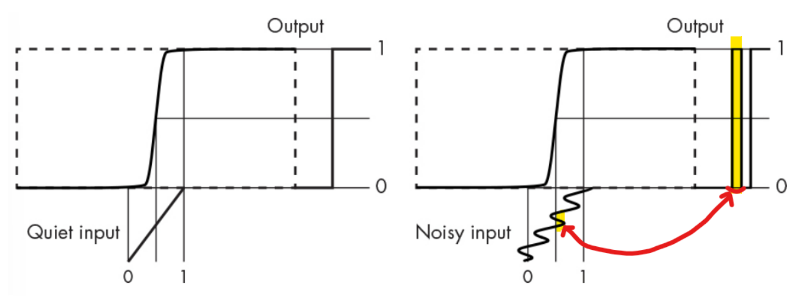

# Noise Glitch

Digital Circuit에서의 **`Glitch`** 는 

* 아주 짧은 시간 동안 
* 원래 의도한 값이 아닌,
* 다른 값들(error value)로 

출력 신호들이 나오는 현상임 (심각도가 덜한 오류).

> 일반적으로 특정 신호 패턴들에서 발생되며,  
> 입력에서의 정전기 등으로 인한 ***짧은 순간의 NOISE*** 등이 원인. : `Noise Glitch`

`Glitch`의 원래 어원은 

* ***사소한 흠집이나 오류*** 를 나타내며, 
* `Bug`가 <u>실제적인 프로그램이나 시스템의 오류</u> 라면 
* *`Glitch`는 좀 더 가벼운 개발자가 <u>의도하지 않은 비정상적인 현상</u>(좀 더 심각도가 낮은)* 을 가리킴.

---

---

## Example of Noise Glitch

아래 그림에서 

* 왼쪽은 이상적인 경우로 Noise가 전혀 없는 경우임: Output 에 Glitch 없음.
* 오른쪽은 Noise가 있어서 **Absolute Thresholding** 을 사용하는 경우 Transfer Function으로 인해 Output에서 **Noise Glitch** 가 보임.

{style="display: block;margin:0 auto;width:500"}

* 오른쪽에서 형광펜으로 강조된 부분이 서로 연관이 있는 곳을 연결하고 있음.
* 짧은 순간 Threshold를 넘나드는 Input에서의 Noise가 Output에서의 Noise `Glitch`가 발생. 

---

---

## Solutions

앞서 애기한 Noise `Glitch`의 경우, `Schmitt Trigger` 등을 사용하면 해결됨. 

`Hysteresis` 를 이용하거나 `Differential Signaling`을 통해 Noise를 줄일 수 있음. 

* [Schmitt Trigger](https://dsaint31.tistory.com/407)
* [Differential Signaling](https://dsaint31.tistory.com/408)

 