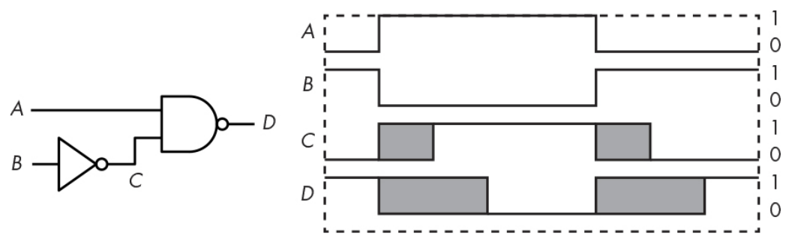

# Propagation Delay (전파지연)

**gate 등에서 input이 output에 영향을 주기까지 걸리는 시간** 을 가르킴.  
(이상적인 회로 설계와 실제 구현 간의 가장 큰 간극에 해당함.)

> Propagation delay에 대한 간단한 설명이 있는 URL.
>   
> * [Propagation Delay 참고 URL](https://dsaint31.tistory.com/entry/CI-Propagation-delay-%EC%A0%84%ED%8C%8C%EC%A7%80%EC%97%B0)

* ripple-carry adder 를 사용하지 않는 가장 큰 이유가 바로 propagation delay 때문임: 때문에 carry look-ahead adder가 사용됨.
* 여러 device가 연결될 경우, propagation delay를 고려해야만 제대로 동작함.

## Example

* 위의 그림에서 gray area 에서는 해당 signal의 값은 보장이 어려움.
* ideal device라면 즉시 변하지만, ^^input에 의해 output이 변하는데 걸리는 시간(propagation delay)^^ 이 바로 gray area를 만들어냄.