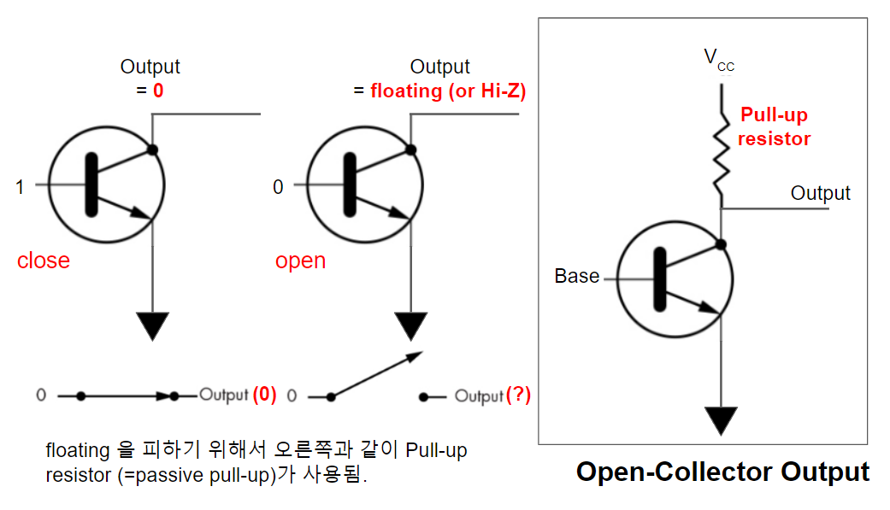
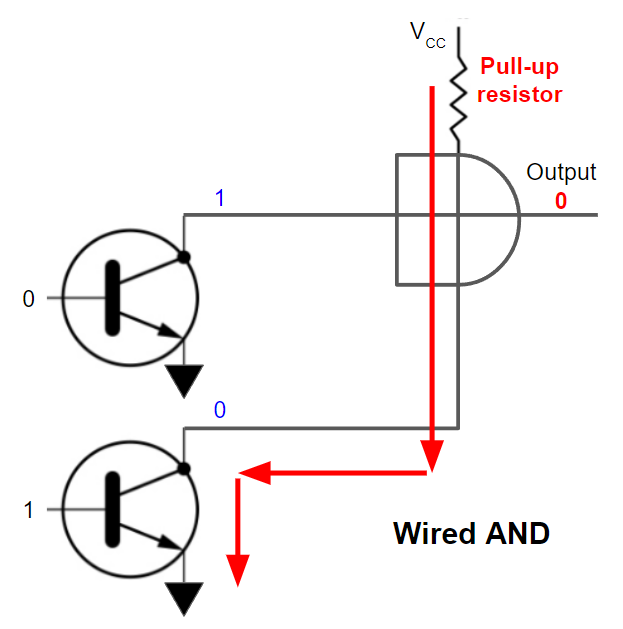

# Open-Collector (or Open-Drain) Output

Totem-Pole Output과 달리, Open-collector (or open-drain) output은 여러 개를 같이 연결할 수 있다는 장점을 가짐.

* 또한 `1`에 대한 출력을 5V 이상으로 변경 가능함 (pull-up resistor를 쓴 경우).
* Totem-Pole Output보다 높은 current를 처리 가능. (LED 제어 등에 많이 사용됨)

## 다음 그림은 Open-collector Output을 보여줌.

* 왼쪽에 보이는 2개의 경우가 pull-up resistor가 없는 경우로 `1`을 출력하지 못함을 보여줌.
    * `floating` (or `Hi-Z`) 상태에서 output을 오실로스코프의 probe로 찍을 경우, 아무런     voltage가 나오지를 않는데, 이는 0v를 의미하는게 아닌 probe를 허공에 대고 있는 것을 의미한다. 
    * 도체가 공중에 떠있는 상태인 `floating`은 voltage를 정의할 수 없다.
* 오른쪽의 박스로 보이는 경우가 pull-up resistor가 있는 경우이며, Open-collector라고 할 경우 대부분 이 경우를 말함.
    * base에 `0`이 가해질 경우, transistor는 끊긴 상태로 저항이 무한대이므로 대부분의 전압이 transistor에 걸리므로 output은 `1`에 해당하는 출력이 이루어짐.
    * base에 `1`이 가해질 경우, output은 gnd와 연결되어 `0`에 해당하는 출력이 이루어짐.

## 단점

* Totem-Pole Output보다 속도가 느림 (pull-up resistor가 낮을수록 속도가 빠르나, 이 경우 높은 전력소모가 발생.).
* Pull-up resistor의 도입은 또한 `0`을 출력할 때 전력을 소비하게 만듬 (낮은 pull-up resistor일수록 높은 current가 흐르게 되어 전력 소모가 커짐)

## pull-up resistor (or passive pull-up)

* base가 `0`일 때, collector (or drain) 의 출력이 `floating`이 아닌 `1`이 되도록, collector를 High voltage ($V_\text{CC}$ or $V_\text{DD}$)에 연결해주는 resistor(저항)
* 참고로 ground에 연결하는 resistor는 pull-down이라고 부름.
* base가 `1`인 경우, output은 ground와 연결되며 `0`이 출력되게 됨. 단 transistor가 close되어도 미세한 저항이 있기 때문에, pull-up resistor에 의해 결정되는 current가 흐르게 되어 전력소모가 발생함.

## Wired-AND

Open-collector output 여러 개를 연결할 경우, 일종의 `AND` gate로 묶은 출력이라고 생각할 수 있음.

* 위 그림의 왼쪽의 Open-collector output 중 하나라도 `0`인 경우, 해당 transistor는 close가 되어 $V_\text{CC}$와 ground간에 circuit이 생성되고, output은 `0`이 출력됨.
* 연결된 Open-collector output 모두가 `1`인 경우에만, 이들이 연결된 이후의 출력단이 `1`을 가지게 됨.
* 즉, 일종의 `AND` gate에 묶인 것과 같고 이를 `Wired-AND`라고 부름.

## Example

[tinkercad](https://www.tinkercad.com/things/0AQ8twrT2TE)