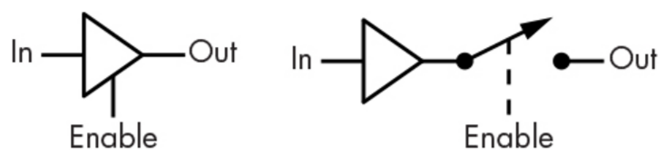
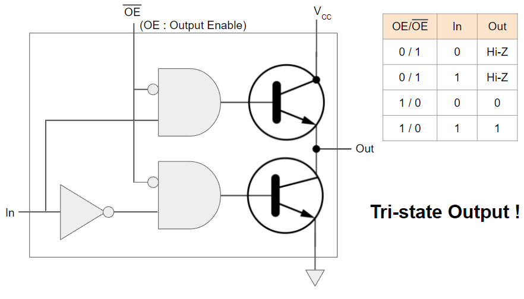

# Tri-State Output

`Enable` 입력을 추가해서, 

* 해당 Output을 사용하기 위해
* `Enable` (or `OE`(Output Enable))에 Active 신호를 할당하면 
* `Output`이 `Input`과 연결됨.

{style="display: block; margin: 0 auto; width:500px"}

* `Enable`이 Low인 경우가 바로 `Off` 또는 `Hi-Z`라고 부름.
* $\text{OE}$(or $\overline{\text{OE}}$)로 `Enable`을 표기하기도 함.

{style="display: block; margin:0 auto; width:500px"}

* 위 그림의 Tri-State Output 에선 위/아래의 Transistor 들의 `base`에 동시에 `1`이 들어가지 못하게 설계됨.
* 만약 `1`이 동시에 들어가면 Meltdown이 발생!

Tri-State Output은 `Enable`을 도입함으로서 `Open-Collector` Output처럼 여러 개가 연결(hook)될 수 있음.

* 단, 연결된 여러 Tri-State Output들 중 
* 사용할 Output에만 `enable`을 Activation시키고 
* 나머지 Deactivation시켜야 함. 