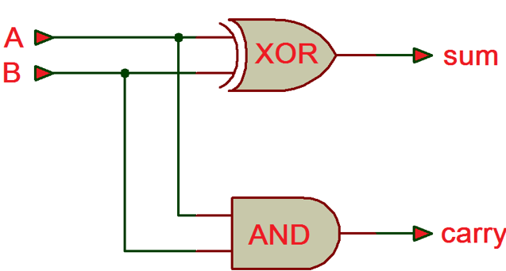

# Adder

이 문서에서는 gate들로 adder를 구현하는 것을 보여줌.

## Half Adder

2개의 bit를 입력으로 하여 addition을 수행함.

* 이전 자리에서 넘어오는 carry에 대한 고려가 없음
* 때문에 half adder라고 불림.

## Full Adder

2개의 bit와 이전 자리에서 넘어오는 carry를 고려한 addition을 수행함.

## Ripple-carry Adder

full adder들을 순차적으로 연결하여 구현.

* input carry가 이전 자리에 대한 full adder의 출력 carry와 연결됨.
* 각 full adder의 출력 carry가 다음 자리의 input으로 연결되어 각 비트에서 다음 비트로 물결이 출렁이듯 전달된다는 의미로 ripple이 붙음.

쉽게 이해가 되는 구조이나 propagation delay 등으로 인해 자리수가 높은 adder 구현에는 적합하지 않음.

## Carry Look-ahead Adder

$i+1$th bit의 입력 carry (or carry-in)는 다음과 같이 $i$th bit의 입력 bit $A_i,B_i$와 carry0in $C_i$에 의해 결정됨.

$$
C_{i+1}
 = (A_i
 \text{ AND } B_i
) \text{ OR } (A_i
 \text{ AND } C_i
) \text{ OR }(B_i
\text{ AND } C_i
)$$

ripple carry adder의 문제점이 carry들이 순차적으로 입력되는 구조라는 점인데, 다음자리의 carry_in을 계산하려면 현재 자리의 carry_in이 있으면되므로 이를 미리 계산해낼 수 있고,이 경우 맨 첫자리의 carry-in과 모든 자리의 $A,B$를 안다면 모든 자리의 carry_in을 구할 수 있다.

이를 위해,우선 $i+1$th bit의 입력 carry를 살펴보면 다음과 같은 식이 된다.

$$
C_{i+2}
 = (A_{i+1}
 \text{ AND } B_{i+1}
) \text{ OR } (A_{i+1}
 \text{ AND } C_{i+1}
) \text{ OR }(B_{i+1}
\text{ AND } C_{i+1}
)
$$

앞서 구한 $C_{i+1}$을 위 식에 대입하면, $i+2$th의 carry-in (=$i+1$th carry-out)을 계산하는데, $i$th의 입력정보만으로 충분함을 확인할 수 있다.

$$

\begin{aligned}C_{i+2}
 =& (A_{i+1}
 \text{ AND } B_{i+1}
)\\& \text{ OR } (A_{i+1}
 \text{ AND } [(A_i
 \text{ AND } B_i
) \text{ OR } (A_i
 \text{ AND } C_i
) \text{ OR }(B_i
\text{ AND } C_i
)])\\
 &\text{ OR }(B_{i+1}
\text{ AND } [(A_i
 \text{ AND } B_i
) \text{ OR } (A_i
 \text{ AND } C_i
) \text{ OR }(B_i
\text{ AND } C_i
)]
)\end{aligned}
$$

이를 가장 첫째 자리까지 수행하여 구하면 한번에 모든 자리의 carry를 구할 수 있게 된다.

이같이 carry를 구하는 방식의 adder를 carry look-ahead adder라고 부르며 이 경우 propagation delay의 영향이 최소화되게 된다. (단 더 많은 gate들이 필요함.)
