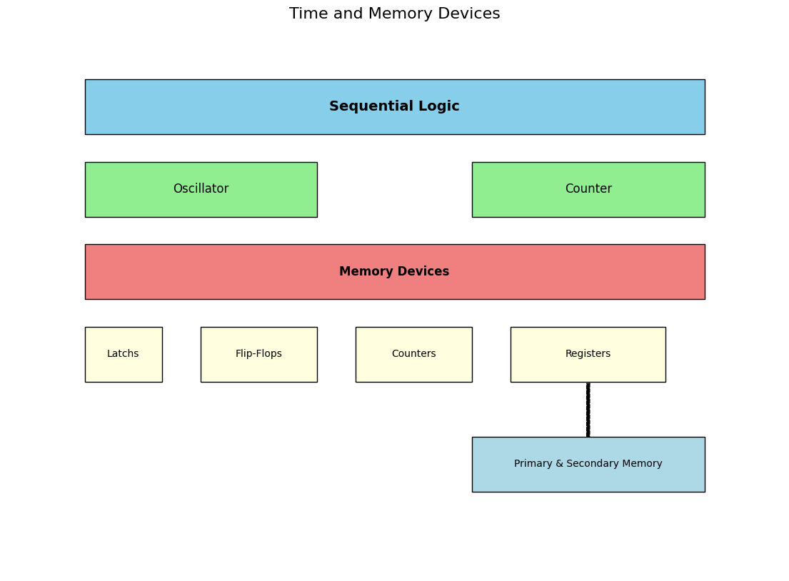

# 시간 및 기억소자들

<figure markdown>
{width=500, align=center}
</figure>

Combinatorial Logic과 달리,  

Sequential Logic의 경우 

* 과거의 출력값에도 영향을 받기 때문(feedback)에 **Memory Device가 필요** 

또한, 현재의 input 이외의 <u>과거 상태 및 현재 상태 값들을 고려</u> 하여 출력이 결정되므로 

* **Time을 나타내는 Device가 필요**.

---

## Time Devices

**Computer에서 <u>Time(시간)을 나타내는 Device</u>** 는 다음과 같음:

* `Oscillator` 
* `Counter` 

---

## Memory Devices: Simple Impl.

Computer가 사용하는 **Memory Device** 는 단순히 

* `OR` gate에 `feedback`을 추가한 경우에서부터 
* `RAM`, `ROM`, `HDD`, `SSD`까지 다양함. 

대부분의 컴퓨터 개론 관련 교과서들은  
`Gate` 기반의 구현물 부터 소개하는데, 
여기서도 이 순서를 따라 설명하고자 한다.

> `Register` 이후의 `RAM`, `ROM`, `Block Device`(or Disk Memory, DM) 등의  
> `Primary Memory`와 `Secondary Memory`는 이후 장에서 다루겠다.

* `Latch`s **
* `Flip-Flop`s ***
* `Counter`s 
* `Register`s ****
* [Primary Memory and Secondary Memory](../ch04/ce04_01_memory.md) ***

