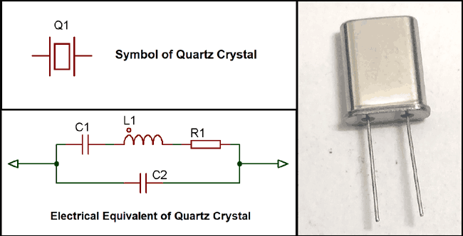

# Oscillator (발진자)

일정시간에 맞춰 반복되는 ***주기적인 펄스를 발생*** 시켜 computer등에서 time정보를 제공하는 역할을 함.  

CPU등에서 동작 클럭 등이 해당 Device가 어떤 빠르기로 동작하는지를 나타내며, 이같은 동작 클럭을 제공하는 것이 바로 oscillator임.  

* 주로, piezoelectric effect를 이용하는 crystal로 만들어진다(보다 저렴한 ceramic으로 만들어지는 경우도 있음). 
* crystal (주로 석영,quartz,이 사용됨)에 전기를 가할 경우, 일정 시간 이후 crystal이 다시 전기를 만들어내는데 이 시간 간격이 매우 정확함.
* 이를 바탕으로 clock signal을 발생시키는 oscillator가 만들어진다.  

## Clock 

computer나 circuit의 동작 pace를 가르킴. 단위를 보통 Hz로 표기되며 초당 몇번의 pulse signal이 반복되는지로 빠르기를 나타낸다.  

computer나 circuit을 구성하고 있는 여러 device들은 propagteion delay등의 특성이 다들 다르기 때문에 clock에 맞춰서 정상적인 동작이 이루어지도록 동기화되는 경우가 대부분이다. (비동기 방식이 없는 건 아니지만, 매우 제어가 어렵다)  

일반적으로 device들의 시간과 관련된 특성 (propagation delay 포함)들은 동일 소자라도 온도나 제조공정에서의 차이 등등으로 인핸 꽤나 variation이 다양하기 때문에 통계적인 측정치로 표시되며 일정 range(범위)에서 정상동작이 보장되는 특징을 가진다.  

## 더 살펴보기

* pulse signal은 신호처리나 디지털 회로 등에서 자주 보게 되는 signal 중 하나임. 
* 여러 종류가 있으나 일반적으로 rectangular pulse를 주로 가르키며 구형파라고도 불림.

* 참고자료 : wikipedia's [Pulse](https://en.wikipedia.org/wiki/Pulse_(signal_processing))