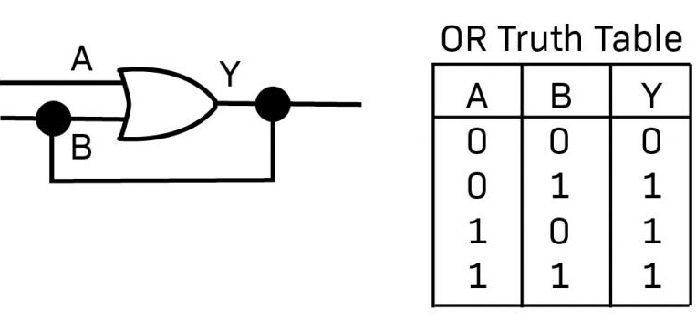
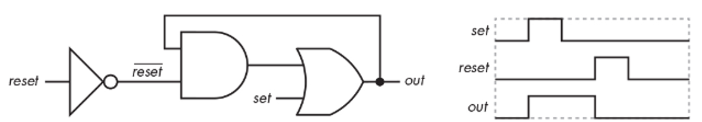
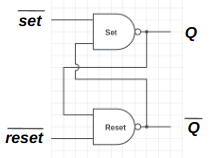
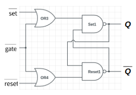
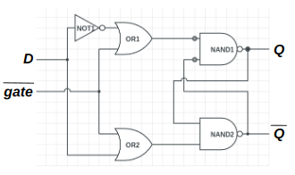
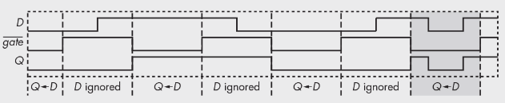

# Latches (래치)

## Latch란?

> **걸쇠** 라는 뜻으로 ^^자물쇠^^ 의 의미를 가짐.  
> 
> **Gate를 조합** 하여 **1 Bit 의 정보를 기억** 하는 (걸어두는) 역할을 하는 회로를 의미함.

주로 `S-R Latch` (Set-Reset Latch)를 가르키며, 

* 실제 ***1 Bit 의 정보를 기억*** 하는데 많이 사용되는 `Flip-Flop`을 이해하는 과정으로 배우게 됨. 
* 이 Flip-Flop은 “CPU가 명령어와 데이터를 기억하는데 사용하는 `Register`”로 확장되게 됨 

1 Bit의 정보를 기억하는 `Flip-Flop`과의 대표적인 차이점은 Clock Signal에 대해

* High (or Low) 레벨에서 기억이 이루어지는지 (`Latch`) 아니면 
* Rising (or Falling) Edge에서 기억이 이루어지는지 (`Flip-Flop`)

라고 할 수 있음.

> `Latch`는 주로 **High 레벨에서 기억** 이 이루어지며,  
> `Flip-Flop`의 경우 주로 **Rising Edge에서 기억** 이 이루어지는 버전이 많이 사용됨. 

---

---

## `OR` Latch

***Feedback 연결*** 과 `OR` gate를 이용하여 1 Bit의 정보를 기억한다는 점에서 ^^가장 간단한 Latch^^.

{style="display: block; margin: 0 auto; width:400px"}

* `A`(input)에 `1`이 입력되는 순간, 
* 이후 출력 `Y`(output)는 `1`이 되어(Set) 계속 유지됨.

> 하지만, ^^기억만 가능(정확히는 Set만)^^ 할 뿐, 다시 **Reset할 방법이 없음**.

교과서에서만 주로 다루는 Latch 임.

---

---

## `AND`-`OR` Latch

* `OR` Latch의 Feedback Connection을 `OR`에 직접 연결하지 않고, 
* `OR` 앞에 연결된 `AND`에 연결하고  
* 동시에 해당 AND에 $\overline{\text{Reset}}$ (`Reset`입력을 `inverter`에 연결)을 입력시켜 

***Reset 기능을 추가한 Latch***. 

{style="display: block; margin:0 auto;width:600px"}

`OR` Latch에서 Reset이 되지 않는 단점을 보완한 것으로  
**정보의 기억 및, 기억된 정보의 출력, 기억될 정보의 수정이 가능한 가장 간단한 memory** 임.

하지만, Symmetric Structure가 아니기 때문에 
Gate간의 Propagation Delay 에 취약함.

---

## `S-R Latch` ***

`AND`-`OR` Latch와 같은 역할을 하지만, 

* `NAND`나 `NOR`로 구현하여  
* ***symmetric structure를 가지도록 구현*** 된 것이 특징이며, 
* 이름의 `S`와 `R`은 Set과 Reset을 줄인 말임.  

{style="display: block; margin: 0 auto; width:300px"}

| $\overline{\text{set}}$ | $\overline{\text{Reset}}$ | $Q$ | $\overline{Q}$ | |
|:---:|:---:|:---:|:---:|:---:|
| 0 | 1 | 1 | 0 | | 
| 1 | 0 | 0 | 1 | | 
| 1 | 1 | $\text{memory}$ | $\overline{\text{memory}}$ ||
| 0 | 0 | 1 | 1 |not intended for use | 

* 위 그림은 `NAND`로 구현한 예만 보여줌.
*  “디지털회로” 등의 과목에서 `NOR`등으로 만드는 버전도 다루게 될 것임.

흔히 Latch라고 하면 `S-R Latch`를 가르킴.

> 초기값 관련한 문제가 디지털 회로등에서 자주 제기된다.  
> $\overline{\text{set}}$과 $\overline{\text{Reset}}$이 동시에 activation되는 경우는 사용하지 않는다 (not intended for use).

***

## Gated `S-R Latch`

Clock Signal을 입력받아서, ***특정 시점의 정보를 기억*** 하도록 `S-R Latch`를 확장한 것이며,  
개념적인 `S-R Latch`가 아닌 실제 회로 등에서 애기하는 `Latch`는 
(특히 synchronization circuit에서) 
이 Gated S-R Latch를 가르키는 경우가 많다.  

{style="display: block; margin:0 auto; width:300px"}

S-R Latch의 $\overline{\text{Reset}}$과 $\overline{\text{set}}$의  
입력단 각각의 앞에 `OR`를 붙이고  
각 `OR`에서 $\overline{\text{Reset}}$과 $\overline{\text{set}}$의 입력을 받고,  
동시에 각 `OR`은 clock이 입력될 동일 $\overline{\text{gate}}$ 입력을 받는 구조임.

***

## `D Latch`

위의 `S-R Latch` 구조에서 
$\overline{\text{Reset}}$과 
$\overline{\text{set}}$의 입력을 분리하여 받고 있으나, 
***이 둘은 동시에 1이 될 수 없는 입력이다***. 

때문에 다음과 같이 하나의 신호로 받아, 

* 하나는 이를 그대로 입력하고 
* 다른 쪽에는 inverter를 거쳐 입력하는 구조로 만드는게 보다 낫다.  

이를 반영하여 아래 그림과 같은 Latch를 ***D Latch*** 라고 부름.

{style="display: block; margin:0 auto;width:300px"}

이 경우, 입력을 $D$라고 하면,  
이 Latch는 해당 $D$의 1 Bit 정보를 $\overline{\text{gate}}$에 
따라 지정된 시간만큼 기억하는 Memory로 동작하게 된다.

{style="display:block; margin: 0 auto; width:600px"}

* $\overline{\text{gate}}$가 active인 경우 ($\overline{\text{gate}}=0$)에 $D$의 signal이 그대로 출력 $Q$에 전달됨.
* 즉, $\overline{\text{gate}}$가 active이 상태에서 $D$의 상태가 변한다면 해당 변화가 그대로 출력 $Q$에 전달
* $\overline{\text{gate}}$ 가 inactive 인 경우, $D$의 상태는 무시됨.

Memory는 일정 기간동안 입력을 받기보다 ^^한 순간의 값을 기억하는게 유리^^ 한 경우가 많다. 

* 일정기간 동안 입력값이 변할 경우, 어느 값이 기억될지가 알기 어려운 경우가 많기 때문임.
    * $\overline{\text{gate}}$가 active인 기간동안 $D$의 값이 0과 1사이를 왔다갔다 하는 경우를 생각해볼 것.
* 이 때문에 Latch보다는 ***Flip-Flop이 보다 많이 이용*** 된다.
