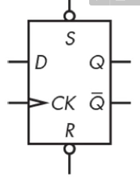
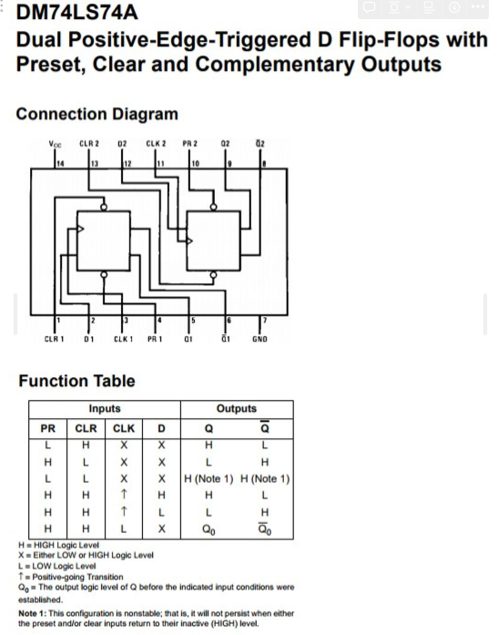
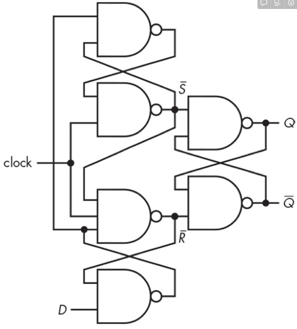
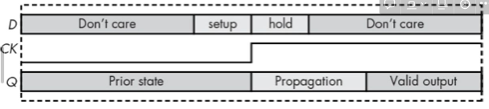

# Flip-Flops (Edge Triggered Latch, 플립플롭)

> 특정 시점의 1bit의 정보를 기억하는 memory device.

`latch`에서는 ^^기억이 이루어지는 특정 시점이 level^^ 로 결정되지만, `Flip-Flop`에서는 **edge (=transition between logic level)로 결정** 됨. 

- `latch`가 특정 level인 경우 입력을 받아들이므로 해당 level 기간동안 입력이 변경될 수 있음.
- `edge`는 훨씬 짧은 시간동안 입력을 받아들이므로, 해당 시간에 입력이 변경될 확률이 latch에 비해 매우 낮음 (flip-flop은 Edge triggered latch라고도 불림)

flip-flop들을 묶어서 

* 여러 bit를 기억하도록 확장한 형태의 `register` 를 만들고, 
* clock의 rising edge(or positive edge)의 횟수를 세는 `counter` 로 확장됨.

흔히 다음의 4가지 종류의 Flip-Flop이 다루어지지만,  
여기선 가장 널리 사용되는 D Flip-Flop만을  살펴본다.

- SR Flip-Flop
- D Flip-Flop (Delay Flip-Flop) : 가장 간단 (S-R latch 3개를 묶어 구현)
- JK Flip-Flop : $\overline{\text{set}}, \overline{\text{reset}}$ 이 모두 active인 경우에 toggle이 되도록 구현된 flip-flop
- T Flip-Flop

***

## D Flip-Flop

Schematic diagram (7474 or DM74LS74)은 다음과 같음.

<figure markdown>
{width=300, align=center}
</figure>

- $D$ : input
- $Q$ : output
- $S$ : set, `PR(preset)`, bubble 있으므로 active low인 $\overline{S}$
- $R$ : reset, `CLR(clear)`, bubble이 있으므로 active low인 $\overline{R}$
- CK : Clock Pulse, 삼각형 표시가 rising edge triggered 임을 표시.

다음과 같은 데이터 시트를 이용하여 flip-flop 의 동작을 파악한다.

<figure markdown>
{width=500, align=center}
</figure>

* **참고: [D Filp-Flop 7474 의 동작 테이블에 대한 좀 더 자세한 설명](https://dsaint31.tistory.com/699)**

Gate로 D Flip-Flop 의 구조를 보면 다음과 같음. (`S-R Latch` 3개를 이용함.)

<figure markdown>
{width=300, align=center}
</figure>

***

## Setup and Hold Times.

`Flip-Flop`처럼 edge에서 입력이 이루어지는 경우, ideal하게는 순간의 값이 저장되어야 하나 현실적으로는 그렇지 못하며, 정상적인 입력을 위해서 앞뒤로 시간이 필요하다. 이를 `Setup Time`과 `Hold Time`이라고 부르며 각각의 의미는 다음과 같음.

`setup time` :

- 정상적으로 입력이 이루어지기 위해 입력 signal을 받아들이는 clock edge가 발생하기 전에 input signal이 유지되어야 하는 시간.
- $t_\text{setup}$으로 표기됨.

`hold time` :

- 정상적으로 입력이 이루어지기 위해 입력 signal을 받아들이는 clock edge가 발생한 후에 input signal이 유지되어야 하는 시간.
- $t_\text{hold}$로 표기됨.

이들과 Propagation Delay를 반영한 Timing Diagram은 다음과 같음.

<figure markdown>
{width=500, align=center}
</figure>

* Latch보다는 입력을 받아들이는 시간이 짧지만, 위의 timing diagram에서 보이듯이 입력이 출력으로 반영되기 위한 일정 시간들이 필요함.

