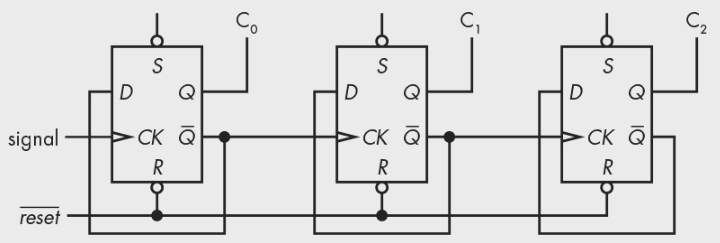
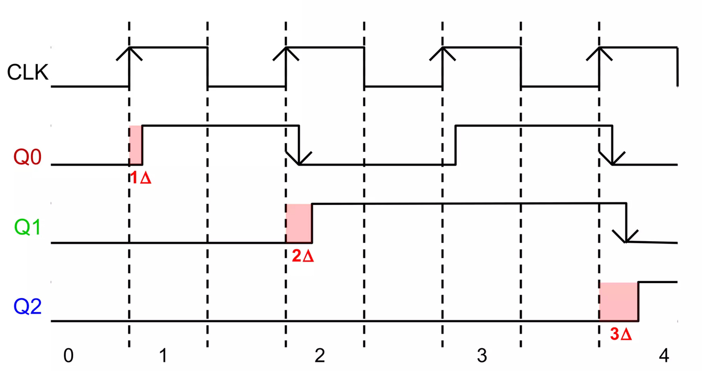

# Counter

`Counter`는 `Register`와 함께 `Flip-Flop`의 대표적인 응용사례임.

가장 간단한 정의로는 다음과 같음.

* `Counter`는 일정한 순서로 `State`(상태)가 반복하여 변화하는 ^^일종의 `Register`^^ 임.
* `Oscillator`의 Clock Pulse를 입력받아 ***Digital System(Computer포함)에서 Time에 대한 정보를 주는 소자***.

흔히, Counter의 출력은 Counter의 `state`가 된다. oscillator의 pulse train의 주기에 정수배한 주기 신호들을 만들어낼 수 있음. 비동기식(Asynchronous) counter와 동기식(synchronous) counter로 나뉘는데 synchronous counter가 사용하기 쉽기 때문에 많이 사용됨.

---

---

## Asynchronous (Ripple) Counter

{style="display: block; margin:0 auto; width:400px"}

* Signal이 `Clock` 에 들어가면서, 
    * Signal(=`CK`, Clock)이 0에서 1로 변할 때 (Rising Edge)마다 
    * 그 Count (횟수)를 세어서 $\text{C}_0,\text{C}_1,\text{C}_2$에 출력함.
* Signal은 보통 `Oscillator`(발진자)로부터 오게 되고, $\text{C}_0,\text{C}_1,\text{C}_2$들은 각각 앞의 입력에 비해 2배 더 긴 주기의 신호를 생성해 냄.
* `D Flip-Flop`의 Input $D$에 $\overline{Q}$가 연결되어 있기 때문에 Signal의 Rising edge 마다 반전(0에서 1, 또는 1에서 0)이 됨. 

위의 그림과 같은 Counter 는 `Ripple Counter` 라는 별칭을 가지고 있는데,  
구성하고 있는 `D Flip-Flop`의 출력이 왼쪽에서 오른쪽으로 전달되는 것이  
마치 물결이 퍼져나가는 것과 비슷하다는 점에서 유래됨.  

이 별칭에서도 알 수 있듯이 

* 각 `Flip-Flop` 에서의 출력이 동시에 이루어지지 않고 
* 앞단의 출력이 나오고 나서 출력되는 구조임. 

다음은 `Ripple Counter` 의 Timing Diagram 임  
(아래 그림의 `Q`는 위의 그림에서의 `C`에 해당함.).

{style="display: block; margin:0 auto; width:400px"}

* 때문에 `Propagation Delay` 와 같은 요소에 취약할 수 밖에 없음. 
* 위의 Timing Diagram 에서 음영이 이루어진 `Propagation Delay` 를 확인할 수 있음.
* `Propagation Delay` 때문에, Clock signal 이 매우 빠르게 바뀔 경우 정상적인 동작이 이루어지지 못한다.

---

---

## Synchronous Counter

> `Synchronous` 란 Clock을 공유한다는 뜻으로  
> H/W나 S/W나 동기식이 훨씬 제어가 쉽다.  
>  단 일정부분 느려지는 Trade-Off가 있다.

다음은 Synchronous Counter 로서 

* clock, $\text{CK}$를 공유함으로서 
* 모든 Flip-Flop들이 정확히 같은 시간에 값이 변화하게 된다.
 

{style="display: block; margin:0 auto;width:400px"}

 
 * 출력이 valid 하기위해 요구되는 
 * `Setup` 및 `Hold Time`, `Propagation Delay` 영향은 있으나 
 * 각 `Flip-Flop` 들이 동일한 Clock 에 맞춰 동작함.
