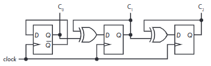

# Counter (카운터)

Counter는 register와 함께 flip-flop의 대표적인 응용사례임.

가장 간단한 정의로는 다음과 같음.

* `Counter`는 일정한 순서로 `state`(상태)가 반복하여 변화하는 ^^일종의 `Register`^^ 임.
* `Oscillator`의 clock pulse를 입력받아 ***Digital System(Computer포함)에서 Time에 대한 정보를 주는 소자***.

흔히, Counter의 출력은 Counter의 `state`가 된다. oscillator의 pulse train의 주기에 정수배한 주기 신호들을 만들어낼 수 있음. 비동기식(Asynchoronous) counter와 동기식(synchoronous) counter로 나뉘는데 sychronous counter가 사용하기 쉽기 때문에 많이 사용됨.

## Asynchronous (Ripple) Counter

![ripple counter]

> 그림 추가할 것.

* Signal이 Clock Pulse부분에 들어가면서, signal이 0에서 1로 변할 때 마다 그 count(횟수)를 세어서 $\text{C}_0,\text{C}_1,\text{C}_2$에 출력함.
* Signal은 보통 oscillator(발진자)로부터 오게 되고, $\text{C}_0,\text{C}_1,\text{C}_2$들은 각각 앞의 입력에 비해 2배 더 긴 주기의 신호를 생성해냄.
* `D-flip flop`의 input $D$에 $\overline{Q}$가 연결되어 있기 때문에 1로 올라가고 나선 다시 0으로 떨어지게 되며 이를 $\text{CK}$에 들어오는 signal에 맞춰 반복하게 됨.

repple counter라는 별칭을 가지고 있는데 구성하고 있는 `D Flip-Flop`의 출력이 왼쪽에서 오른쪽으로 전달되는 것이 마치 물결이 퍼져나가는 것과 비슷하다는 점에서 유래됨. 이 별칭에서도 알 수 있듯이 각 flip-flop에서의 출력이 동시에 이루어지지 않고 앞단의 출력이 나오고 나서 출력되는 구조임. 때문에 propagation delay와 같은 요소에 취약할 수 밖에 없다. 실제로 clock signal (위의 그림에서 `signal`)이 매우 빠르게 바뀔 경우, 정상적인 동작이 이루어지지 못한다.

## Synchoronous Counter

> synchronous 란 clock을 공유한다는 뜻으로 HW나 SW나 동기식이 훨씬 제어가 쉽다. 단 일정부분 느려지는 trade-off가 있다.

 다음은 synchronous counter로서 $\text{CK}$를 공유함으로서 모든 flip-flop들이 정확히 같은 시간에 값이 변화하게 된다.
 
 
 
 * 출력이 valid하기까지 요구되는 setup 및 hold time, propagation delay영향은 있으나 각 flip-flop들이 동일한 clock에 맞춰 동작함.
