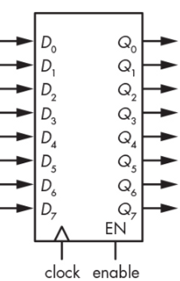

# Registers (레지스터)

> **1bit를 기억할 수 있는 `Filp-flop`** 들을 여러 개를 묶어서,  
> ***여러 bits를 기억*** 하도록 만들어진 device.
>  
> ^^CPU 내부에 위치하며, ALU 등이 직접 접근하여 사용되는 memory가 바로 Register임.^^    
> 
> * 가장 빠르고, 
> * 가장 비싼 memory 라고 할 수 있음 (여러 bits를 저장하는).

* Register를 ***여러 개 사용하면 보다 많은 bit를 저장*** 할 수 있음. 
* 이는 여러 Flip-Flop을 사용하여 여러 bit를 기억하는 register를 만든 것과 같음.
    * 8개의 `D flip-flop`들을 묶어서 사용하면 8bit register가 가능함.
* 하지만 보다 많은 여러 bit를 기억하기 위해서는 
    * 각각의 값들이 어느 register에 저장되는지를 나타내는 ***address가 필요*** 하며, 
    * 이를 위해 `decoder`와 `selector (Mux)`가 연결된 
    * `memory` device (`Static RAM`)가 등장하게 됨.

---

## Schematic Representation

<figure markdown>
{width=300, align=center}
</figure>

- `clock` : rising edge에 입력 `D`의 값이 `Q`에서 출력.
- `enable` : 해당 입력이 active여야 register가 동작함(여기선 `1`이어야함.)