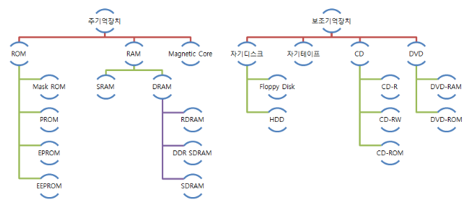
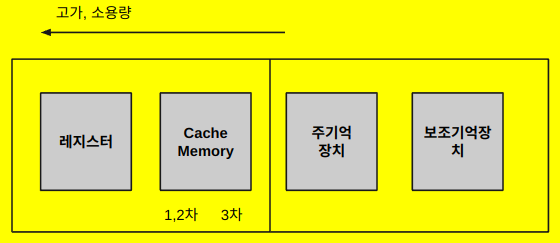
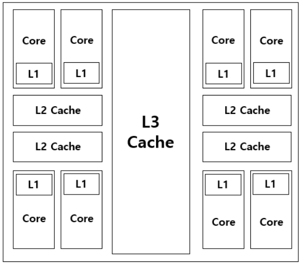

# Memory (기억장치)

computer에서 데이터를 기억하기 위해 사용하는 device를 총칭.

## 기억 장치 종류 및 구성

종류를 나타내면 다음과 같음.

다음과 같은 그림으로 간략히 표시 가능함.

참고로 Cache의 구분은 다음과 같음.

## 주기억장치 

* CPU 가 직접 참조하는 고속의 메모리
* 프로그램이 실행될 때 필요한 프로그램이나 자료를 보조 기억 장치로부터 이동시켜 실행시킬 수 있는 기억 장소.
* 프로그램을 기억하는 프로그램 영역과 입력 자료를 기억하는 영역, 출력 자료를 기억하는 영역, 작업을 실행하여 중간 계산 결과를 기억하는 작업 영역으로 구성.

### 주기억장치 특성.

1. 저장된 내용이 변경될 때까지 그대로 유지시켜야 함.
2. 새로운 내용으로 바뀔 수 있어야 함.
3. 주기억장치의 데이터는 저장된 순서에 관계없이 (가급적) 같은 시간에 접근할 수 있어야 함.
4. 원하는내용에 쉽게 접근가능해야함.
5. access time이 짧을수록 유리
6. 가능한 많은 양의 데이터 저장할수록 유리

## 보조기억장치

* 주기억 장치의 한정된 기억 용량을 보조하기 위해 사용하는 메모리로 전원이 차단되어도 기억된 내용이 유지.
* 주기억 장치에 비해 속도는 느리지만 대량의 자료를 영구적으로 저장.
* 자료 접근 방법에 따라 SASD 방식과 DASD 방식으로 구분.

> * Sequential Access Storage Device & media (SASD)
> * Direct Access Storage Device & media (DASD)
