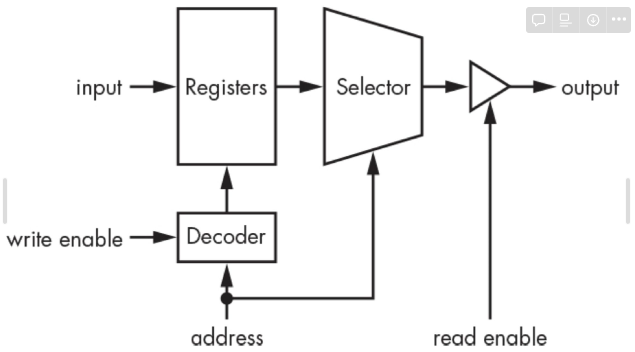
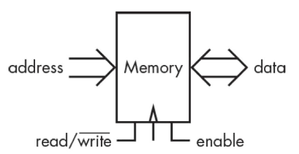
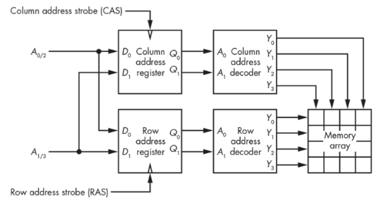

# Memory Component

보다 많은 bit를 기억하기 위해서는  
`register`들을 많이 사용해야하는데,  
이 경우 어느 register에 저장할지를 지정해야 하고,  
이를 다시 load할 때도 어느 register에서 load할지를 지정해야 함.  

## Address
> 이같은 필요성으로 `address`가 도입된다.  
>
> `address`는
>
> * memory의 특정 위치를 가르키며 
> * 실제 data가 memory의 어디에 저장되어있는지를 나타낸다.

---

---

## Memory with Address

`address`를 이용하는 memory component의 구조는 다음과 같음.

{style="display: block; margin: 0 auto; width:500px;"}

* [`Decoder` (이진수를 one-hot code로)](https://dsaint31.tistory.com/404#--%---Binary-%--Decoder%----)를 통해, `address`를 이용하여 실제 저장된 register를 선택 (enable)
* [`Selector` (`Mux`)](https://dsaint31.tistory.com/403#--%--Multiplexer)를 이용하여 여럿 연결된 register의 출력 중 `address`에 해당하는 register의 출력을 출력.
* [`tri-state` output](../ch02_co/ce02_04_4_3_tri_state_output.md)을 선택하여 여러 memory component들을 묶음.

> 여러 output들을 ***하나의 핀*** 으로 묶을 경우,  
>
> * open-drain 또는 
> * [tri-state](https://dsaint31.me/mkdocs_site/CE/ch03_seq/ce03_02_1_memory1/#memory-with-address) 가 쓰임. 

---

---

## GPIO (General Purpose I/O)

General Purpose I/O는 chip에서 제공하는 pin의 수가 한정되어 있기 때문에  
특정 핀들을 **입력과 출력으로 같이 쓰는 경우** 를 애기함.  
일반적으로 `tri-state output` 을 이용하여 구현됨.

> memory의 경우,  
> **read와 write가 동시에 이루어지는 경우가 거의 없기 때문** 에
> 보통 ***GPIO를 이용하여 단자(핀)의 수를 줄임*** .

--- 

---

## BUS 

`BUS`는 

* 1bit의 개별 signal 대신에 
* ***연관된 signal들을 묶은 것*** 을 가르킴.

Memory의 경우 다음과 같은 2개의 BUS를 가짐. 

* Address Signal들을 묶은 Address bus, 
* Data Signal들을 묶은 Data bus를 가짐.

다음 그림은  

* 아까의 Memory Component에  
* `tri-state`를 적용하여 입출력 단자를 공유 (GPIO) 하고,  
* Bus를 도입한 경우에 대한
* schematic representation임.

{style="display: block; margin: 0 auto; width:500px;"}

---

---

## Address Register (Row and Column)

Memory 의 용량이 커질수록 address의 길이가 길어지며,  
이는 집적화에 큰 장애가 됨.  

* 때문에 address를 상위, 하위로 나누고 
* address register들 (column address register, row address register)과
* address strobe들 (CAS, RAS)를 도입하여 
* address bus의 폭을 절반으로 줄여서 사용(일종의 multiplexing)하는 경우가 많음.

**상위, 하위로 나누는 것** 을 **matrix의 row와 column으로 생각** 할 수 있다. 

* 특히 상위 Address (Row address)는 `Page`라고도 불림.

일반적으로 같이 많이 쓰이는 데이터는  

* 한 `Page` 내에 같이 저장하여  
* ^^Row는 고정하고 column만 변화시켜 처리하는 방식^^ 으로 동작
* 가능하도록 함으로써, Memory의 입출력 성능을 향상시킴.

{style="display: block; margin: 0 auto; width:500px;"}

* `Strobe`는 **parallel connection에서 신호를 구분하기 위해 사용하는 신호** 를 가르킴
    * Memory에선 
    * Column Address Strobe (CAS)와 
    * Row Address Strobe (RAS)가 있음.
* 위의 그림에서 row와 column register에 parallel 하게
    * $A_{0/2}$과 $A_{1/3}$이 연결되어 있는데
    * CAS와 RAS를 통해,
    * $A_{0/2}$과 $A_{1/3}$이 row에 대한 주소 $A_0, A_1$로 쓰이는지
    * 아니면 column에 대한 주소$A_2, A_3$로 쓰이는지가 구분이 됨.
* strobe들에 의해 메모리의 속도(latency)가 결정됨. 
    * ^^일반적으로 Column Access Strobe(CAS)가 memory latency를 결정함^^ .

---

---

## 읽어볼 자료.

* [strobe와 memory latency관련하여 읽어보면 좋은 자료](http://m.enuri.com/knowcom/detail.jsp?kbno=35825&bbsname=guide&cateno=&page=1)
