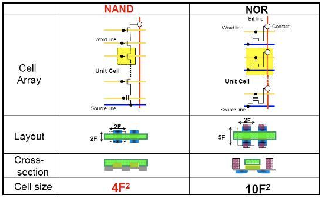

# Flash Memory and SSD

{style="display: block; margin: 0 auto; width: 500px"}

* [ref. site](https://metar.tistory.com/entry/%EC%97%94%EC%A7%80%EB%8B%89%EC%97%90%EC%84%9C-%EB%B0%98%EB%8F%84%EC%B2%B48%EB%8C%80%EA%B3%B5%EC%A0%95%EC%9D%84-%EB%B0%B0%EC%9A%B0%EA%B3%A0-%EC%B7%A8%EC%97%85%ED%95%98%EC%9E%90-1%EC%A3%BC%EC%B0%A8-2%EC%9D%BC%EC%B0%A8)

## Flash Memory 란?

`Flash Memory`는

* Read 의 경우에는 `Random Access Memory (RAM)` 와 유사 (`NOR Flash`의 경우)하게 동작하며,  
* Write 의 경우에는 `Block Device` 와 비슷하게 동작하는 

Secondary Memory Device.  

> 읽기의 경우, RAM 과 같이 `Random Access` ( or 그와 유사한 Page 단위로 읽기)  동작이 가능하며,  
> 쓰기의 경우, Block (or Page) 단위로 쓰이고 `Erase Before Write` 특성을 가지는  
> (ROM 과 같은) `Non-Volatile Memory` 임.
> 
> 널리 사용되고 있는 Secondary Memory Device 임.

1980년대 초 도시바의 Fujio Masuoka 박사 연구팀이 개발한 것으로 알려지며, 기존의 EEPROM(Electrically Erasable Programmable Read-Only Memory)가 한 바이트 단위로 데이터를 지우는 것과 달리, block단위로 데이터를 지우는 속도가 섬광(Flash) 처럼 빠르다는 점을 강조하여 Flash Memory라는 이름이 붙음.

---

---

## Solid State Disk (SSD) 란?

`Solid State Disk (SSD)`는 

* Flash memory를 Disk Drive 형태로 패키징하면서, 
* `Wear Leveling Processor` 를 추가하여 

HDD 처럼 Flash memory를 사용하게 한 것.

---

---

## 특징.

* 전기적으로 내용 변경 및 일괄 소거도 가능.
    * `EEPROM`의 일종.
    * 기존의 `EEPROM`은 Byte 단위로 읽기/쓰기/지우기 가 가능했음.
    * Flash Memory는 Page, Block 단위로 지우기가 처리됨 (쓰기 전에 지워야 함에 주의.)   
* Cell이 저장할 수 있는 Bit의 크기에 따라 다음으로 구분.
    * Single-Level Cell(`SLC`) : 1bit/cell 저장 (=1BPC), `NOR Flash`는 대부분 SLC임.
    * Multi-Level Cell(`MLC`) : 2bit/cell 저장 (=2BPC)
    * Triple-Level Cell(`TLC`) : 3bit/cell 저장 (=3BPC)
    * Quad-Level Cell(`QLC`) : 4bit/cell 저장 (=4BPC)
    * 참고0: ***BPC가 커질수록 read time이 커짐(=느려짐)*** 
    * 참고1: ***BPC가 커질수록 동시에 수명도 짧아짐.***
* Cell을 직렬로 연결할지 병렬로 연결할지에 따라 `NAND Flash`와 `NOR Flash1`로 구성됨.
    * NAND Flash: 직렬연결. 높은 데이터 밀도와 고용량. 빠른 쓰기 속도!
    * NOR Flash: 병렬연결, 빠른 읽기(Random Access 가능)이나 느린 쓰기 속도. 
* 일부 RAM 과 유사한 읽기 동작.
    * `NOR Flash` 의 경우, 1bit를 담고 있는 Cell 별로 읽기 가능(SLC라면).
    *  주로 사용되는 `NAND Flash` 의 경우, ***Page 단위로 읽기*** 를 지원.
    * `Page`는 초기 512 bytes 였으나 현재는 4~16 KB 정도임.
* 읽기 / 쓰기 / 지우기 단위
    * 읽기: 
        * NOR Flash에서는 Cell 별로 가능.
        * NAND Flash에서는 Cell 들이 모인 ***Page가 기본 읽기 단위*** 임.
    * 쓰기:
        * 데이터가 쓰여 있지 않은 영역에 쓰기는 읽기처럼 `Page`가 기본 단위.
        * Flash는 데이터가 쓰여져 있을 경우, ***지우고 나서만 쓸 수 있는 특징(`Erase Before Write`)*** 으로 인해 `Block` 단위로 동작.
        * 1개의 Block은 일반적으로 64, 128 또는 256 개의 Pages로 구성.
    * 지우기:
        * ***Block 단위*** 로 이루어짐.
    * 참고: [Memory : Page and Column 참고 내용](./ce03_02_1_memory1.md#address-register-row-and-column)
* 전원이 나가도 기억 유지: `Non-Volatile Memory`
    * ***DRAM 과 유사하게 bucket(=MOSFET+Floating Gate Transistor) 에 전자를 담아 기억하는 방식*** 
        * DRAM에서는 capacitor에 전자가 저장: 1bit를 위해 transistor와 capacitor 가 하나씩 필요.
        * Flash Memory에서는  Floating Gate (=transistor)에 전자가 저장. 
    * 하지만, **DRAM과 달리 전자가 잘 새지 않음** (전원을 공급할 필요 없음. 10년 가량 기억 가능)
    * 단, cell별 또는 page 별로 0에서 1로 직접 변경이 안 됨 (한번 0으로 기재하면, 1로 변경이 안됨을 의미.)
        * 1에서 0은 전압변화로 전자를 방출시킴으로 쉽게 처리됨 (1로 초기화 이후, 0으로 한번 쓰는 건 가능하다는 의미.).
        * 하지만 0에서 1 (=program 쓰기 동작)로 변경은 전자를 셀에 주입하는 것으로 불가능함. 
    * 때문에 기존 데이터를 다 지우고 (모조리 1로 초기화) 다시 쓰는 형태로 처리 됨 (`Erase Before Write`).
* 읽기/쓰기 가능 횟수에 제한(=수명)이 있으며 전기적으로 여러 차례 가능함.
    * 데이터를 저장하는 Cell 하나당 쓰고 지우는 횟수의 한계가 존재함.
        * BPC가 높을수록 수명이 짧아짐.
        * 예를 들어, SLC의 경우 10만번 정도의 수명이고  TLC의 경우 1000번 정도의 수명임 (확률적임) 
    * Flash memory를 Disk Drive 형태로 패키징 한 SSD에서는 Cell들을 Block으로 묶고, 이들 블록이 몇차례 기록이 되었는지를 카운트하여 구성 Block들이 쓰고 지워진 횟수를 일정하게 유지시키는 Wear Leveling Processor가 있음.

---

---

## Flash Memory 종류

### NAND Flash

Cell을 ***직렬로 연결한 방식*** 으로 `NOR Flash`에 비교하여 

* Read Time이 느린 단점을 가지나 (Page 단위로 읽어들임), 
* Program(=Write)와 Erase Time이 각각 Page, Block 단위로 이루어짐에 따라 매우 빠름 (빠른 쓰기/지우기 가능).

Random Access (Cell별 읽기)가 안된다는 단점이 있으나,  

* 각 Cell에 대한 개별 접근을 위해 요구되는 회로가 없기 때문에
* 하나의 Cell이 차지하는 면적이 `NOR` Flash 대비 매우 작아서 
* 높은 집적화와 함께 단위 저장용량에 대해 낮은 제조 단가를 가능하게 함.

저장 매체에 적합한 `NAND Flash` Memory

* 소형화 및 대용량화 에 유리하면서
* 저장용량당 단가가 낮음.
* 단, Read Speed가 높지 않아 RAM과 같은 용도로는 사용하기 어려움.

> NAND Flash는 높은 집적도의 경제성을 가진 storage 제품을 가능하게 함.  
> 현재 NAND방식은 대용량 Flash Memory 시장에서 가장 널리 사용됨.

---

### NOR Flash

Cell을 ***병렬로 연결한 방식*** 으로, `NAND` Flash에 비해 

* Random Access를 통한 Read Time이 훨씬 (6-7배 정도) 빠르지만, 
* Program (=Write)과 Erase가 Cell 단위로 이루어지다보니 
* 쓰기와 지우기에서 NAND에 비해 매우 느린 단점을 가짐: 읽기 전용 장치로 사용하는게 유리.
    * 전원이 커져도 보존되어야 하며 실행 속도(읽기 속도)가 빨라야 하는 code 저장에 유리.
* 즉, 개별 Cell로 작업이 이루어지기 때문에 대용량의 데이터를 쓰거나 지우는 등의 경우 상대적으로 느리다는 단점을 가짐.

Cell별로 Read가 이루어지다보니 **Random Access가 가능** 하다라는 장점이 있으나,

* Cell 마다 요구되는 회로로 인해 낮은 집적도와 용량당 높은 제조단가를 가지는 단점을 가짐.
* 저장장치로는 `NAND` 방식에 밀린 상태.
* 부트로더, Firmware 등과 같이 작은 용량의 데이터를 저장하면서 빠른 읽기 속도가 필요한 경우에 사용됨.

> Micro-Controller 의 부트로더 등에 활용도가 높음.

---

---

## Solid State Disk (SSD)

SSD의 경우, 최근 HDD를 대체하고 있는 추세임.

AI 시대가 되면서 데이터 센터에서도 SSD를 사용하는 추세가 증가하기 시작.

* 이미 노트북 등의 시장에서는 SSD가 대세로 자리잡음.
* HDD 대비 빠른 읽기/쓰기 가 가능하며 낮은 발열과 소음 이라는 장점을 가짐.
* 주로 대용량 저장을 위한 NAND Flash로 구성됨.
* Wear Leveling Processor를 통해, 전체 device의 읽기/쓰기의 수명을 연장하며 데이터 손실 및 오류 가능성을 줄임.

> Flash Memory의 각 Cell 은 일정 횟수의 프로그래밍 및 삭제 작업만이 가능함.  
> 특정 횟수 이상 쓰기/지우기 가 이루어질 경우 수명이 종료되며,  
> 이같은 읽고 쓰여진 정도를 ***Wear Level*** 이라고 부름.
>
> 데이터가 자주 업데이트되어 일부 Cell (정확히는 block)이 지나치게 너무 빨리 수명이 종료될 경우  
> 전체 SSD의 저장능력에 문제가 되므로    
> Wear Level Processor는 모든 Cell (정확히는 block)의 Wear Level이 균일하게 되도록 도와줌.

---

---

## References

[나무위키's Flash Memory](https://namu.wiki/w/%ED%94%8C%EB%9E%98%EC%8B%9C%20%EB%A9%94%EB%AA%A8%EB%A6%AC)
