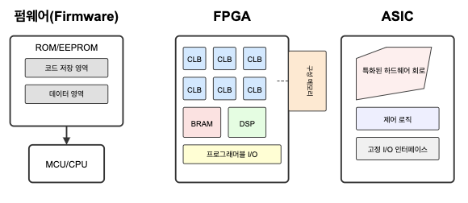

# Hardware vs. Software (Firmware and FPGA관점에서 비교)

현재의 기술 trend는 convergence (융합)이다.  

별개의 기술이라고 보이던 것들에서 각각의 장점을 가져와 더 나은 기술이 되는 경우가 많다. 

이는 오늘날 S/W와 H/W도 적용된다.

일반적으로 S/W와 H/W는 수행해야 할 logic이 

* programming source code로 구현되느냐, 
* 아니면 gate들로 구성된 chip (e.q. ASIC)으로 만들어지느냐의 차이로 구분이 된다. 

S/W는 뭐든지 수행가능한 CPU (or MPU)에서 동작하거나 아니면 해당 S/W를 수행할 수 있는 H/W에서 수행되므로, 핵심 logic인 program (~bytes code)만 변경하면 다른 task를 수행하거나 좀 더 개선된 형태로 동작이 가능하다.  
이에 비해 H/W는 우선 제조가 되고 나면 설계된 task만 수행가능할 뿐 변경이 어렵다. 대신, H/W는 해당 task를 CPU 대비 매우 빠르게 수행하면서 개별 단가가 매우 낮다 (물론 large volume production이 된 경우에 한함). S/W는 뭐든지 수행할 수 있는 범용 CPU가 필요하므로 개별 단가가 낮아지기 어렵고, 실행속도 측면에서 H/W (여기선 ASIC으로 생각하라)보다 낮은 성능을 보인다.

위에서 설명한 S/W와 H/W의 장단점을 개선하기 위한 여러 기술이 소개되었고, 예로서 

* Firmware, 
* FPGA 등이 있다.

---

---

## Firmware

초기의 ROM은 H/W처럼 제조하고 나면 저장된 내용의 수정 및 변경이 불가했으나, 점점 ROM의 장점인 non-volatile은 유지하면서 자유롭게 수정가능하도록 발전했다.  

현재의 EEPROM과 Flash memory가 그 결과물이다. 

* 참고: [ROM 에 대한 참고자료](./ce03_02_3_rom.md)

이는 ***ROM에 저장된 S/W*** 를 가르키던 **firmware의 정의** 를 확장시키는 결과로 이어졌다. 

`Firmware`
: 원래 firmware는 ROM에 저장된 software를 의미하였다.  
전원이 나가도 유지가 되어야하는 logic을 programming code를 컴파일하여 만든 실행코드로 작성하고 이를 ROM에 저장시켰던 것이다.  
BIOS등이 대표적인 예라고 할 수 있다.

* 참고: [BIOS란?](https://dsaint31.tistory.com/464)

하지만 Flash memory가 ROM을 대체하면서, firmware도 제조된 이후 업데이트가 가능해졌고 이는 일반적인 software와 firmware의 구분을 굉장히 모호하게 만든다. 일반적으로 업데이트 빈도수가 보다 firmware가 적을 뿐이지 큰 차이가 없다.

---

---

## Field Programmable Gate Array (FPGA)

firmware 보다 더 강력한(?) 융합은 Filed Programmable Gate Array (FPGA) 라고 할 수 있다.  
어찌되었든 firmware에서 ROM 또는 Flash memory는 logic을 실제 수행하진 않는다 (logic을 저장하고 있을 뿐이다).  
즉, 앞서 설명한 logic의 수행의 관점에서보면 여전히 software라고 할 수 있다.  

> 하지만, FPGA는 자체가 logic을 담고 있고, IC처럼 해당 logic을 수행하는 chip이다.  
> 그러면서도 logic을 구현할 때, Hardware Description Language (HDL)과 같은 특별한 programming language로 구현하고 이를 FPGA에서 다운로드시킴으로 해당 logic을 수행하는 H/W가 된다. 

IC가 gate들을 조합하여 구성되는 것을 이용하여, FPGA는 사용가능한 기본 component들을 block으로 지정하고 이를 array로 묶은 chip이다. 이를 어떻게 연결하느냐에 따라 logic이 구현되는데 이를 연결하는 것을 전용 programming language로 작성된 code가 결정한다. 즉, FPGA를 만드는 업체는 어떤 logic의 chip이 될 수 있는 일종의 만능칩을 제공하고, 이후 시스템이나 어플리케이션을 만드는 개발자가 여기에 logic을 구현하는 셈이다. 초기 FPGA는 PROM처럼 한번 다운로드하고 나면 수정이 안되었으나, 현재는 전기적으로 자유롭게 수정이 가능하다. 

FPGA는 firmware보다 한 발 더 나아간 ***수정이 가능한 Hardware*** 라고 할 수 있다. 

---

### ASIC vs. FPGA

반도체로 구현되는 다양한 VLSI들의 경우, 많은 제품들이 Application-Specific Integrated Circuit (ASIC) 형태로 제작된다.
ASIC은 마치 ROM처럼 제조 시점에서 특정 용도(or logic)에 맞게 회로가 고정된 전용 IC이며, 해당 task를 수행하는 데 가장 빠르고 효율적인 결과를 제공한다. 특히 **대량 생산(high-volume production)** 이 이루어지는 분야에서는 개별 단가가 매우 낮아지는 장점이 있다.

그러나 low-volume production application이 주가 되는 산업 분야(예: 항공우주, 군수 및 방위, 의료 등)에서는 초기 설계 비용과 마스크 제작 비용이 매우 높기 때문에 개별 단가를 낮추기 어렵다. 이로 인해 초기 투자 비용이 크며, 프로토타입 개발이나 소량 생산에는 적합하지 않은 단점을 가진다.

주요 IC 형태 및 ASIC 여부는 다음과 같음 (off-the-shelf 가 아니면 ASIC이라고 보면 됨):

* **AP (Application Processor)** :
    * 대표적인 ASIC의 예로, 스마트폰과 같은 휴대기기의 핵심 프로세서 역할을 수행.
    * CPU, GPU, 통신 모듈 등 다양한 기능을 하나의 칩에 집적한 System on Chip (SoC) 형태이며
    * 특정 애플리케이션에 최적화된 설계를 통해 성능과 전력 효율을 높임.
* **CPU (Central Processing Unit)** :
    * 범용 컴퓨팅에 사용되는 프로세서로, 일반적으로는 ASIC으로 보지 않는다.
    * PC에서 사용하는 Intel, AMD 등의 CPU는 범용 소프트웨어를 실행할 수 있도록 설계된 Standard IC
    * 컴퓨터에서 연산과 제어만 담당함.
    * 다만, **특정 목적에 맞춰 설계** 된 AI/서버용 CPU나 커스텀 설계된 CPU(예: Apple M 시리즈)는 ASIC의 범주에 포함될 수 있음.
* **MPU (Micro Processing Unit)** :
    * CPU와 거의 동일한 개념으로, 연산과 제어 기능 중심의 범용 프로세서. 
    * 일반적으로는 ASIC이 아닌 범용 IC로 분류된다.
* **MCU (Micro Controller Unit)** :
    * MPU와 유사하지만 **연산 성능은 낮고, 메모리와 입출력 기능(I/O)을 함께 내장** 한 저전력 범용 컨트롤러를 가리킴. 
    * 자판기, 전기밥솥, 소형 가전 등에 사용됨.
    * 일반적으로는 ASIC이 아니며, 다양한 임베디드 응용에 사용되는 Standard IC이다.
    * 단, 고객 맞춤형 MCU는 ASIC 방식으로 구현되기도 함.
* **Micro-computer (μ-com 또는 u-com)** :
    * IC 하나에 CPU, 메모리, I/O 등을 통합한 간단한 **SoC** 구조로, MCU보다 기능이 확장된 형태.
    * 보통은 범용 마이크로컨트롤러처럼 사용되므로 ASIC은 아님.
    * 하지만, 특정 용도에 최적화되어 설계되면 ASIC으로도 구현될 수 있음.
    * 마이컴($\mu$-com or u-com)으로 표기되기도 함.

[MPU, micro controller 요약](https://dsaint31.tistory.com/entry/CE-Micro-Controller-Unit-MCU-and-Micro-computer)

> **참고** :  
> ASIC이 여러 사용처에서 공통적으로 사용되는 경우에는, 일종의 표준화된 제품으로 공급될 수 있으며 이를 Application-Specific Standard Product (ASSP) 라고도 부름. ASSP는 일종의 기성복(=유니폼처럼 특정 분야에서 입는)이고 ASIC은 완전맞춤복이라고 할 수 있음. 단 General purpose IC (GPIC)와 ASSP는 구별되는데 ASSP는 특정 용도나 분야에 한정되며, GPIC는 보다 다양한 용도, 기기, 분야에서 기성품(일반적인 기성복)으로 제공된다. 사실 ASSP와 ASIC은 기능적인 면과 기술적인 면에서 큰 차이가 없어서 ASIC으로 같이 불리며 비지니스 측면에서만 차이가 있다고 볼 수 있음.

FPGA는 ASIC과 반대되는 특성을 가진다. design과 manufacture를 위한 초기 비용은 매우 낮지만, setup 이후의 생산 개별 단가는 ASIC보다 훨씬 높다. 하지만, 개별 제품이 고가이고 소량다품종이 요구되는 산업분야에선 ASIC보다 나은 선택이 된다. 실제 의료기기 및 항공우주 산업, 그리고 일부 방위산업 등에서는 FPGA가 빠르게 확산되고 있으며, 일부 ASIC의 분야마저 FPGA가 사용되고 있다.

{:style="display: block; margin: 0 auto; width: 500px"}

---

### FPGA의 가능성

FPGA에서 가장 중요한 선두업체는 Xilinx와 Altera 인데, Altera는 Intel이 2015년 12월 인수를 했으며, AMD가 Xilinx를 2022년 2월 인수 완료했다. 실제로 FPGA의 개별단가도 기술의 발전으로 매우 낮아지고 있고 그 유연성이 CPU 업체들이 인수를 결정할 정도로 매우 중요하다는 반증이다. 요약하면 의료기기 및 항공우주, AI 컴퓨팅 등에서 FPGA의 중요성은 더욱 커질 것으로 보이며, 관련 시장 역시 더욱 넓어질 것이 분명하다. 

> Intel은 현재 Altera를 판매하고 있는 중이다. 2024년 10월, Intel은 Altera를 별도 회사로 분리하고 향후 3년 내 IPO를 추진할 계획을 발표했고 2025년 2월에는 사모펀드인 Silver Lake가 Altera의 지분 인수를 논의 중이라는 보도가 나온 상태임. 하지만 이는 FPGA의 가능성이 낮아져서라기보다 Intel의 내부 사정이 매우 나쁜 상황에서 나온 결정이라고 보는게 맞다.

---

### FPGA를 위한 Programming Language (Hardware description language)

FPGA(Field-Programmable Gate Array) 프로그래밍 언어는 하드웨어를 기술하고 설계( Hardware Description)하는 데 사용됨.

* 전통적으로 Verilog와 VHDL이 대표적인 하드웨어 기술 언어(HDL)로 사용되어 왔음. 
* 단순히 언어의 문법에 맞춰 코드를 작성하는 것이 아닌 만들고자 하는 회로에 대한 지식(Hardware적 지식)을 기반으로 작성해야 한다.
    * 이는 컴퓨터 동작에 대한 지식이 풍부한 S/W개발자가 좋은 프로그램 코드를 작성하는 것과 마찬가지임.
    * 동작 clock이나 기술하고자 하는 H/W의 특성(clock 특성 등)들을 고려하여 코드를 작성해야 한다. 
* 최근에는 C++ 기반의 SystemC, Python 기반의 HLS(High-Level Synthesis), Hardcaml 등 다양한 언어와 도구들이 FPGA 설계를 위해 제안됨.  

#### **Verilog** 와 **VHDL**

* Verilog: C 언어와 유사한 구문을 가지며, 상업적인 반도체 설계 분야에서 널리 사용됨.
* VHDL: 미국 국방부의 VHSIC 프로젝트에서 개발되었으며, 강력한 기능과 정교한 데이터 타입을 제공함. 유럽 및 군사, 항공우주 산업에서 선호됨.

#### SystemC

* **SystemC** 는 C++ 기반의 하드웨어 기술 언어로, 
* 높은 수준의 추상화를 제공하여 복잡한 시스템 설계를 용이하게 함.
* 이는 좀더 개발자가 사용하기 쉽다는 뜻이며, 반대로는 H/W 보다 사람에 친화적인 언어라고 볼 수 있음.
 
 
#### Python 기반의 HLS

* 최근에는 Python과 같은 고수준 언어를 활용한 FPGA 프로그래밍이 주목받고 있음. 
* DaCe(Data-Centric Parallel Programming) 프레임워크는 Python을 사용하여 FPGA 코드를 작성하고 최적화할 수 있도록 지원함. 
* 이를 통해 개발자는 FPGA의 시간 결정적 처리 및 병렬 처리의 이점을 활용할 수 있음.   

> HLS(High-Level Synthesis)는  
>
> * C/C++/SystemC, Python 같은 **고수준 언어(High-Level Language)** 로 작성된 알고리즘을, 
> * **HDL** 로 자동 변환해주는 기술.
> * 설계자가 Verilog/VHDL 대신 익숙한 언어로 개발하여 생산성 향상하려는 목표를 가짐.
> * 때문에 HDL을 생성하는 프레임워크들이 중심이 됨.

| 입력 | HLS Framework | 출력 |
| --- | --- | --- |
| Python 코드 | hls4ml, DaCe, PyMTL | Verilog / VHDL (HDL) |
| C/C++ 코드 | Vitis HLS, Intel HLS | Verilog / VHDL (HDL) |

---

### FPGA 개발 도구(EDA)

FPGA 설계를 위해서는 EDA(Electronic Design Automation) 도구가 필요함.  
전통적으로 이러한 도구들은 고가로 제공되어 개인이 접근하기 어려웠으나 최근에는 오픈 소스 FPGA 도구의 등장과 클라우드 기반 설계 플랫폼의 개발로 인해 접근성이 향상되고 있음.

FPGA 프로그래밍은 하드웨어에 대한 깊은 이해와 전문 지식을 요구하지만, 다양한 언어와 도구의 발전으로 인해 점차 접근성이 높아지고 있음. 이를 통해 더 많은 개발자들이 FPGA의 유연성과 성능을 활용할 수 있을 것으로 기대됨.

보통 EDA는 HDL 과 묶여서 같이 다루어짐.

* “Verilog + Vivado”
* “VHDL + Quartus”
* “SystemC + Synopsys“

---

> **참고**:  
> S/W개발에서 필요한 IDE (Integrated Development Environment)들이 상당수 무료 또는 저렴하게 사용할 수 있는 것과 비교하면, FPGA에서의 IDE에 해당하는 EDA (Electronic Design Automation)의 접근성이 과거에는 좀 더 낮았다. 하지만 2024년 2월에 발표된 Rapid Silicon의 Raptor Design Suite는 업계 최초의 완전한 오픈소스 FPGA SDK 및 컴파일러를 개발자들에게 무료로 제공하는 등의 FPGA 설계의 진입 장벽을 낮추는 시도들이 이루어지고 있음.  
> [관련 자료](https://www.prnewswire.com/news-releases/rapid-silicon-leads-the-way-with-first-complete-open-source-fpga-eda-tool-chain-302064525.html)

---

## 다른 자료들

* [오늘날 VLSI의 종류](https://dsaint31.tistory.com/900)
* 정보통신기술용어해설's [Verilog HDL](http://www.ktword.co.kr/test/view/view.php?m_temp1=6235)
* [디지털시스템 설계 및 실습](https://cms3.koreatech.ac.kr/sites/yjjang/down/dsys11/M01_VerilogHDL01.pdf)
* technologyreview's [미·중 반도체 전쟁 새로운 국면 진입…EDA 수출 금지의 파장은?](https://www.technologyreview.kr/eda-software-us-china-chip-war/)