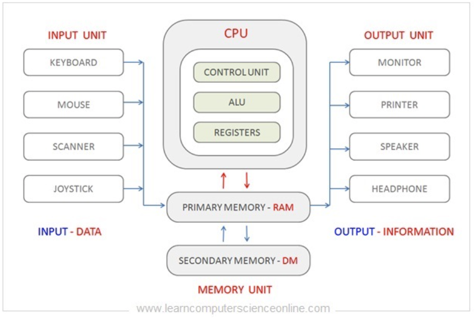

# Computer Architecture

## 1. Computer Architecture란?

***Computer Architecture*** 는 컴퓨터 시스템의 Design과 구조 및 구성요소 또는 이를 다루는 분야를 의미함.

* CPU 
    * ALU, Control Unit, Register, Cache
    * ISA (Instruction Set Architecture)
* Memory
* I/O Device 

---

---

## 2. Architecture of a Simple Computer System

{width="400"}

> **DM** : Disk Memory. 보통은 storage라고 부름.

* [Memory](./ce04_01_memory.md) *****
    * byte oriented addressing에 대한 이해. 
    * address를 저장하는 register의 크기와 memory address에 대한 이해.
    * 다양한 memory들의 종류와 각각의 역할.
* [Byte Ordering](./ce04_02_byte_ordering.md) *****
    * big-endian과 little endian
* [I/O Bus](./ce04_03_io_bus.md): Bus에 대한 이해와 다양한 입출력 표준 이해. *** 
* [CPU](./ce04_04_cpu.md)
    * cpu의 구성요소 이해: ALU, CU, Register *****
    * core, mpu, microprocessor, microcontroller ****
    * [Instruction Sets](./ce04_11.md): Instruction set이란?  **
    * [Instruction Execution](./ce04_22_fetch_execute.md): fetch와 execute 이해. ***
    * [Signal Traffic Control](./ce04_31.md): random logic과 microcode. * 
* [RISC vs. CISC](./ce04_41.md): Instruction set을 통한 cpu 구분. *****
* [GPU, NPU, and TPU](./ce04_51.md): AI시대의 core device, GPGPU. *****    

