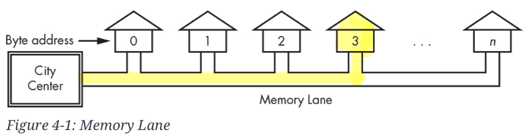
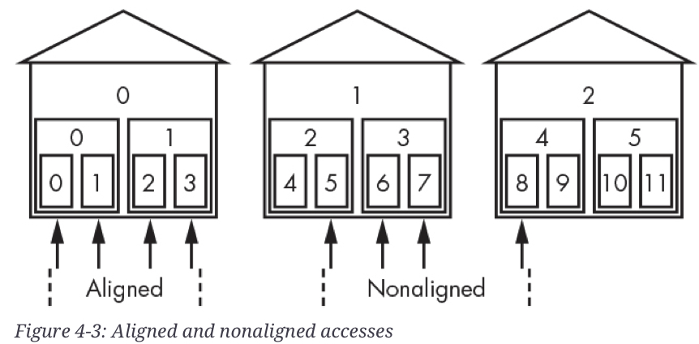
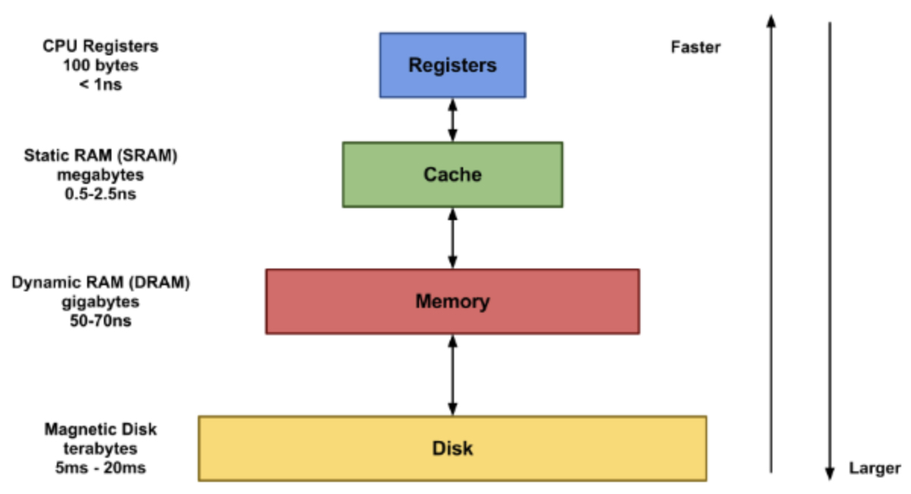

# Memory (기억장치)

컴퓨터는 어찌보면 ^^입력된 데이터들을 처리하고 그 결과를 출력하는 장치^^ 임. 

데이터 처리는 

* 데이터 등에 해당하는 여러 bit를 조작해야만 하며,
* 이들을 저장할 장소가 필연적으로 요구된다. 

***컴퓨터에서 bit들을 저장하는 장소를 `memory` (기억장치)라고 부름.***

> 넓은 의미에서의 memory는 storage (주로 block device)를 포함.

---

## 1. Memory Location and Address

Memory에 대한 접근은 `Address`를 통해 이루어짐 (이를 **Random Access** 라고 부름).

- Address가 다르면 Memory 내의 위치가 다름.

> **정의: Random Access**  
> 
> * address 를 통해 
> * 메모리의 물리적 위치와 상관없이 
> * 동일한 시간 내에 어느 위치에 있는 데이터든 
>
> 직접 접근할 수 있는 특성을 가리킴.​​​​​​​​​​​​​​​​

{style="display: block; margin: 0 auto; width:500px;"}

위 그림에서 집들은 1byte의 같은 크기를 가지는 각각의 `memory location`을 의미한다.

- 각각의 집(memory location)에는 `byte address`가 할당되어 있음.
- 64bit computer의 경우 이런 memory location이 $2^{64}(=n)$개 존재할 수 있음.
    - Memory Lane = Memory Bus,
    - City Center = CPU

Memory의 address를 지정할 때, 

* `byte`들을 2개, 4개, 또는 8개를 묶어서 지정하는게 일반적이다. 

현재의 64bit Computer에서는 8개의 byte를 묶어서 한번에 지정한다.

---

## 2. Memory Address and OS

64bit computer 인지 32bit computer 인지 구분은  
실제로는 CPU 내의 **memory(기억장치)인 register의 크기로 결정** 됨. 

> 64bit computer 는 CPU 내의 register의 크기가 64bit임.
> 

memory에 저장된 값을 **CPU가 접근** 하기 위해서는  
***cpu내 register에 address가 저장*** 되어야 하기 때문에  
몇 비트 컴퓨터이냐에 따라 가용 memory의 한계가 결정됨.

- 16bit computer는 memory address를 $2^{16}$가지로 지정 가능.
    - 이는 2bytes로 address를 지정함을 의미.
    - 16bit를 `word`라고 자주 부름
- 32bit computer는 memory address를 $2^{32}$가지로 지정 가능.
    - 이는 4bytes로 address를 지정함을 의미.
    - 32bit를 long word라고 자주 부름
- 64bit computer는 memory address를 $2^{64}$가지로 지정 가능.
    - 이는 8byte로 address를 지정함을 의미.

64bit computer의 경우, 최대 $2^{64}$ bytes에 해당하는 address를 가질 수 있으나,  
실제 memory addressing에는 ***전체 64bit 중 하위 48bit만 사용*** 함.

- `C`언어에서의 **pointer variable (포인터 변수)** 의 크기(자료형의 크기)를 보면,  
  해당 memory address가 어느정도 크기인지를 알 수 있음.
- 64bit computer가 제대로 동작하려면, H/W 측면 외에도 S/W 적으로도 64bit가 지원되어야 함.
- 무엇보다 OS부터 64bit OS를 설치해야 함.

> $2^{64}$ bytes 은 16,777,216 TiB (Tebibytes, 2의 40승)의 어마어마한 수임.

---

## 3. Non-Aligned Access

32bit Computer의 경우, Memory에서 32bit 단위: 즉 **4개의 bytes가 묶여서 읽을 수 있음**  
(register의 크기에 맞추어 생각하자)

때문에 보다 효과적인 데이터 읽기를 위해, 

* 데이터를 Memory에서 특정 기준에 맞춰 정렬시켜 저장시키는데
* 이를 가리켜 ***Memory Alignment*** 라고 부른다.  

예를 들어, 
 4바이트의 `int` 타입의 데이터는 Memory에서  
 시작주소가 4의 배수가 되는 곳에 저장시킨다. 

정렬되지 않은 방식으로 데이터가 저장될 경우, 
 성능 저하 뿐 아니라 오류를 발생시킬 수 있기 때문에  
 `Padding` 등을 통해 Aligned Memory가 되도록 처리함.

다음 그림은 Memory Alignment가 왜 필요한지를 보여준다.

* 4개의 bytes가 한번에 읽어들여지는 방식으로 동작하는데,
* 아래 그림처럼 5,6,7,8의 byte address 를 차지하고 있는 경우에는
* 2번의 access가 필요하게 되며, 이는 성능 저하로 이어짐.

{style="display: block; margin: 0 auto; width:500px;"}

- 참고로 일반적으로 `int` type으로 수치 데이터를 다루는 것이 가장 빠름.
- 하지만 실수형 데이터(real number)를 다룰 때는 `double`이나 `float` 중 에서 골라야 함(정수형보다는 느림.):
- 항상, 라이브러리에서 기본으로 지정된 것을 사용하는게 가장 좋다.

---

---

## 4. Memory Hierarchy: Price/Performance ratio and Access time

`Register`
: 속도는 최고이나 가장 비싸고 많은 데이터 저장이 어려움. CPU 내부에 위치. ALU등이 바로 사용하는 작은 크기의 데이터를 담고 있음.  
(`flip-flop`으로 구성됨)

`SRAM (Cache, Static RAM)`
: register보단 느리나 충분한 속도를 가짐.  
register보단 동일 가격에 보다 많은 데이터를 저장할 수 있음.  
CPU 내부에 위치  
(register보다는 거리가 멀리 있으며 거리순에 따라, L1, L2, L3등으로 나뉨)  
L3는 core 밖에 위치.

`DRAM (Dynamic RAM)` 
: 주기억장치로 많이 사용됨.  
SRAM보다는 느리지만 가성비는 보다 나음.  
보통 RAM이라고 하면 DRAM을 가리킴

`HDD (Hard Disk Drive)`
: 보조기억장치의 대표격으로  
속도는 매우 느리지만, 같은 비용에 매우 많은 데이터를 저장 가능함.

`SSD (Solid State Drive)` 
: HDD를 대신하는 보조기억장치로 떠오르고 있음.  
NAND Flash Memory 이므로,  
HDD보다 빠른 ACCESS를 보이나 비용이 아직은 HDD보다 높음.

{style="display: block; margin: 0 auto; width:500px;"}
<figcaption>ref. https://wisetrue.tistory.com/m/173 </figcaption> 

- capacitance (용량)은 아래로 갈수록 커짐.
- `throughout`은 `단위시간당 처리량(속도)`로 위로 갈수록 커짐.

---

---

## 5. References

* [The Secret Life of Programs, Ch4](https://nostarch.com/foundationsofcomp)
* [The Secret Life of Programs, Ch5: 메모리 계층과 성능](https://nostarch.com/foundationsofcomp)
* [윌리의 Technical References](https://m.blog.naver.com/PostView.naver?isHttpsRedirect=true&blogId=techref&logNo=222246966805)
