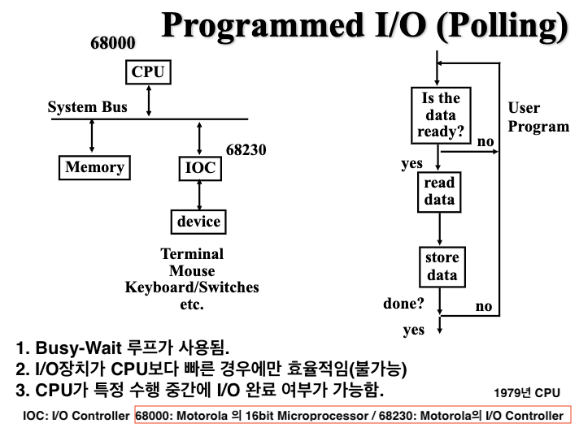
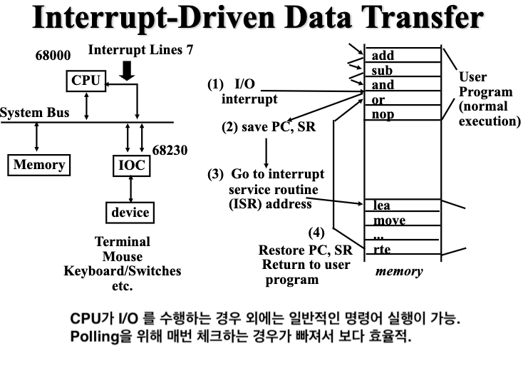
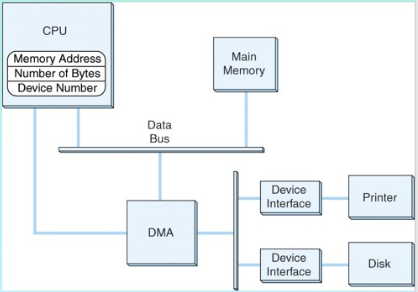
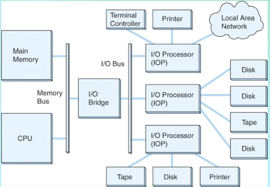

# **입출력 제어방식 (Input/Output Control Methods)**

컴퓨터와 입출력 장치가 데이터를 주고받는 방법을 
**입출력 제어방식 (Input/Output Control Methods)** 이라고 함.

* I/O Device를 제어하는 I/O Controller (or Device Controller)가 존재.
* I/O Controller 는 CPU와 통신을 수행하여 입출력장치는 I/O Controller에 연결되어 이를 통해 CPU와 데이터를 주고 받음.
* I/O Controller를 통한 데이터 통신은 CPU에서 해당 장치의 Device Driver 라는 프로그램이 실행됨으로서 수행됨.
* Device Driver는 Device controller를 동작시키는 명령어 및 데이터를 주고받는데 필요한 명령어들로 구성됨.

> 즉, I/O Device Controller와 CPU간에 데이터를 주고받는 방식을 I/O Control Method라고 부름.

흔히, CPU가 관여 여부로 구분되며, 다음과 같은 주요 방식으로 나누어짐:

- **Programmed I/O (PIO)**,
- **Interrupt-Driven I/O (Including PIC/APIC)**,
- **DMA (Direct Memory Access)**,
- **Channel I/O**

---

## **1. CPU가 관여하는 방식 (CPU-Involved Methods)**

### (1) Programmed I/O (PIO)

{style="display: block; margin: 0 auto; width:500px;"}

- **특징 (Characteristics)**:

    - CPU가 입출력 장치를 직접 제어하며 데이터를 전송할 준비 상태를 확인.
    - 이때 **Polling** 방식이 사용됨: CPU가 장치의 상태(Flag)를 지속적으로 확인하는 방식.
    - CPU가 I/O Device의 `Status Register`를 읽어 장비가 준비되었는지를 확인.

- **효율성 (Efficiency)**:

    - CPU가 반복적으로 상태를 확인하며 대기하기 때문에 다른 작업을 수행할 수 없음.
    - Interrupt-Driven I/O나 DMA에 비해 비효율적임.
    - 오늘날 PC에서는 느린 속도의 장치 제어나 초기화 단계(BIOS)와 같은 단순한 작업에서 여전히 사용됨.

- **동작 순서 (Operation Sequence)**:

    1. 입출력 장치가 I/O 요청.
    2. CPU가 장치 상태를 확인하며 대기.
    3. 준비 완료 시 데이터를 전송.
    4. 데이터 전송 후 기존 작업 재개.

- **상태 레지스터 (Status Register)**:

    - **위치 (Location)**: I/O 장치의 컨트롤러(Device Controller) 내부에 위치하며, CPU 내부에 존재하지 않음.
    - **역할 (Role)**: 장치의 현재 상태(예: 준비 상태, 에러 상태 등)를 나타냄.
    - **접근 방법 (Access Methods)**:
        1. **메모리 매핑(Memory-Mapped I/O)**: 
            * 상태 레지스터를 메모리 주소 공간에 매핑하여 접근.
            * 일반 memory접근과 차이없이 I/O Device에 데이터를 전송하거나 읽어들임.
        2. **포트 매핑(Port-Mapped I/O)**: 
            * `Isolated I/O`라고도 불림.
            * I/O 주소공간이 memory 주소공간과 분리되어 별도로 존재 
            * 특수 명령어를 사용하여 레지스터에 접근.

> Python의 `input()` 함수는 동기적 방식으로 CPU가 입력 대기 상태에 머무른다는 점에서 PIO와 비슷하나, 이는 하드웨어 PIO와는 다른 소프트웨어적 입출력 처리 방식으로 구분할 것.
>
> 하드웨어 PIO는 CPU가 I/O 장치의 상태 레지스터를 주기적으로 읽으며 데이터 전송 준비 상태를 직접 확인하고, 준비 완료 시 데이터를 전송합니다. 반면, `input()` 함수는 소프트웨어적으로 구현된 동기화 메커니즘으로, 하드웨어 상태 레지스터를 직접 제어하거나 확인하지 않습니다.

#### 참고: PIO (or Polling)의 사용 사례:

- 매우 느린 I/O 디바이스 상태 확인 등.
    - 실제로는 특수 목적의 소형 임베디드 시스템이 아니면 거의 사용안됨. 
    - 오늘날 PC에서도 프린터 및 키보드 입력에서 마저 Interrupt-Driven I/O 방식을 사용하여 Polling 대신 인터럽트를 통해 처리됨.
- 초기화 단계(BIOS)처럼 단순한 하드웨어 제어가 필요한 상황에서는 여전히 사용됨.

### (2) Interrupt-Driven I/O

{style="display: block; margin: 0 auto; width:500px;"}

- **특징 (Characteristics)**:
    - 입출력 장치가 준비되면 CPU에 인터럽트(H/W Interrupt)를 보냄.
    - CPU는 준비 대기 중에도 다른 작업을 수행할 수 있음.
    - 일반적으로 여러 Interrupt를 처리(다중인터럽트)하기 위해 Programmable Interrupt Controller (PIC) 또는 Advanced Programmable Interrupt Controller (APIC)가 사용됨. APIC는 현대 시스템에서 더욱 일반적으로 사용되며, 효율적인 다중 인터럽트 처리를 지원함.
    - 여러 I/O Devices를 지원하기 위해 PIC는 다층 구조를 가지게 됨.
- **효율성 (Efficiency)**:
    - Polling에서 발생하는 반복 확인 과정을 제거하여 CPU 자원을 절약.
    - PIC/APIC는 Interrupt 우선순위를 관리하며, NMI (Non-Maskable Interrupt)와 같은 우선도가 높은 Interrupt를 먼저 처리함.
        - NMI는 일반 인터럽트보다 중요한 하드웨어 오류 처리 등에 사용됨.
        - Interrupt Register의 값에 상관없이 NMI는 처리됨.
- **동작 순서 (Operation Sequence)**:
    1. 입출력 장치가 준비 완료.
    2. CPU는 인터럽트를 통해 알림을 받음.
    3. 인터럽트 처리 루틴으로 입출력 수행.
    4. 완료 후 기존 작업 재개.

참고: [Interrupt 요약](https://dsaint31.tistory.com/447)

---

## **2. CPU가 관여하지 않는 방식 (CPU-Independent Methods)**

### (1) DMA (Direct Memory Access)

DMA에서는 DMA Controller가 CPU의 관여없이 직접적으로 Memory에 접근함.

DMA 기능이 CPU 칩셋 또는 I/O 브릿지(예: Southbridge 또는 PCH)에 통합되는게 일반적이나, 고성능 시스템은 특정 I/O H/W에 내장되기도 함.

- **특징 (Characteristics)**:

    - DMA Controller가 Memory와 I/O Device 간 데이터 전송을 담당. 
    - CPU는 초기 설정만 제공하고 나머지 작업에 관여하지 않음.
        - CPU가 DMA Controller에 입출력 정보만 초기에 전달함.
        - I/O Device의 주소 및 수행할 I/O 관련 연산과 관여된 메모리 주소가 초기 설정임.
    - 작업 완료 후 인터럽트를 통해 CPU에 알림.

- **효율성 (Efficiency)**:

    - CPU의 작업 간섭을 최소화하여 작업 효율성 증가.
    - DMA Controller가 메모리에 접근할 때 우선권을 획득(Cycle Stealing).

- **동작 순서 (Operation Sequence)**:

    1. CPU가 DMA Controller에 입출력 정보를 전달.
    2. DMA Controller가 버스 사용 요청(Bus Request).
    3. CPU가 버스 사용 허가(Bus Grant).
    4. DMA Controller가 데이터를 전송.
    5. 작업 완료 후 CPU에 인터럽트로 알림.

#### **Details**:

{style="display: block; margin: 0 auto; width:500px;"}

- DMA Controller는 마치 I/O 장치처럼 레지스터를 포함하며, 아래와 같은 주요 레지스터를 가짐:
    - **버퍼 주소(Buffer Address)**: 데이터 전송의 시작 메모리 주소.
    - **버퍼 크기(Buffer Size)**: 데이터 전송 크기(단어 계수기).
    - **명령(Command)**: 전송 방식, 읽기/쓰기 명령.
- 작업이 끝난 후 인터럽트를 통해 CPU에 작업 완료 보고.
- CPU와 DMA가 동시에 메모리에 접근할 경우 ***DMA가 우선권*** 을 가지며, 이를 **사이클 탈취(Cycle Stealing)** 이라고 함.

### (2) Channel I/O

Channel I/O는 여러 개의 입출력 장치를 각각 channel로 독립적으로 관리하며 대량의 데이터를 병렬로 처리하는 방식임.

- I/O Channel마다 I/O Processor 가 존재: ALU 과 Control Unit을 가짐.
- I/O 처리를 위한 고유의 mini-program을 I/O Processor가 돌림.

{style="display: block; margin: 0 auto; width:500px;"}

> DMA와 가장 큰 차이점은  
> DMA의 경우, I/O Device에서 failure가 발생하는 경우에는 CPU가 개입해야함.  
> 하자민 Channel I/O에서는 해당하는 I/O Processor가 처리하여 CPU 개입이 없음.

Channel I/O
- 대형 컴퓨터 기반의 금융이나 과학 연산처럼 높은 신뢰성과 고속 처리가 요구되는 분야에 활용되는게 일반적
- 소형 컴퓨터나 특수 목적 시스템에서도 다중 채널 DMA와 같은 방식으로 구현됨.

> 다중 채널 DMA(Multi-channel DMA)
>
> DMA(Direct Memory Access)의 확장된 형태로, 여러 개의 데이터 전송 요청을 동시에 처리할 수 있는 구조를 가짐.
>
> - DMA 컨트롤러가 다수의 입출력 장치(I/O devices)를 각각 별도의 채널로 관리하여 데이터를 메모리와 장치 간에 병렬로 전송할 수 있음.&#x20;
>
> - 이를 통해 데이터 전송 효율을 크게 향상시키며, 특히 다중 작업이 필요한 환경에서 효과적

- **종류 및 특징 (Types and Characteristics)**:

  - **셀렉터 채널(Selector Channel)**:
      - 고속 장치를 담당하며, 입출력 명령을 하나씩 처리.
      - 예: 디스크와 같은 고속 장치.
  - **멀티플렉서 채널(Multiplexor Channel)**:
      - 저속 장치(예: 키보드, 프린터)에서 여러 입출력 명령을 동시에 처리 가능.
      - 여러 장치를 순차적으로 서비스.
  - **블록 멀티플렉서 채널(Block Multiplexor Channel)**:
      - 여러 개의 명령어 집합을 받아 차례로 자동 처리.
      - 셀렉터 채널과 멀티플렉서 채널의 특성을 모두 가짐.
      - 입출력 중 하나의 장치만 집중적으로 처리하되, 다른 장치의 요청 사항은 저장 가능.

- **효율성 (Efficiency)**:

    - CPU의 관여 없이 독립적으로 처리하여 효율성 극대화.
    - 입출력 처리 속도 향상.

---

## 참고자료

* [EECC250 - Shaaban](https://slideplayer.com/slide/5053939/)
* [HSM 개발공부](https://h-devnote.tistory.com/20)
* [Interrupt and Polling](../ch05/ch05_04_02_interrupt.md)

