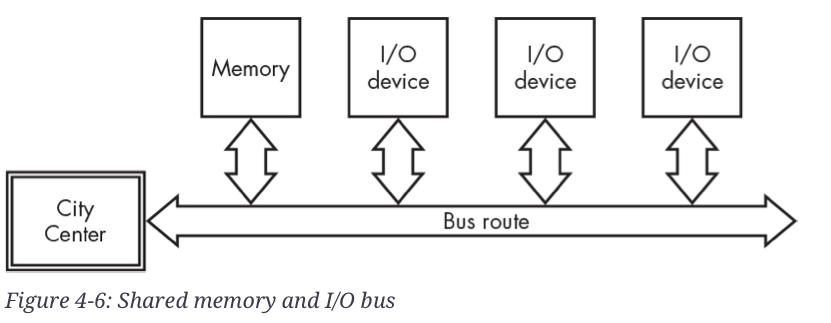

# Input and Output: BUS

현재의 컴퓨터들은 memory와 I/O Device를 같은 bus로 연결 하여 정보를 주고 받음.

<figure markdown>
{width=600, align=center}
</figure>

위 그림은 System Bus와 I/O Bus가 결합된 형태.

---

---

## Bus

컴퓨터 내에서  ***CPU(중앙 처리 장치)가***  

* Primary memory (주기억장치) 및 
* I/O device (입출력 장치) 들과  
* **정보를 전송하는데 사용하는 전기적 공통 선로**.

> 컴퓨터 내에서 ***데이터(address 및 명령어 포함) 전송*** 은 ***bus를 통해 이루어짐***.
> 

- ***구조*** 에 따른 분류 (← 현대 컴퓨터는 이 둘이 합쳐진 구조)
    - System Bus : CPU와 Memory 연결 (Data line, Address line, Control line)
    - I/O Bus : Memory와 다른 I/O device(or Peripherals) 연결
- ***신호의 기능*** 에 따른 분류
    - Data Bus : CPU가 메모리나 I/O 기기에 데이터 송출 또는 읽어들일때 데이터를 전송.
    - Address Bus : CPU가 메모리나 I/O 기기의 주소 지정.
    - Control Bus : CPU가 데이터 전송 시 제어 관련 신호나 자신의 상태 정보를 알리는데 이용
- Internal Bus(내부버스)
    - CPU 내에서 register들 연결하는 bus만을 가리키는 경우도 있으나.
    - 최근엔 memory나 video card 등의 기본적으로 내장된 component간의 통신을 지원하는 bus를 가리키는 경우가 보다 많음.
- External Bus 
    - 외부버스, CPU와 Peripherals간의 데이터 전송을 하는 bus를 가리킴.
    - Expansions (확장버스, 다른 기능을 지원하는 장치를 연결할 때 많이 사용됨.)
    - slot 형태 (or port)라 “확장슬롯“이라고도 불림.

---

---

## External Bus의 종류.

### ISA (Industry Standard Architecture) *

초기 확장 버스 방식. 매우 높은 호환성을 가지나 매우 느린 속도.

현재 거의 사용되지 않음.

1981 (PC/XT Bus, 8bit ISA), 1984 (PC/AT Bus, 16bit ISA)

---

### EISA (Extended ISA)

ISA보다 향상된 기능. 하지만 역시 현재 거의 사용되지 않음.

---

### VESA (Video Electronics Standard Association)

486컴퓨터에서 사용됨.  
당시에는 데이터 전송 속도가 개선된 버스였으나 현재는 거의 사용되지 않음. 

`PCI`로 대체됨.

---

### PCI (Peripheral Component Interconnect) *

현재 널리 쓰이는 `PCI-E`의 이전 (old) 버스.  
하지만 ^^PCI-E와 호환성이 없음.^^

plug-and-play 기능을 지원하고 bridge회로를 통해 높은 호환성을 보임.

---

### AGP (Advanced Graphics Port) *

GPU카드 전용버스  
(2000년대에 일반적으로 그래픽카드가 부착되던 port. 현재는 PCI-E가 그 자리를 물려받음).

***그래픽카드만 장착가능*** (속도도 PCI-E보다 느림).

* Intel이 제안
* 그래픽카드를 위한 높은 속도와 대용량 데이터 전송 능력을 보였으며 
* 4가지의 속도 모드로  8x (AGP 3.0) 가 가장 빠른 형태임. 

> AGP 1x (1997) : 66MHz Clock, 32bit/clk = 266MB/s  
> 를 기준으로 몇 배의 속도인지를 나타냄.
> 

---

### ***PCI-E (PCI Express)*** **

2023 년 현재 그래픽카드 등의 ***고속의 데이터 전송이 요구되는 외부장치*** 위한 bus.  
이론적으로 `x16` (242.08GB/sec)까지의 양방향 고속 데이터 전송 지원.

* 버전이 하나 올라갈수록 2배 정도의 속도 향상이 이루어짐.
* 동일 버전에서는 2의 제곱에 해당하는 lane 수에 따라 2배의 속도 향상이 이루어짐: 16lane까지 지원.

> 1 lane (`x1`) 이 기본 단위.
> 
> * `x1`는 1개 lane 임을 가리키며, 
> * `x` 뒤에 숫자를 표기하여 몇 개의 lane이 할당되었는지를 의미함.

초기엔 PCI 의 한계를 극복하고자 개발이 되었으나,  
현재 가장 높은 전송대역폭과 인기를 자랑하면서  
AGP가 담당하던 그래픽카드를 위한 bus로까지 이용되고 있음.

| PCIe 버전 | 1레인(x1) | 2레인(x2) | 4레인(x4) | 8레인(x8) | 16레인(x16) |
| --- | --- | --- | --- | --- | --- |
| 1.0 | 250 MB/s | 500 MB/s | 1 GB/s | 2 GB/s | 4 GB/s |
| 2.0 | 500 MB/s | 1 GB/s | 2 GB/s | 4 GB/s | 8 GB/s |
| 3.0 | 984.6 MB/s | 1.97 GB/s | 3.94 GB/s | 7.88 GB/s | 15.75 GB/s |
| 4.0 | 1.97 GB/s | 3.94 GB/s | 7.88 GB/s | 15.75 GB/s | 31.51 GB/s |
| 5.0 | 3.94 GB/s | 7.88 GB/s | 15.75 GB/s | 31.51 GB/s | 63.20 GB/s |
| 6.0 | 7.56 GB/s | 15.12 GB/s | 30.24 GB/s | 60.48 GB/s | 120.96 GB/s |
| 7.0 | 15.13 GB/s | 30.26 GB/s | 60.52 GB/s | 121.04 GB/s | 242.08 GB/s |

* PCI-E 는 `full duplex` 이므로 실제 데이터 대역폭은 위의 숫자에서 2를 곱하면 됨.

참고: [Full Duplex(전이중) 란?](../ch06/ce06_2_01_history.md#-)

---

### USB ***

[Universal Serial Bus](../ch06/ce06_1_09_usb.md) 참고.