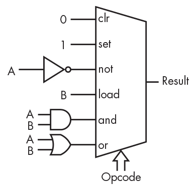
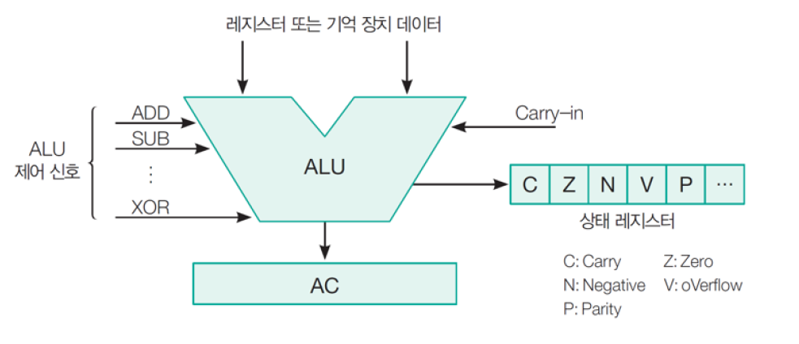
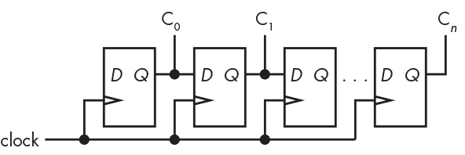
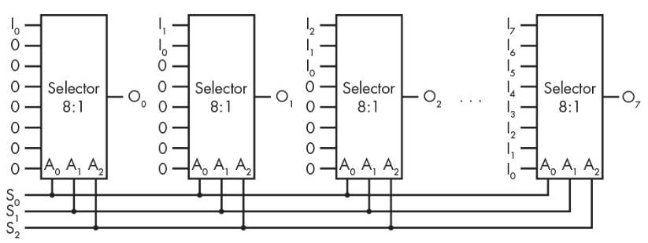

# Arithmetic and Logic Unit

arithmetic and logical operation (연산) 이 실제 수행되는 장치.

뭔가 신비해 보이지만, selector와 combinatorial logic circuit (gate)로 구성된다 

{width="300"}

* shift operation은 shift register로, data flow control은 control unit에서 이루어짐.

> operation을 구성하는 microoperation은 크게 register-transfer, arithmetic, logical, shite 들의 4가지로 나누어지는데, ALU는 이중 arithmetic operation과 logical operaton을 담당한다고 볼 수 있다. (register에 저장된 data들에 대해 이루어지는 기본적인 operaton들을 micro-operation이라고 함)

* Cotrol unit에서 오는 control signal (`opcode`)에 따라, data를 가져와서 연산을 수행.
* Accumulator 와 `condition code register`등에 연산결과와 status가 저장됨.

{width-"300"}

* 위 그림에서 status register 가 바로 condition code register임.
* ALU 제어 신호는 달리 말하면, `opcode` (operation code)로 연산의 종류를 의미함.
* 상단의 register 에서 들어오는 data를 `operand` (피연산자) 라고 부름.

## ALU's opcodes

ALU가 수행하는 opcode들을 나타낸 표임. (example)

| opcode | mnemonic | description |
|:----:|:----:|:---|
|0000| clr | operand에 상관없이 result를 0으로|
|0001| set | result를 1로|
|0010| not | operand `A`의 각 bit에 not연산|
|0011| neg | operand `A`의 two's complement `-A`를 result로|
|0100| shl | Shift `A` left by the low 4 bits of `B`|
|0101| shr | Shift `A` right by the low 4 bits of `B`|
|0110|  | Unused |
|0111|  | Unused |
|1000| load | pass operand `B` to the result |
|1001| and | bitwise `A AND B`  |
|1010| or | bitwise `A OR B`  |
|1011| xor | bitwise `A XOR B`  |
|1100| add | `A + B`  |
|1101| sub | `A - B`  |
|1110| cmp | Set condition codes based on `B-A` (compare)  |
|1111| | Unusd|

## Shift Registers

`shift`연산을 담당.

### Sequential Shift Register

flip-flop들로 구성한 shift register임.

* 1bit를 shift하는데 1 clk가 필요 : 매우 느림.

### Barrel Shifter

selector(or MUX) 기반의 shift register.

> shiter를 만드는데 들어가는 기본 구성요소 selector등은 EDA등에서 component로 제공되며, 이들을 조합하여 하나의 chip으로 만드는게 일반적임. 마치 programming이 여러 function과 class들을 조합하는 것과 비슷하다.

## Control Unit

* [Execution Unit (or Control Unit), Program Counter, and Instruction Register](https://dsaint31.tistory.com/entry/Execution-Unit-or-Control-Unit-Program-Counter-and-Instruction-Register)

