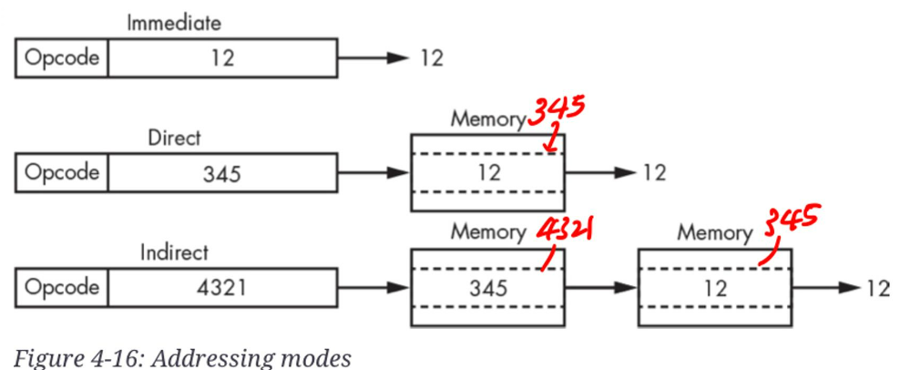
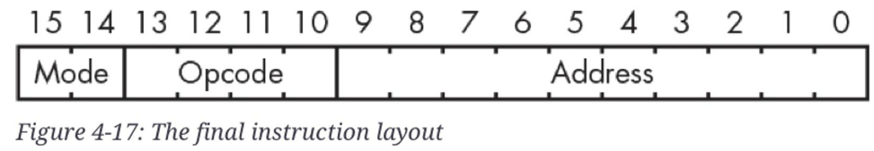

# Instruction Sets

## Instruction

### 정의 ***

> 컴퓨터가 수행해야할 명령을 나타내는 bit pattern.  
> CPU에서 control unit이 이를 해석하여 이에 해당하는 제어신호를 보내게 됨.

---

일반적으로 instruction은

* (addressing) mode
* operation code (opcode)
* address

로 구성됨 (Single-address instruction layout).

`mode`
: addressing mode를 가리킴. 간단히 말하면 3가지의 다른 addressing mode가 존재함.

`opcode`
: 수행할 명령어를 나타내는 code.

`address`
: 현재 수행할 instruction과 관련된 data들이 놓인 memory location 혹은 data 그 자체, 또는 memory location이 놓여있는 memory location. (addressing mode에 따라 다름)

Single-address instruction layout은 ALU에서의 결과가 accumulator에 저장되고 해당 accumulator를 operand로 사용하는 형태.

* 한번에 하나의 memory location에 접근하면 되며, 적은 크기의 instruction으로 수행가능하다는 장점을 가짐.

---

---

## Addressing Mode (주소지정 모드)

> 여기서 다루는 addressing mode는 absolute addressing에 해당함.  
> 후에 다루는 `relative addressing`도 존재.

instruction에서 memory location을 가리키는 방법은 다음과 같은 3가지로 나뉜다.

### `immediate mode addressing`

* instruction에 address가 아닌 실제 값이 들어가 있는 경우임.
* 작은 크기(bit)의 상수값을 이용하는 경우 사용되며 가장 속도가 빠른 방식.

### `direct addressing`

* instruction에 포함된 address가 reference하는 곳(memory location)에 instruction이 사용할 value(값)이 있음.

### `indirect addressing`

* instruction에 포함된 address가 가리키는 곳에 또 address가 들어 있음.
* 즉, instruction에 포함된 address가 reference하고 있는 memory location에 가서 값을 가져오는게 아니고, 
* 해당 memory location의 값이 또 address이기 때문에 다시 해당 address가 reference하고 있는 memory location으로 가서 값을 가져옴.

> instruction의 크기를 늘리지 않고도 보다 큰 용량의 memory로 확장할 수 있음.  
> 단, 2번에 걸쳐 memory에 접근하므로 가장 느림.

{style="display: block; margin: 0 auto; width:500px"}

> `absolute addressing`은 주소 0을 기준으로 address를 나타내지만,  
> `relative addressing`은 현재 주소를 기반으로 상대적인 값을 통해 address를 나타낸다.

---

---

## Condition Code Instructions.

condition code register를 직접 다루는 instruction을 가리킴.

`cca` instruction

* Condition Code register → Accumulator
* condition code register의 저장된 값을 accumulator로 copy.

`acc` instruction

* Accumulator → Condition Code register

---

---

## Branching (분기, 분기명령)

일반적으로 하나의 instruction이 수행되고 나면, PC register가 가리키고 있는 instruction을 수행하게 되고, 해당 다음 instruction을 수행하기 전 PC는 하나가 증가하게 됨. 이 같은 경우, 메모리에 저장된 instruction들을 순서대로 수행하게 된다.

하지만 프로그램이 항상 순서대로만 수행되는 게 아닌 특정 조건에 따라 다른 순서로 수행해야 하는 경우도 있기 때문에 이를 위한 ^^branching 명령어^^ 가 존재함.

이들은 PC register의 값을 직접 변경하여, instruction들의 수행순서를 바꾸게 함. 대표적인 Branch instruction의 종류와 이에 해당하는 조건은 다음과 같음.

|Code	| Mnemonic	| Description |
|:---:|:---:|:---:|
|000	|`bra`	|branch always.
|001	|`bov`	|branch if the `O` (overflow) condition code bit is set.
|010	|`beq`	|branch if the `Z` (zero) condition code bit is set.
|011	|`bne`	|branch if the `Z` condition code bit is not set.
|100	|`blt`	|branch if `N` (negative) is set and Z is clear.
|101	|`ble`	|branch if `N` or `Z` is set.
|110	|`bgt`	|branch if `N` is clear and `Z` is clear.
|111	|`bge`	|branch if `N` is clear or `Z` is set.

- condition code register의 해당하는 bit에 대한 조건을 만족하면 branching.

위에서 살펴본 것처럼 조건에 의해서 branching하지 않고, program counter register의 값을 명시적으로 그냥 바꾸는 등의 동작을 수행하는 instruction도 존재함.

- `pca` : 현재 program counter register의 값을 accumulator로 copy.
- `apc` : 현재 accumulator의 값을 program counter register로 copy.

---

---

## Final Instruction Set

16bit 기준 single address instruction layout은 다음과 같음.

{width="600"}

| Opcode	|Direct (00)	|Indirect (01)	|Immediate (10)	|None (11)|
|:---:|:---:|:---:|:---:|:---:|
| 0000	| `load`	 |`load`  |`load`	| |
| 0001	| `and`	 |`and`   |`and`|	`set`|
| 0010	| `or`	 |`or` 	|`or`	|`not`|
| 0011	| `xor`	 |`xor`	|`xor`|	`neg`|
| 0100	| `add`	 |`add`	|`add`|	`shl`|
| 0101	| `sub`	 |`sub`	|`sub`|	`shr`|
| 0110	| `cmp`	 |`cmp`	|`cmp`|	`acc`|
| 0111	| `store`  |`store` |   |   `cca`|
| 1000	| `bra`	 |`bra`|	`bra`|	`apc`|
| 1001	| `bov`	 |`bov`|	`bov`|	`pca`|
| 1010	| `beq`	 |`beq`|	`beq`| |	
| 1011	| `bne`	 |`bne`|	`bne`| |	
| 1100	| `blt`	 |`blt`|	`blt`| |	
| 1101	| `ble`	 |`ble`|	`ble`| |	
| 1110	| `bgt`	 |`bgt`|	`bgt`| |	
| 1111	| `bge`	 |`bge`|	`bge`| |	

* `shl`, `shr` 는 operation에서 사용하지 않는 하위 4비트를 이용하여 얼마만큼 쉬프트할지를 지정함.

---

---

## program과 instruction set ***

우리가 만드는 program은 결국 위와 같은 instruction들의 list임.

- 사람이 알기 쉬운 high level programming language로 프로그래밍을 하여 작성된 source code 는 위에 나열된 instruction들의 list로 변경됨.
- 해당 instruction의 list는 정해진 bit size의 bit-pattern들의 묶음임.
