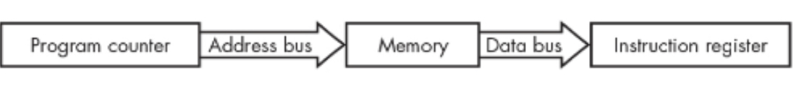

# 명령어 수행: Fetch and Execute

instruction의 수행은 다음과 같은 fetch-execute cycle로 구성된다.

---

## Fetch

CPU가 instruction(명령어)을 실행하기 위해,  
**memory에서 instruction을 register (정확히는 instruction register)로 가져오는 것** 을 의미함.

- stored program computer에서는  
memory에 처리해야 하는 instruction들의 list가 저장되어 있음.
- Program Counter register (← PC register)가 reference하고 있는 `memory location` (=다음에 수행되어야하는 instruction이 저장된 memory location)에 저장된 instruction을  
`instruction register`로 가져오는 것을 `fetch` 라고 함.

{width="500"}

- PC에 저장된 주소가 address bus를 통해 memory로 주어지고,
- address bus를 통해 전달된 address에 해당하는 memory location에 저장된 값이
- data bus를 통해 instruction register로 저장됨.
- 이 값이 사실 instruction임.

---

---

## Execute

fetch된 instruction이 해당 instruction의 내용에 따라, memory에서 값을 읽어오는 등의 여러 작업이 이루어지며 이에 따라 해당 instruction이 수행됨. 이 단계를 Execution cycle이라고 부름.

> 이같이 fetch된 instruction을 수행하기 위해 memory에 접근하는 등의 작업을 하는 동안, instruction이 저장되어 있는 공간이 바로 instruction register임.

---

하나의 instruction을 수행하기 위한 fetching-execution cycle은 여러 단계가 필요하기 때문에, 현재 단계가 무엇인지를 나타내는 counter가 필요하다.

