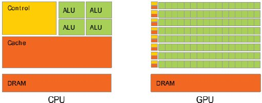

# Graphics Processing Units

다음 URL을 확인할 것.

* [GPU](https://dsaint31.tistory.com/416)

아래 그림은 CPU와 GPU의 차이점을 모식도로 표현함.
병렬처리에 최적화된 GPU의 특징인 다수의 core 를 볼 수 있음.

{width="300"}

---

---

## Tensor Processing Unit (TPU) 

Google에서 커스텀식으로 개발한 ASIC(Application-Specific Integrated Circuit).
Tensorflow로 구현된 application등을 효과적으로 학습시키고 처리하는 데 사용됨.

- Dense vector and matrix 를 매우 빠르게 처리한다.

다음의 경우 권장됨.

- matrix operation이 주를 이루는 경우.
- 기본 training loop 내에 custom TensorFlw 작업이 없는 모델
- 몇 주 이상의 장기간 학습이 필요한 경우
- 초대형 모델

> 개인이 연구하는 모델 수준에선 GPU가 훨씬 빠르게 동작한다.  
> TPU는 단가가 낮아 여러 개를 병렬로 사용되는 경우 GPU 보다 낮은 가격으로 높은 성능의 시스템을 구축할 수 있음.

