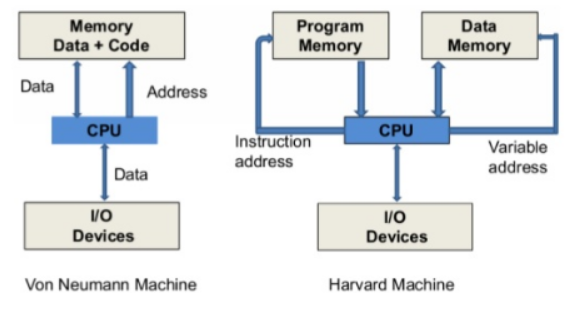

# Computer Architecture

## von Neumann Architecture vs. Harvard Architecture

{width="500"}

`von Nuemann` Architecture
: EDVAC 관련 보고서에서 등장하였고, EDSAC에서 최초로 구현된 컴퓨터 구조. `stored program`방식으로도 불리며 data와 program이 동일한 공간에 저장되고 동일한 버스를 사용된다. John von Neumann이 제안한 방식임.

참고자료: [EDSAC, EDVAC, 그리고 Stored Program Computer](https://ds31x.tistory.com/384)

`Harvard` Architecture
: Mark I 컴퓨터가 program은 종이 테이프(punched paper tape)에 저장하고, data는 Relay 기반 메모리에 저장한 구조를 반영하여 발전한 방식으로, program과 data가 저장되는 memory와 bus가 분리되어 있다. 이 역시 대표적인 stored program computer의 architecture로 von Neumann구조와 매우 유사하다. ***분리된 memory와 bus를 통해 동시에 program과 data 접근이 가능*** 하므로 von Neumann보다 빠른 성능이 가능하다는 장점을 가진다.

> CPU 외부에서는 von Neumann architecture를 주로 따르며, 내부에선 Harvard architecture를 따름.

MMU가 도입되면서, single bus로도 program memory와 data memory가 분리되는 효과를 얻을 수 있게 됨 (Virtual Memory System, VMS 통해) : 때문에 von Neumann Architecture와 Harvard Architecture간의 구분이 모호해짐.

