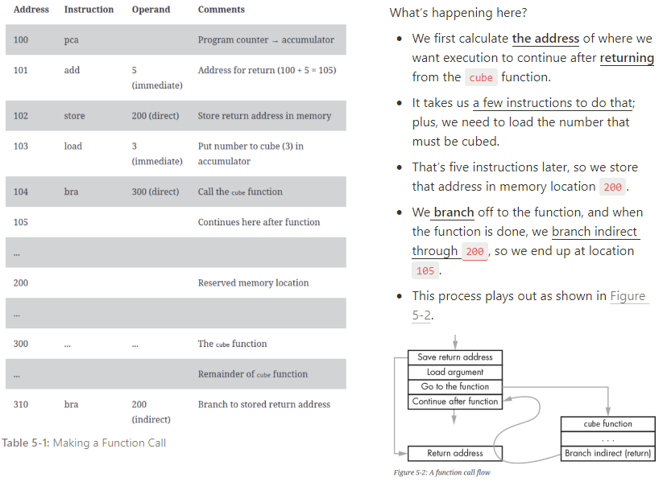

# Function in the Programming


> Mathematics에서의 function과 약간의 차이점이 있으나 프로그래밍에서의 function은 많은 부분에서 Mathematics에서의 function과 유사함.

수학에서 function은 특정 계산들을 `reuse`하거나, 복잡한 계산을 보다 쉽게 `read`할 수 있도록 하기 위해 equation을 사용하여 특정 계산 등을 `f(x,y)`와 같은 형태로 대체하는 것이라고 볼 수 있다.

> 수학적으로 엄밀한 의미의 function은 mapping이나 transform의 개념으로 설명되어진다. 다음의 url을 참고하자: [함수 간략 정리](https://dsaint31.tistory.com/entry/Function-%ED%95%A8%EC%88%98-%EA%B0%84%EB%9E%B5-%EC%A0%95%EC%9D%98)

Programming에서도 function은 ***재사용성*** 과 ***가독성*** 을 위해 사용된다.

* Programming에서의 function은 동의어로 `procedure`, `subroutine` 등이 많이 사용된다.

> 특정 programming language에서는 이들을 조금 다르게 사용하기도 하지만 실제적으로 부르는 이름의 차이만 있을 뿐 개념상으로는 큰 차이 없다.

수학에서 function은 ^^입력과 출력간의 mapping에 좀 더 초점^^ 을 두는 반면, programming에서의 function은 입력들을 받아 출력(Programming에선 return value라고 부르는 경우가 더 많음)을 만들어내는 ^^처리에 초점^^ 을 더 둔다는 차이는 있다.

## Programming에서의 Function.

> 논리적으로 코드를 나누는(or 그룹짓는) 기본적인 도구.
> - `procedure`의 추상화로서 코드의 묶음: I/O 만 파악해도 사용가능함.
> - 함수 내 변수는 `local variable`로, 다른 함수에 의해 영향을 받지 않음.
> - **parameter에 ^^호출시 주어진 argument^^ 를 할당하여 입력** 을 받고, **`return`을 통해 출력** 을 수행.

Programming에서의 function은 SW (or program)에서 특정 동작을 수행하는 ***일정 code들의 모임*** 을 의미한다.  

`특정 동작(=특정 처리)을 수행하기 독립적으로 설계된 프로그램 코드의 묶음(or 집합)`으로 정의할 수 있음.


입력 (parameter들로 정의됨) 및 그에 따른 출력(return value로 정의됨)을 가지며, 이들 사이에서 입력을 바탕으로 출력을 만들기 위한 처리부분으로 구성됨.

* Programming에서의 function은 입력이 없거나 출력이 없는 것도 가능함 (둘 다 없을 수도 있음)
* Programming에서 반복되는 처리들을 묶어서 function으로 만들고 해당 처리들을 각각 수행하는 방식이 아닌, 이들을 묶어서 만든 function을 호출하여 수행하는 것을 권장함.

> Imperative programming language의 경우엔 function을 만드는 것이 programming에서 가장 중요한 작업 중 하나에 해당한다.

## Function의 종류.

### `built-in function`

Programming language등이 기본적으로 제공하는 함수들을 가르킴. 파일 입출력 등과 같이 많은 경우에 공통적으로 필요한 다양한 함수들이 built-in function으로 제공됨.

Programming을 공부한다는 것은 상당 부분이 built-in function들을 올바르게 사용하는 것을 익히는 것이기도 함. (영어 공부에서 단어나 숙어 공부에 해당?)

### `custom function`

프로그래머가 built-in function을 기반으로 작성한 고유의 함수들. 프로그래밍을 한다는 것은 많은 function을 만들어내는 작업을 포함한다.

## 예 : Function 만들기 

다음은 Python, JavaScript, C 에서 세제곱을 수행하는 `cube`함수를 정의하는 예를 보여줌.

* 모든 경우 function의 이름은 `cube`로 지정함.
* function의 입력은 parameter `x`의 값으로 주어지게 됨. function `cube`를 call(호출)할 때 주어지는 argument가 `x`의 값으로 할당된다.
* 모든 경우 출력은 `x`의 세제곱을 수행한 값임.

```Python
# Python
# Function Definition
def cube(x):
    tmp = x **3
    return tmp 

# Function Call
a = cube(3);    
```

```Javascript
// JavaScript
// Function Definition
function cube (x)
{
    return (x * x * x);
}

// Function Call
a = cube(3);

//console.log(a)
```

```C
// C
// Function Definition
float cube(float x)
{
    float tmp = 0.;
    tmp = x*x*x;
    return tmp;
}

// Function Call
float a = cube(3);
```

## Function call (함수 호출)을 instruction set으로 쪼개보기

> 다음은 [The Secret Life of Programs](https://nostarch.com/foundationsofcomp)의 5장에서 2번째 절의 내용 일부임.)



* 위의 구현에서는 `bra`(branch always)를 통해 `cube` 함수의 실행코드가 있는 주소로 제어가 점프하기 전에 복귀할 address를 ***고정된 특정 주소 (`200`)에 저장*** 하고 있음.
* 문제는 고정된 주소에 저장하기 때문에 `recursive function call` (재귀함수호출)을 지원할 수 없음 (때문에 실제로는 `stack` 이라는 data structure 가 사용됨.)
* Function call은 stack에 argument들과 return address를 저장하기 때문에 ***추가적인 부하*** 가 발생한다. 
* 하지만, 이를 없앤다고 function을 사용하지 않을 경우 program code자체에 중복되는 코드가 너무 많아져 버그에 취약해지고 가독성을 잃게 되므로 가급적 중복되는 처리는 function으로 만들어서 사용해야 한다.

> Recursive call (재귀호출) 에 대한 이해를 위해선 [Subdivision using DFS](https://dsaint31.tistory.com/entry/CE-Subdivision-using-DFS)와 [recursive call : Fibonacci Sequence](https://dsaint31.tistory.com/entry/Python-recursive-call-Fibonacci-Sequence)를 참고하라.

### Function call과 stack.

프로그램이 수행될 때, function call이 이루어지면 function이 저장되어 있는 memory의 address로 PC가 가르킴에 따라 수행되는 주소의 분기(branching)가 이루어짐.

function의 수행이 끝나면 function call이 이루어진 다음 주소로 돌아와야 하기 때문에 해당 address가 저장되어야 한다. 이 돌아올 address 및 function에서 사용할 local variables( parameters 포함)은 stack에 저장되게 된다.

이같이 ^^stack에 저장된 데이터들의 모음^^ 을 `Stack Frame`이라고 부름.

* function(=subroutine)으로 전달하는 parameters (이들의 값은 호출 시 사용된 argument임)
* local variables (C언어)
* 복귀 주소

 stack관련해서는 다음 url을 참고. : [Stack](https://dsaint31.tistory.com/entry/CE-Stack)


