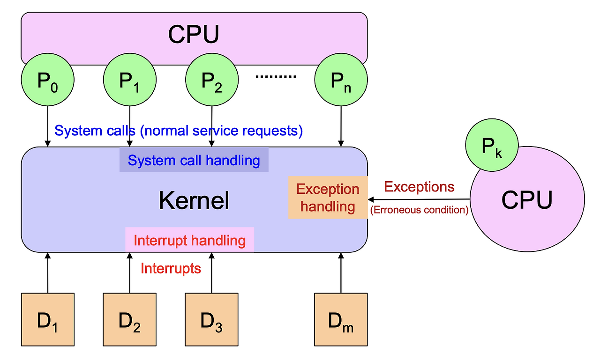

# Interrupt and Polling

{style="display: block; margin: 0 auto; width: 600"}

`Interrupt`와 `Polling`은 

* `CPU`에게 어떤 event들이 발생했음을 알리고
* 이들을 처리하기 위해 제안된 두가지 방법임.

event가 발생했을 때, `CPU`는 대개의 경우 어떤 process를 처리하고 있을 경우가 많음.  
즉, `CPU`는 어떤 process를 처리하고 있는 도중이라도 특정 event들이 발생했는지 여부를 알 수 있어야 하고 이를 처리할 수 있어야 함.

예를 들어, 키보드에서 입력이 된 event가 발생했으나 `CPU`가 특정 process를 처리하느라 이를 인식하지 못할 경우 사용자는 해당 process가 종료되기 전까지는 키보드를 통한 어떤 입력도 수행되지 못하는 것을 보게될 것이고 이는 컴퓨터가 죽은 게 아닌가 생각하게 될 것임. 때문에 interrupt나 polling을 통해 event를 확인하고 처리할 수 있어야 함.

---

---

## Polling

> `Polling` 방식은 CPU가 실행 중인 software가 주기적으로 device의 상태 register, flag, queue 등을 확인하여 event 발생 여부를 점검하는 방식임.

즉, `Polling`은 device가 먼저 CPU에게 알리는 방식이 아니라, CPU가 실행하는 program이 반복적으로 다음과 같은 질문을 하는 방식임.

* keyboard input이 있는가?
* network packet이 도착했는가?
* disk I/O가 완료되었는가?
* 특정 flag가 set 되었는가?

이 방식은 구현이 단순하지만, 점검해야 할 대상이 많거나 event 발생 빈도가 낮은 경우 비효율적임.

* event가 발생하지 않았는데도 계속 상태를 확인해야 하기 때문임.
* 따라서 `Polling`은 점검해야 할 event의 수가 많아질수록 CPU time을 낭비하기 쉬움.

때문에 현재는 일반적인 computer 시스템에서는 `interrupt` 방식이 `polling` 보다 많이 사용되며, 실제로 ^^HW적으로 구현된 interrupt system이 사용^^ 된다. 

다만 Polling도 여전히 사용됨. 

* 예를 들어 embedded system,
* driver 내부의 특정 대기 loop,
* network protocol 처리,
* game loop, event loop 등에서는
* polling 방식이 적절하게 사용될 수 있음.

---

---

## Interrupt

`Interrupt`는 ^^CPU가 주기적(and 주도적)으로 device 체크하는 `polling`^^ 과 달리, event가 발생된 경우 ***해당 event와 관련된 device가 CPU에게 event가 발생*** 되었다고 알려준다.

> 즉, `Interrupt`는 CPU가 계속 확인하는 방식이 아니라, event 발생 주체가 CPU에게 처리를 요청하는 방식임.

주변기기에서 발생한 `interrupt`의 처리과정을 예를 들어 살펴보면 다음과 같다.

1. 주변기기에서 CPU가 attention해야 하는 event가 발생함.
2. device 또는 interrupt controller가 `Interrupt Request` (IRQ)를 생성하여 processor에게 전달함.
3. processor는 현재 instruction의 실행을 적절한 지점에서 마무리한 뒤 interrupt 요청을 확인함.
4. processor는 현재 실행 흐름으로 돌아오기 위해 필요한 최소한의 상태를 저장함. 일반적으로 `PC`, `status register` 등이 저장됨.
5. interrupt 번호 또는 vector를 이용하여 해당 interrupt를 처리할 `interrupt handler` 또는 `Interrupt Service Routine` (`ISR`)의 위치를 찾음.
6. processor는 kernel mode 또는 privileged mode로 전환한 뒤 해당 interrupt handler를 실행함.
7. interrupt handler는 해당 interrupt에 필요한 처리를 수행함.
8. 처리가 끝나면 저장해 둔 실행 상태를 복원하고, 중단되었던 작업을 다시 수행함.

`Interrupt handler`는 특정 interrupt가 발생했을 때 수행되어야 하는 작업을 구현한 function 또는 routine이라고 볼 수 있음.

---

### Stack 과 interrupt

> Interrupt가 발생하면, 현재 실행 중이던 code로 나중에 다시 돌아오기 위해 실행 상태의 일부가 저장되어야 함.  
> 이때 사용되는 대표적인 자료구조가 `stack`임.

다만 `stack` 자체가 processor 내부에 hardware로 구현되어 있는 것은 아님.  

* 실제 stack은 memory에 존재하며,
* processor는 `stack pointer` register와 stack 조작 instruction, interrupt entry mechanism 등을 통해 stack 사용을 지원함.

Interrupt 처리 시 stack에는 interrupt handler가 종료된 뒤 원래 실행 흐름으로 돌아가기 위한 정보들이 저장됨.  
대표적으로 다음과 같은 정보들이 저장될 수 있음.

* return address에 해당하는 `PC (Program Counter)` 또는 `IP (Instruction Pointer)`
* processor status register 또는 flags
* privilege level 전환과 관련된 stack 정보
* 일부 general-purpose register
* OS kernel이 interrupt 처리를 위해 추가로 보존해야 하는 정보

이처럼 저장되는 실행 상태들을 넓게 `context`라고도 부름.

* [참고자료: 다양한 context](https://ds31x.tistory.com/621)

> 다만 이 저장 작업 전체를 interrupt handler가 직접 모두 수행한다고 보면 안 됨.
> 일반적으로 processor hardware가 `PC`, status register 등 최소한의 정보를 자동으로 저장하고, 나머지 register 저장은 interrupt entry code, ISR prologue, 또는 OS kernel code가 수행함.

따라서 interrupt 처리에서 stack은 다음 목적을 가짐.

* interrupt 처리 후 원래 실행 위치로 복귀
* interrupt 발생 당시의 processor state 보존
* interrupt handler 실행 중 필요한 임시 데이터 저장
* nested interrupt 처리 지원

---

### Interrupt vector

`Interrupt handler`가 위치하고 있는 memory address등을 가지고 있음.

발생한 interrupt의 종류와 이를 처리할 interrupt handler의 memory address등을 가지고 있음.

> 엄밀히 애기하면, **Interrupt Vector** 는
>
> * interrupt 종류를 식별하는 번호 또는 그 번호로 참조되는 entry 임.
> * 실제 handler 주소는 Interrupt Vector Table 또는 Interrupt Descriptor Table의 entry에 저장됨.

---

### (Interrupt) Mask, Priority and Timer

***특정 `interrupt`를 켜고 끌 수 있으며 이에 대한 정보를 가지고 있는 `mask`*** 가 존재함.

또한 interrupt들은 `priority`(우선순위)를 가지며 ***높은 우선순위의 interrupt*** 가 우선적으로 처리된다.

지나치게 interrupt처리에 많은 시간을 줄 수 없으며, 이같은 시간제한을 위한 `timer interrupt`도 존재함.

**Interrupt Mask** 

* 특정 `interrupt`를 허용하거나 차단할 수 있으며, 이를 제어하기 위한 `mask`가 존재함.
* `Interrupt mask`는 특정 interrupt source를 일시적으로 비활성화하거나, 특정 조건에서 interrupt 처리를 미루기 위해 사용됨.
* 예를 들어 중요한 kernel code가 실행되는 동안 일부 interrupt를 잠시 막을 수 있음.

**Priority**

* interrupt들은 `priority`(우선순위)를 가질 수 있으며,
* 여러 interrupt가 동시에 발생하거나 처리 대기 중인 경우 높은 우선순위의 interrupt가 먼저 처리됨.

**Timer (Interrupt)**

* `Timer interrupt`는 일정 시간 간격으로 발생하는 interrupt임.
* 운영체제는 이를 이용하여 system clock 유지, timeout 처리, sleep 상태의 process 깨우기, process/thread scheduling 등을 수행함.

> 특히 preemptive multitasking OS에서는
>
> * `timer interrupt`를 통해
> * 현재 process/thread가 CPU를 너무 오래 독점하지 못하도록 하고,
> * 필요할 경우 scheduler가 다른 process/thread로 전환할 수 있게 함.

---

---

## 참고: OS와 signal (or event) handler system.

SW적 관점에서 OS는 마치 hardware interrupt를 모방한 ***virtual (or software) interrupt system*** 을 가지고 있다.

대표적인 예가 다음 두 가지임.

* system call
* SIGNAL

---

### System Call

User application이 file I/O, process 생성, network 통신 등 kernel의 기능을 사용하려면 system call을 호출해야 함.

이때 user mode에서 kernel mode로 전환이 일어남.

* 전통적인 x86 system에서는 `INT 0x80` 같은 software interrupt instruction(**TRAP** 이라고 불림)을 사용하여 system call을 수행했음.
* 현대 x86 system에서는 `SYSCALL`, `SYSENTER` 같은 전용 instruction이 사용됨.
* ARM 계열에서는 `SVC` instruction이 사용됨.

이들은 모두 user mode program이 CPU instruction을 실행하여 kernel mode로 진입한다는 공통점을 가짐.

> **TRAP**은
> 특정 instruction 이름이 아니라
> system call이나 CPU exception처럼 현재 실행 흐름에서 동기적으로 발생하는 kernel/handler 진입 mechanism을 가리킴.

단순화하면 다음과 같음.

1. user application이 system call wrapper function을 호출함.
2. 내부적으로 `SYSCALL`, `SVC`, `INT n` 같은 instruction이 실행됨.
3. CPU가 privilege level을 kernel mode로 전환함.
4. kernel의 system call handler가 실행됨.
5. 요청된 kernel service가 수행됨.
6. 처리가 끝나면 user mode로 복귀함.
7. 원래 user application의 실행이 재개됨.

이러한 흐름은 ***synchronous하게 발생*** 함.  
즉, system call instruction을 실행한 바로 그 instruction 흐름에서 kernel mode 진입이 발생함.

{style="display: block; margin: 0 auto; width:600px"}

* Signal을 제외한 Interrupt들의 개념도!

> **system call** 은
> 넓은 의미에서 software interrupt 또는 TRAP-like mechanism으로 설명할 수 있음

---

### SIGNAL

> UNIX/Linux에서 signal은
> kernel이 process에게 특정 event의 발생을 통보하기 위해 사용하는 mechanism임.

UNIX에서는 이러한 software interrupt 개념에 착안하여, 

* 프로세스에게 **비동기적** 으로 event 발생을 통보하기 위한 signal mechanism을 제공.
* Signal은 **software interrupt와 유사하게 _현재 실행 흐름을 중단_ 하고 등록된 handler를 호출** 한다.
* 하지만, CPU 명령어에 의해 **동기적으로 발생하는 software interrupt(TRAP)** 와 달리
* kernel이 프로세스 단위로 전달하는 **비동기적/동기적 통보 메커니즘** 이라는 점에서 구별(주로 비동기이긴함)됨:
    * `CTRL+C`에 의한 `SIGINT`도 대표적인 SIGNAL 의 예임
    * **CPU Exception에 의해 만들어지는 SIGNAL은 동기적 (Internal Exception)** 이나
        * `SIGSEGV`, `SIGFPE` 등은 해당 instruction 실행 결과로 발생하므로 synchronous signal.
    * 다른 대부분의 **SIGNAL은 모두 비동기적** 임 (SIGNAL은 주로 비동기적임).
        * 즉, `SIGINT`, `SIGTERM`, `SIGALRM`은
        * process의 현재 instruction 흐름과 직접적인 관련 없이 전달될 수 있음.    

[SIGNAL 요약](https://ds31x.tistory.com/132)

대표적인 signal은 다음과 같음.

* `SIGINT`: 사용자가 CTRL+C를 입력했을 때 발생
* `SIGTERM`: process 종료 요청
* `SIGKILL`: process 강제 종료
* `SIGFPE`: arithmetic exception 발생
* `SIGSEGV`: invalid memory access 발생
* `SIGALRM`: alarm timer 만료

보다 자세한 건 다음 url을 참고할 것 : [Interrupt 요약](https://dsaint31.tistory.com/447)

---

### 참고: H/W Interrupt vs. S/W Interrupt vs. Signal

* H/W Interrupt는 **외부 장치가 CPU에게** event 발생을 알리는 것(External, Asynchronous)이고,
* S/W Interrupt는 **프로그램이 CPU instruction 을 통해 Kernel mode에 진입** 을 요청(CPU의 명령어 execute 통해)하는 것(Internal, Synchronous) 이며,
* Signal은 (프로세스가) **Kernel을 통해 다른 프로세스에게** event 발생을 통보하는 것 (Kernel, Asynchronous/Synchronous 이나 주로 Asynchronous!).

| | H/W Interrupt | S/W Interrupt | Signal |
|---|---|---|---|
| **발생 원인** | CPU 외부 장치 (키보드, 타이머 등) | CPU가 명령어 실행 (`INT n`, `SVC`, `SYSCALL`) | Kernel이 process를 대상으로 통보 |
| **발생 위치** | CPU 외부 | CPU 내부 | Kernel |
| **동기/비동기** | 일반적으로 비동기 | 항상 동기 | 주로 비동기, CPU Exception에 의한 경우 동기 |
| **전달 대상** | CPU → Kernel(ISR) | CPU → Kernel(ISR) | Kernel → Process |
| **전달 방향** | H/W → Interrupt Controller → CPU → Kernel | 프로그램 → CPU → Kernel | Kernel → 프로세스 |
| **처리 방식** | ISR 실행 | ISR 실행 | Signal handler 실행  (or 기본동작 수행)|
| **handler 등록** | Kernel이 관리 | Kernel이 관리 | 프로세스가 일부 signal handler 등록 가능 |
| **목적** | H/W 이벤트 처리 | OS 서비스 요청 (system call, debug trap, exception처리) | 프로세스에 이벤트 통보 |
| **예시** | 키보드 입력, 타이머, disk I/O | `SYSCALL`, `SVC`, `INT 0x80` 등등 | `SIGINT`, `SIGFPE`, `SIGKILL` 등등 |

