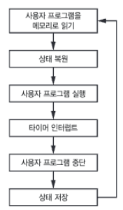

# Index Register와 Relative Addressing

`Absolute Addressing`+`Index Register` 와 `Relative Addressing`은

Multi-programming System 및 Time Sharing System에서  

* RAM에 적재된 여러 user program의 
* 각각의 address를 읽어들이기 위한 기술임. 

[notion 자료(비공개)](https://www.notion.so/mmmil/Relative-Addressing-OS-Index-Register-Relative-Addressing-3fbedadd0567417cab4461558da35e68
)

---

---

## 1. **OS: Time Sharing System 의 동작 방식: 타이머 인터럽트와 프로세스 메모리 접근 방식**

Time Sharing OS 타이머를 이용해 사용자 프로그램을 짧은 시간 간격(time slicing)으로 실행되도록 스케줄링함.  

* 이를 **타임 슬라이싱(time slicing)** 이라고 하며, 
* 이는 실행 중이던 프로그램의 상태를 저장하고 다음 프로그램으로 전환하여 시스템 자원을 효율적으로 사용하고,
* 사용자와 프로세스의 상호작용을 가능하게 함.
  
만약 하나의 프로그램의 데이터 만이 메모리에 적재될 경우, 

* 메모리에 실행할 프로그램의 데이터를 적재하고 복원하는 작업으로 인해
* 많은 시간과 자원을 많이 소모되며 시스템이 너무 느려지게 됨.

{width="200"}

즉, 이러한 문제를 해결하기 위해, 

* **사용자 프로그램의 데이터를 미리 메모리에 적재해 두고** 
* 프로세스가 실행될 때 적절한 메모리 접근 방식(addressing)을 사용하는 방법이 자주 활용됨.

> 즉, Time Sharing OS는 multi-programming OS의 확장임.

참고: [Time Sharing OS 와 Multi-Programming OS에 대하여](../../OS/operating_system.md#4-2-2-다중-프로그래밍multi-programming-시스템)

---

---

## 2. Memory Addressing

이를 위한 addressing으로는 다음의 2가지가 대표적임:

---

### **2-1. Absolute Addressing과 Index Addressing 활용**

Absolute Addressing(절대 주소 지정)은 명령어에 특정 메모리 주소를 직접 명시하는 방식임.

* 그러나 사용자 프로그램이 메모리의 특정 주소에 고정되지 않고 실행된다면, 
* 이같은 절대 주소만으로는 유효한 메모리 접근이 어려워짐. 
* 이를 해결하기 위해 **인덱스 레지스터(index register)**가 추가됨.

**인덱스 레지스터의 역할**:

  인덱스 레지스터는 명령어에 명시된 주소에 값을 더해 **유효 주소(effective address)** 로 매핑을 가능하게 함.  
  예를 들어,  
  사용자가 프로그램이 메모리 주소 `0` 부터 사용한다는 가정 하에  
  메모리 주소 `1000`부터 실행하도록 설계했다면,  
  실제로는 `3000`번지에서 실행되어야 하고, 
  이 경우, 인덱스 레지스터를 `2000`으로 설정함.

  - 명령어: `LOAD A(Index Register)`
  - 계산: `A + Index Register`

이같은 처리는 오늘날 컴퓨터에서는

* CPU (or Micro-processor)에 내장된 `MMU` (Memory Management Unit)이라는 H/W에서 이루어짐.
* `MMU`는 virtual address와 physical address를 구분하여 처리함.

---

### **2-2. 상대 주소 지정(Relative Addressing)의 활용**

상대 주소 지정은  

* 명령어가 메모리의 **기준 주소(base address)** 를 기준으로 
* ***오프셋(offset)을 계산*** 하여 메모리에 접근하는 방식임.

base address는 보통 프로그램 카운터(PC)나 베이스 레지스터(Base Register)에 저장됨.

- **장점**:
  1. 프로그램이 메모리 어디에 로드되더라도 ***기준 주소만 변경*** 하면 수정 없이 실행 가능.
  2. 프로세스 전환이 빈번한 멀티프로그래밍 환경에서 재배치(relocation) 작업이 간단해짐.
- **예제**:
  기준 주소가 `1000`이고, 명령어가 `LOAD A`라면 `LOAD 1000 + A`로 계산됨.
