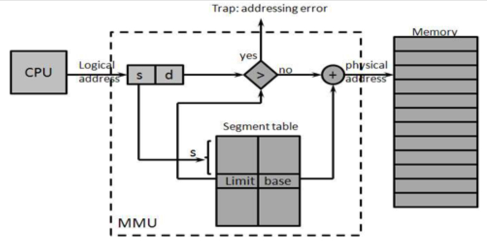
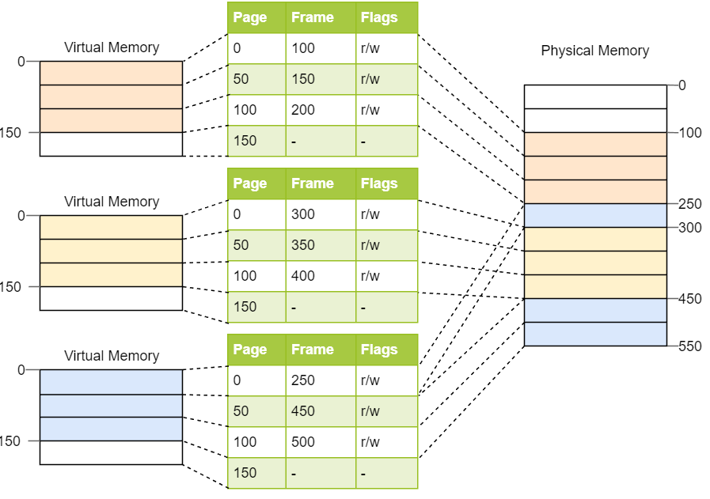
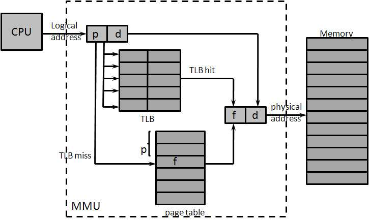
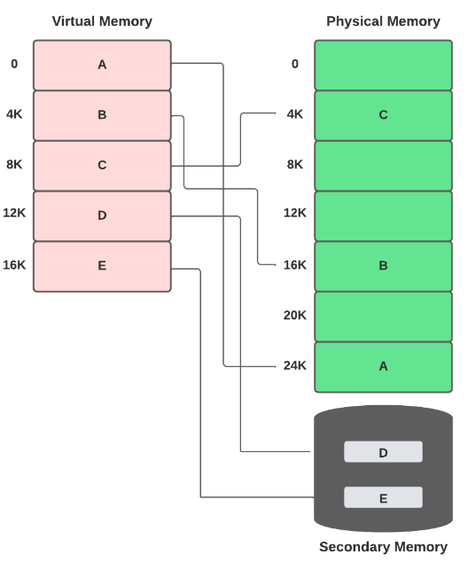
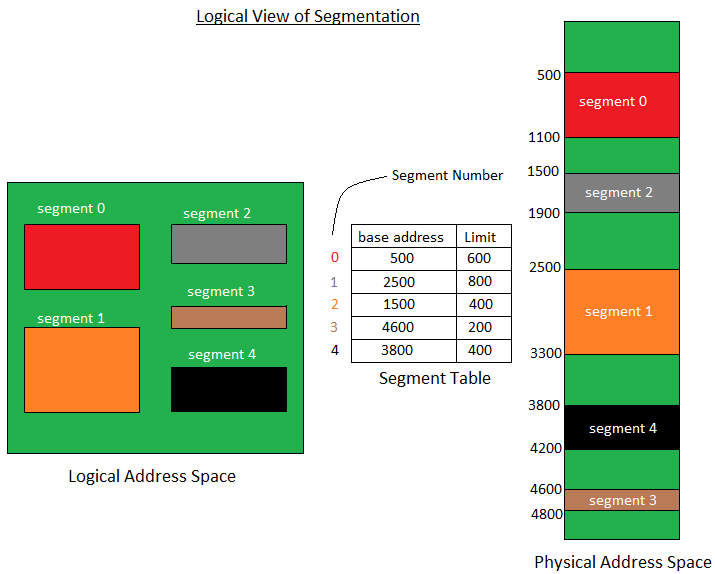
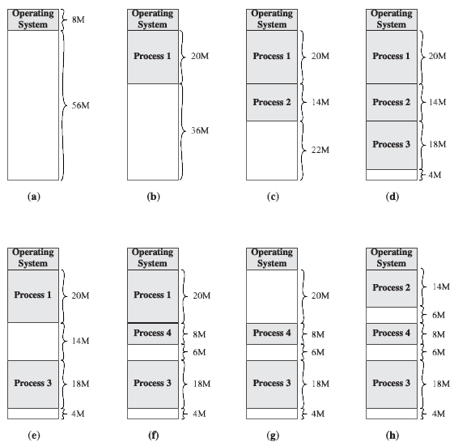
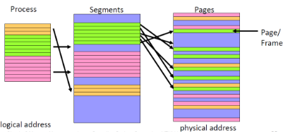

---
tags:
  - OS 
  - Memory
  - MMU
  - Virtual Memory
  - Page
  - Segmentation
  - Frame
  - Address Binding
  - Address 
---

# Memory Management Units (MMU)

## 1. Address 종류

random access memory에 접근하기 위해서는 address가 필요하며,  
이 address를 지정하는 방식은 다음의 2가지로 크게 나뉨.

---

### 1-1. Logical Address ( = Virtual Address )

* 기본적으로 Process마다 독립적으로 할당되는 주소 공간
* 각 process마다 0부터 시작한다.
* CPU 와 program, programmer 가 사용하는 address!

---

### 1-2. Physical Address

* Physical Memory 에 실제 주소.
* Memory Management Unit 을 통해 얻어짐.

> 추가적으로 Symbolic Address 도 사용된다.  
> 아래 [Logical Address와 Symbolic Address](#logical-address-와-symbolic-address)를 참고.

---

---

## 2. MMU (Memory Management Unit) 이란? 

CPU (or Program)가 Physical Memory에 접근하는 것을 관리하는 **하드웨어 장치**.

MMU를 통해  

* Program(or CPU)가 사용하던 logical address(=virtual address)가  
* 실제 Memory의 physical address로 변환됨.

logical address를 physical address로 변환하는 작업을 address translation이라고 하며 MMU가 담당함.

다음 그림은 segment 기반의 MMU를 보여줌 (Paging 기반도 있음).

{style="display: block; width:500px; margin:0 auto"}

* MMU는 각 Program (or Process)에 해당하는 
    * `index register`(=`base register`)의 값을 가지고 있음
        * 이는 Segment table의 base address (=해당 process의 사용하는 physical address의 시작 address, `STBR`) 임.
    * 동시에 각 Process가 사용가능한 범위의 한계 address도 알고 있음: `limit register`.
* ^^MMU는 OS에 대해 transparent하지 않음.^^

> 현재는 CPU와 MMU가 하나의 chip으로 통합되어 있어서  
> 마치 physical memory가 CPU에서 나오는 것처럼 보일 수 있으나  
> CPU의 core에서는 logical address만을 사용하며,  
> 이를 MMU가 table lookup등을 통해 해당 process의 실제 physical address로 변환해줌.

주의할 건 

* logical address와 physical address간의 변환은 
* `MMU`, 즉 ***H/W상에서 이루어진다는 점*** 으로 OS는 여기에 관여하지 않음.

하지만, 앞서 기재했듯이 `MMU`는 OS에 대해 transparent하지 않기 때문에,

* address translation 은 OS 대신 `MMU`에 따라 H/W로 이루어지나,
* 이 변환과정에 필요한 table 의 설정은 OS가 관여해야 함.
* 즉, OS는 `MMU`가 사용하는 각 테이블의 위치 (base address)와 범위 (limit)을 설정하여
* `MMU`가 정상적으로 동작하도록 함.
* 이는 OS가 `MMU`의 내부 동작을 알고 있고 OS가 직접 `MMU`의 page table 을 변경함을 의미함.

> `MMU`는 von Neumann Architecture와 Harvard Architecture의 구분을 모호하게 만든다.  
> ^^하나의 bus를 사용하면서도 MMU는 data memory영역과 instruction memory 영역의 구분^^ 이 가능함.  
> (`MMU`를 통해 "여러 process별로 사용하는 memory 영역이 구분하는 virtual memory" 가 가능해짐.). 

참고: [A Survey on Computer System Memory Management and Optimization Techniques](http://article.sapub.org/10.5923.j.ajca.20120103.01.html)

---

### 참고: Transparent 의 의미.

앞서의 "Transparent"라는 표현은 

* 운영 체제(OS)나 사용자에게 특정 동작이 보이지 않고, 
* 내부적으로 자동으로 처리되는 것을 의미함.

즉, OS 또는 사용자에게 Transparent 한 H/W 또는 기능이란

* OS나 사용자 입장에서 해당 하드웨어나 기능이 존재하지 않는 것처럼 보이지만, 
* 실제로는 동작하고 있는 상태를 나타냄.

즉, "transparent하다"는 말은 "보이지 않지만 동작한다"는 것을 강조하는 표현임.

---

### 참고: Logical Address 와 Symbolic Address

CPU core에서 데이터에 접근하기 위해 사용하는 `logical address`가 programmer가 사용하는 address임.

* 하지만 오늘날 대부분의 programmer는 low level programming(기계어, assembler)를 하지 않기 때문에 ^^variable을 통한 `symbolic address`를 사용^^ 함.
* 때문에 실제로 logical address를 사용하는 것은 compiler, linker, interpreter 등의 program임. 

Logical Address는 보통 CPU 또는 program이 사용한다고 표기됨.  
Symbolic Address는 주로 프로그래머들이 사용함.

---

---

## 3. Address Binding

> Symbolic address와 logical address, physical address 간의 binding을 의미함.

`source code`에서는 symbolic address가 사용됨. 

* `Add A B`와 같이 `A`, `B`로 memory에 저장된 데이터를 가르킴.

compiler 및 linker에 의해서 symbolic address는 logical address로 변환됨 (symbolic address와 logical address간의 binding).

* logical address는 cpu와 low level program language를 사용하는 programmer가 사용함.

logical address는 해당 process가 loader에 의해 load되거나, 아니면 실행될 때 MMU등을 통해 physical address로 binding이 됨

* load time binding : memory에 적재시 binding.
    * loader 가 memory address 부여
    * compiler가 재배치가능코드(relocatable code) 를 생성
    * 메모리에 비어있는 공간 어디에도 올라갈 수 있음
* run time binding : 실행시 binding.
    * run time 중에도 process의 memory 위치가 변경가능함.
    * cpu에서 memory 접근이 이루어질 때마다 MMU에 의해 address translation이 이루어짐.

> 과거에는 compile 과정에서 physical address가 결정되던 Compile Time Binding도 있었음.  
> compiler가 relocatable code가 아닌 absolute code를 생성하는 방식으로 시작위치를 변경하려면 컴파일을 다시 해야함. 

MMU 등을 통한 virtual memory는 OS가 문제가 발생한 process의 memory영역을 파악하고 해당 resource를 다시 환수할 수 있음. 

* 때문에 전체  system이 특정 process들의 문제로 down되는 것을 막아주는 효과가 있다.  
* 실제로 ^^VMS (Virtual Memory System)이 도입^^ 된 이후로 `C` 프로그래밍 실습시간에서 pointer문제로 인해 OS가 뻗는 상황이 일어나는 횟수가 어마어마하게 줄어들었다.

---

---

## 4. Paging과 Segmentation

Multiprogramming System의 경우, 

* memory에 여러 process들이 적재되어야 함.
* 이를 위해선, 각 process가 사용하는 memory영역이 구분이 되어야 함.

이같은 이유 때문에 오늘날 OS에선 

* 하나의 process가 사용하는 physical memory 영역도 
* 효율적인 사용을 위해 noncontiguous allocation이 이루어짐.

> 이를 위해 memory 영역은 특정 단위로 나뉘어지게 된다

이때 나누는 단위가 `segment`와 `page` 임.

---

### 4-1. Paging

Memory를 동일한 크기로 자르며, page table이 physical memory 영역(frame)과 virtual memory 영역 간의 매핑을 담당함 (Table Lookaside Buffer 등도 포함됨).

* Paging은 Virtual memory와 Physical memory 공간을 고정 크기의 작은 block으로 나눈다. 
    * Virtual Memory의 상위주소를 이용해 Page Table에서 관련된 Page를 지정함.
    * Virtual Memory의 하위주소는 page 내에서의 displacement (or offset)임.
* Virtual memory 공간의 block은 `page` 라고 하고 
* Physical memory 공간의 block은 `frame` 이라고 한다. 
* 각 page를 frame에 하나씩 매핑할 수 있어서 대량의 메모리를 연속되어 있지 않은 frame들에 나눠서 놓을 수 있다.

다음 그림은 여러 process의 virtual memory와 physical memory의 관계를 보여줌.

{style="display: block; margin: 0 auto; width:500px"}

* page table을 `MMU`가 관리함.
* page table은 크기가 커서 RAM에 모두 적재하지 않고, 일부만 적재하여 사용.
* TLB (Translation Lookaside Buffer)를 사용하여 속도 향상.

{style="display: block; margin: 0 auto; width:500px"}

여러 process가 데이터를 공유해야하는 경우, ***shared page*** (=shared memory) 를 제공.

> paging에선 ***`internal fragmentation`(내부파편화)*** 가 발생함. 
> 페이지 크기가 100 바이트이면 크기가 105 바이트인 프로그램은 페이지 2개를 사용하고 95 바이트가 낭비됨.

또한 일부 CPU가 사용하지 않는 영역은 secondary memory에 둘 수도 있음.

{style="display: block; margin: 0 auto; width:400px"}

> 참고: [Shared Memory](../../OS/ipc.md#shared-memory)

---

### 4-2. Segmentation

`Paging` 과 달리 의미 단위(segment)로 Memory를 자름  
(ex. 스택, 데이터, 코드 / 함수 하나하나 / 프로그램 전체).

Segment table에서 각 segment별로 segment-number, base, limit 등의 정보를 관리한다.

{style="display: block; margin: 0 auto;width=500px"}

각 segment별로 protection bit를 할당하여 접근권한을 지정할 수 있음.

> segmentation의 경우 ***external fragmentation(외부단편화)*** 가 발생함.

{style="display:block; margin:0 auto; width:500px"}

> **외부 단편화(`external fragmentation`)** 는  
> 프로세스가 메인 메모리에서 소멸할 때 다른 프로세스가 올라오는 과정에서 발생한다.  
> 프로세스 소멸 후 그 소멸한 프로세스 파티션 자리에 그보다 작은 프로세스가 올라온다면 남은 파티션이 생긴다.  
> 예를 들어, 위 그림에서 d~f 상황을 보면, 14M짜리 프로세스2가 소멸되면서 8M짜리 프로세스4가 올라오는데 이 과정에서 6M 크기의 남는 파티션이 생긴다. 전체적인 메인메모리를 보면 10M 크기의 메모리가 남는데 10M 크기의 프로세스는 올라갈 수가 없다(f). 이러한 현상이 메인 메모리 상에서 반복해서 발생하다보면 말 그대로 구멍이 숭숭 뚫린 메인 메모리가 될 것이다.  
> 그 구멍(남는 파티션)들은 각각 사용할 수 있지만 한 프로세스가 올라가기에는 각각의 크기가 너무 작아 올라갈 수 없는 이런 현상을 ***외부 단편화*** 라고 한다.

---

### 4-3. Paging vs. Segmentation

**`Segmentation`의 경우 가변 길이로 memory가 나누어지기 때문** 에  

* `external fragment` 가 보다 쉽게 발생한다는 단점이 있으나  
* `paging` 에 비해 상대적으로 table 크기가 작은 장점을 가지며  
* 동시에 메모리에 로드될 수 있는 프로그램의 숫자에 제한이 없다는 장점 등을 가짐.

오늘날 OS는 `paging` 과 `segmentation` 이 같이 사용됨  
(segment로 먼저 나누고 한 segment가 page로 나누어지는 방식 등이 사용됨)

{style="display: block;margin: 0 auto;width: 500px"}

---

---

## 5. References

* [Memory-Management](https://velog.io/@ddosang/%EC%9A%B4%EC%98%81%EC%B2%B4%EC%A0%9C-8-Memory-Management)
* [KOCW 반효경 OS 18. Memory Management 1](https://core.ewha.ac.kr/publicview/C0101020140425151219100144?vmode=f)

