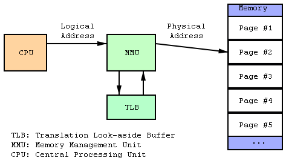
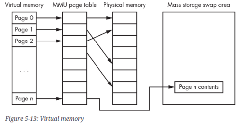

# Virtual Memory

## **1. Virtual Memory란?**

`MMU` 는 

* 프로그램(or Process)의 Virtual Memory를 
* 실제 Physical Memory에 매핑(Mapping)하는 역할을 수행함.  

 
> `MMU` can map a program’s virtual addresses to physical memory. 

더나아가 `Virtual Memory`는

* Memory Management Method로서, 
    * Physical Memory를 Abstraction 하여,
    * 실제 Physical Memory와 ^^사용자 관점의 Logical memory^^ 를 분리하고, 
* `MMU`를 통해 이들간의 Mapping 을 함으로서
    * 실제 Physical Memory 의 크기 제한을 넘어
    * 다수의 프로그램들이 동시에 실행 가능하도록 해 주는 메모리 관리 기술.

{style="display: block; margin: 0 auto; width:400px"}

---

---

## **2. Demand Paging (요구페이징)**

Virtual Memory Management를 위한 Method로서,

* 프로세스를 Memory에 Load할 때, 
* 프로세스의 전체 모든 Pages를 적재하지 않고, **필요한 Page들만 메모리에 load** 하고
* 나머지는 Disk에 저장하는 방식을 사용하여
* 메모리를 절약하는 기법임.

`Demand Paging`은 필요한 Pages만 RAM에 올리면서,  
동시에 최대한 Page Fault의 발생빈도를 줄이는 것이 목표로 함.

> 한 Process의 전체 영역이 Swap-In, Swap-Out하는 `Swapping` 과 달리,  
> 보다 쪼개어 이루어지는 것이 `Demand Paging` 임.

Demand Paging을 통해 Virtual Memory에서는  
**모든 프로세스에서 요청된 전체 메모리 양** 이 물리적으로 사용 가능한 양을 초과할 수 있게 됨.

* 이는 OS에서 `Demand Paging` 을 통해 
* 현재 필요하지 않은 메모리 페이지의 내용을 더 크지만 느린 대용량 저장 장치인 디스크로 이동 (Swap-Out) 시키고 
* 프로그램이 스왑 아웃된 메모리에 액세스하려고 하면, 운영 체제는 필요한 공간을 만들기 위해 필요한 작업을 수행한 후 요청된 페이지를 RAM으로 복사(Swap-In)를 수행함.

{style="display: block; margin:0 auto; width:400px"}

---

---

## **3. Page Fault**

Process가 실행하는 도중 필요한 Page가 Physical Memory에 존재하지 않아,  
Disk로부터 해당 Page를 Swap-In 해야 하는 경우를 가리킴.

* `Page Fault`는 `Fault` Interrupt를 발생시켜서 
* 필요한 Page를 Swap-In 시키는 작업을 시작시킴.
* 메모리에 빈 공간이 존재하면 그대로 읽어들여 Swap-In이 이루어지지만,
* 빈 공간이 부족하면, ***Page Replacement 알고리즘*** 에 따라 메모리의 Page 중 일부를 Disk로 Swap-Out시키는 작업이 선행됨.

Page Fault를 최소화해야 성능이 올라가며,  
Page Replacement 알고리즘은 흔히 `LRU (Least Recently Used) 알고리즘`을 사용함.

참고: [Fault Interrupt 에 대해](https://dsaint31.tistory.com/447#3-4.%20Internal%20Interrupt%3A%20Abort%2C%20Fault-1-6)

---

---

## **4. LRU (Least Recently Used) algorithm**

LRU 알고리즘은

* Pages에 대한 Access를 추적하여,
* 가장 최근에 빈번하게 사용되는 Pages는 Physical Memory에 남기고,
* 최근에 가장 덜 사용된 Page를 Swap-Out 시키는
* Page Replacement 방법임. 
