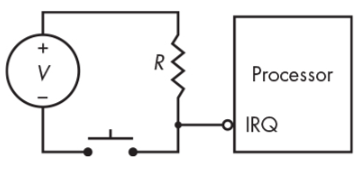
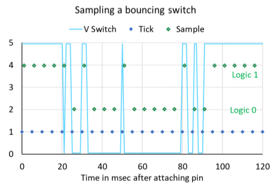

# Push Buttons 

Push button을 다음과 같이 Processor의 input pin에 연결하는 방식은  
가장 간단한 형태로 입력을 구현한 것이라고 할 수 있다.

## 간단한 Push Button 사용 예.

* `R` :
    * `Pull-up Register`로 button이 눌러지지 않은 경우 `high`가 나오도록 pull-up을 시켜주는 resistor임.  
    * pull-down 도 있으나 pull-up이 noise 등에 보다 robust하기 때문에 주로 사용됨. ***floating 상태를 방지***.
* `IRQ` : 
    * `Interrupt ReQuest` 의 약자.  
    * 위의 그림에서 switch가 눌려지면 `0`이 `IRQ`로 들어가며, 
    * bubble이 나타내듯이 `0`이 들어오면 processor는 해당 pin에 할당된 interrupt가 발생하고, 
    * 이에 대한 `Interrupt Service Routine (ISR)`이 수행된다.

---

---

## Interrupt ReQuest (IRQ)

Processor의 특정 pin들은 `IRQ`로 동작하는데 이 경우, 

* 해당 pin에 `activation` signal이 들어오면 
* processor에게 ***interrupt 요청이 발생한다***. 
* ^^중요한 event등의 발생여부를 확인하는 가장 기본적인 방법^^ 이나 
* **IRQ의 수가 제한** 되어 있기 때문에 확장성을 제한하는 부분이기도 하다. 

> IRQ의 activation 방식은 크게 2가지인데, 
> 
> * Level sensitive 인 경우보다 
> * Edge Triggered 인 경우가 보다 많다.

 컴퓨터나 Processor에게 ^^어떤 일을 해야한다고 알려주는게 Interrupt^^ 이며,  
 컴퓨터에선 주변기기들과 연결시 해당 ^^주변기기에 IRQ를 하나씩 할당^^ 해주는 방식으로 동작한다.   
 
 여러 주변기기가 추가될 때 IRQ 충돌이 날 수 있기 때문에  
 최근의 주변기기 Interface들은 ***IRQ 공유기능*** 등을 통해  
 IRQ 충돌 등을 방지하고 있다.

Interrupt는 매우 중요한 개념이다.  
Embedding system 분야 외에서도 병렬처리 등에서도 요구되는 개념이므로 정의를 꼭 기억해둬야 한다.  

Processor등이 어떤 동작을 수행하고 있는지에 상관없이  
중요한 Event가 발생할 경우,  
core (or processor)가 해당 event에 대한 처리를 해야만 한다면,  
interrupt를 이용하여 처리하게 된다.  

즉, Event가 발생하면 `Interrupt`가 발생하여  
processor에게 Event가 발생함을 알려준다.  
Processor는 Interrupt 요청을 받고나서,  
해당하는 `ISR`에게 제어를 넘겨 event에 대한 처리를 수행하도록 한다. 

> OS 나 Microprocessor에서 배울 때 주의를 기울여서 잘 이해하도록 해야한다.

* [Interrupt 요약](https://dsaint31.tistory.com/entry/CE-Interrupt-%EC%9A%94%EC%95%BD-Computer-%EA%B8%B0%EC%A4%80)

---

---

## Bouncing

Push Button의 ***기계적 요소*** 로 인해 

* 누르는 동작에서 `0`,`1` 신호가 
* 매우 짧은 시간에 왔다갔다하는 현상을 가르킨다.  

> 이를 방지해주는 button을 ***bouncing-free button*** 이라고도 하는데 조금 고가임.

일반 push button을 이용하고 S/W 적으로 처리하는 경우도 많다 (S/W는 쉽게 구현가능하고 무엇보다 싸다).

* switch가 눌릴 경우, interrupt handler에서 일정시간 이후에 다시 switch의 상태를 확인하는 방식으로 제거 가능함. 
    * 이 경우 대기하는 일정시간 값 설정이 어려움.
    * 여러 장비가 해당 pin을 공유하는 경우, 각 장비마다 요구되는 시간 값이 다를 수 있음.
* ***Finite Impulse Response Filter*** (신호처리 등에 나오는 개념)를 사용하여 제거한다. 
    * 쉽게 생각하면 일종의 ***low pass filter를 이용*** 하여 
    * 짧은 시간에서의 변화는 무시하고 
    * 긴 시간 동안 유지되는 변화만을 감지하는 것임. 
    * averaging 등을 이용하여 구현가능하다.

